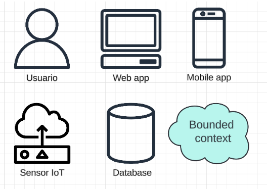

# Universidad Peruana de Ciencias Aplicadas

### **CURSO:** Desarrollo de Soluciones IOT

### **NRC**: 3414

### **Profesor:** Marco Antonio Leon Baca

### **Ingeniería de software**

## Informe de -

### **Nombre del startup:** Papus

### **Nombre del producto:** -AgroAlerta

## **Integrantes**

| **Nombre**                                | **Codigo** |
| ----------------------------------------- | ---------- |
| **Anthony Brahan Loarte Matos**           | ++++++++++ |
| **Bruce Andres Cipriano Chumbes**         | ++++++++++ |
| **Jose Miguel Riega Salas**               | ++++++++++ |
| **Godofredo Quispe Tipo**                 | u202120772 |
| **Erick Hernan Ruiz Torres**              | u202118946 |

**Agosto 2025**

## Registro de Versiones del Informe

<table>
  <thead>
    <tr>
      <th>Versión</th>
      <th>Fecha</th>
      <th>Autor</th>
      <th>Descripción de modificación</th>
    </tr>
  </thead>
  <tbody>
    <tr>
      <td></td>
      <td></td>
      <td></td>
      <td></td>
    </tr>
  </tbody>
</table>

## Project Report Collaboration Insights

El enlace a github del reporte del proyecto es el siguiente: [https://github.com/IOT-Proyecto/UniverseThing-Report](https://github.com/IOT-Proyecto/UniverseThing-Report).

## Contenido

- [Student Outcome](#student-outcome)
- [Capítulo I: Introducción](#capítulo-i-introducción)
  - [1.1 Startup Profile](#11-startup-profile)
    - [1.1.1 Descripción de la Startup](#111-descripción-de-la-startup)
    - [1.1.2 Perfiles de integrantes del equipo](#112-perfiles-de-integrantes-del-equipo)
  - [1.2 Solution Profile](#12-solution-profile)
    - [1.2.1 Antecedentes y problemática](#121-antecedentes-y-problemática)
    - [1.2.2 Lean UX Process](#122-lean-ux-process)
      - [1.2.2.1 Lean UX Problem Statements](#1221-lean-ux-problem-statements)
      - [1.2.2.2 Lean UX Assumptions](#1222-lean-ux-assumptions)
      - [1.2.2.3 Lean UX Hypothesis Statements](#1223-lean-ux-hypothesis-statements)
      - [1.2.2.4 Lean UX Canvas](#1224-lean-ux-canvas)
  - [1.3 Segmentos objetivo](#13-segmentos-objetivo)
- [Capítulo II: Requirements Elicitation \& Analysis](#capítulo-ii-requirements-elicitation--analysis)
  - [2.1 Competidores](#21-competidores)
    - [2.1.1 Análisis competitivo](#211-análisis-competitivo)
    - [2.1.2 Estrategias y tácticas frente a competidores](#212-estrategias-y-tácticas-frente-a-competidores)
  - [2.2 Entrevistas](#22-entrevistas)
    - [2.2.1 Diseño de entrevistas](#221-diseño-de-entrevistas)
    - [2.2.2 Registro de entrevistas](#222-registro-de-entrevistas)
    - [2.2.3 Análisis de entrevistas](#223-análisis-de-entrevistas)
  - [2.3 Needfinding](#23-needfinding)
    - [2.3.1 User Personas](#231-user-personas)
    - [2.3.2 User Task Matrix](#232-user-task-matrix)
    - [2.3.3 Empathy Mapping](#233-empathy-mapping)
    - [2.3.4 As-is Scenario Mapping](#234-as-is-scenario-mapping)
  - [2.4 Ubiquitous Language](#24-ubiquitous-language)
- [Capítulo III: Requirements Specification](#capítulo-iii-requirements-specification)
  - [3.1 To-Be Scenario Mapping](#31-to-be-scenario-mapping)
  - [3.2 User Stories](#32-user-stories)
  - [3.3 Impact Mapping](#33-impact-mapping)
  - [3.4 Product Backlog](#34-product-backlog)

- [Capítulo IV: Strategic-Level Software Design](#capítulo-iv-strategic-level-software-design)
  - [4.1 Strategic-Level Domain-Driven Design](#41-strategic-level-attribute-driven-design)
    - [4.1.1 Design-Level EventStorming](#411-design-devel-eventStorming)
      - [4.1.1.1 Candidate Context Discovery](#4111-candidate-context-discovery)
      - [4.1.1.2 Domain Message Flows Modeling](#4112-domain-message-flows-modeling)
      - [4.1.1.3 Bounded Context Canvases](#4113-bounded-context-canvases)
    - [4.1.2 Context Mapping](#412-context-mapping)
    - [4.1.3 Software Architecture](#413-software-architecture)
      - [4.1.3.1 Software Architecture System Landscape Diagram](#4131-software-architecture-system-landscape-diagram)
      - [4.1.3.2 Software Architecture Context Level Diagrams](#4132-software-architecture-context-level-diagrams)
      - [4.1.3.3 Software Architecture Container Level Diagrams](#4133-software-architecture-container-level-diagrams)
      - [4.1.3.4 Software Architecture Deployment Diagrams](#4134-software-architecture-deployment-diagrams)
  - [4.2 Tactical-Level Domain-Driven Design](#42-tactical-level-domain-driven-design)
- [Conclusiones](#conclusiones)
- [Bibliografía](#bibliografía)
- [Anexos](#anexos)

## Student Outcome

El curso contribuye al cumplimiento del Student Outcome ABET:

**ABET – EAC - Student Outcome 3**

Criterio: _Capacidad de comunicarse efectivamente con un rango de audiencias._
En el siguiente cuadro se describe las acciones realizadas y enunciados de
conclusiones por parte del grupo, que permiten sustentar el haber alcanzado el logro
del ABET – EAC - Student Outcome 3.

<table>
  <thead>
    <tr>
      <th style="text-align: left;">Criterio específico</th>
      <th style="text-align: left;">Acciones realizadas</th>
      <th style="text-align: left;">Conclusiones</th>
    </tr>
  </thead>
  <tbody>
    <tr>
      <td><strong>Comunica oralmente sus ideas y/o resultados con objetividad a público de diferentes especialidades y niveles jerarquicos, en el marco del desarrollo de un proyecto en ingeniería.</strong></td>
      <td>
        -
      </td>
      <td>
        -
      </td>
    </tr>
    <tr>
      <td><strong>Comunica en forma escrita ideas y/o resultados con objetividad a público de diferentes especialidades y niveles jerarquicos, en el marco del desarrollo de un proyecto eningeniería.</strong></td>
      <td>
        -
      </td>
      <td>
        -
      </td>
    </tr>
  </tbody>
</table>

## Capítulo I: Introducción

### 1.1 Startup Profile

#### 1.1.1 Descripción de la Startup

#### 1.1.2 Perfiles de integrantes del equipo

### 1.2 Solution Profile

#### 1.2.1 Antecedentes y problemática

#### 1.2.2 Lean UX Process

##### 1.2.2.1 Lean UX Problem Statements

##### 1.2.2.2 Lean UX Assumptions

##### 1.2.2.3 Lean UX Hypothesis Statements

##### 1.2.2.4 Lean UX Canvas

### 1.3 Segmentos objetivo

## Capítulo II: Requirements Elicitation & Analysis

### 2.1 Competidores

A continuación, se presenta un análisis competitivo que examina a las principales empresas que rivalizan con nuestra startup. Hemos identificado tanto competidores directos, aquellos que ofrecen una solución de software +++++++++++++++++++++++++++ **+++++++++++++++++++++++++++**.

1. **Posture Reminder**  
     
   **Descripción:**  
   +++++++++++++++++++++++++++  
   **Características principales**

- +++++++++++++++++++++++++++
- +++++++++++++++++++++++++++
- +++++++++++++++++++++++++++

---

2. **Upright Go**  
     
   **Descripción:**  
   +++++++++++++++++++++++++++  
   **Características principales**

- +++++++++++++++++++++++++++).
- +++++++++++++++++++++++++++.
- +++++++++++++++++++++++++++
- +++++++++++++++++++++++++++
- +++++++++++++++++++++++++++

---

3. **Workpace**  
     
   **Descripción:**  
   +++++++++++++++++++++++++++.  
   **Características principales**

- +++++++++++++++++++++++++++
- +++++++++++++++++++++++++++
- +++++++++++++++++++++++++++
- +++++++++++++++++++++++++++

#### 2.1.1 Análisis competitivo

<table> 
  <tr>
    <th colspan="6"> Competitive Analysis Landscape </th>
  </tr>
  <tr>
    <td colspan="2" rowspan="2">¿Por qué llevar acabo este análisis? </td>
    <td colspan="4"> Pregunta </td>
  </tr>
  <tr>
    <td colspan="4"> Deberíamos llevar a cabo este análisis para conocer el entorno, la competencia, tomar decisiones de desarrollo y construir nuestra propuesta de valor. </td>
  </tr>
  <tr>
    <td colspan="2"> Productos </td>
    <td> ++++++++ </td>
    <td> +++++++++++++++++++++++++++ </td>
    <td> +++++++++++++++++++++++++++ </td>
    <td> +++++++++++++++++++++++++++ </td>
  </tr>
  <tr>
    <td rowspan="2">Perfil</td>
    <td>Overview</td>
    <td> Software +++++++++++++++++++++++++++. </td>
    <td> Software +++++++++++++++++++++++++++. </td>
    <td> Wearable +++++++++++++++++++++++++++. </td>
    <td> Plataforma c+++++++++++++++++++++++++++. </td>
  </tr>
  <tr>
    <td>Ventaja
    competitiva
    ¿Qué valor
    ofrece a los
    clientes?</td>
    <td> Ofrece +++++++++++++++++++++++++++. </td>
    <td> Ofrece +++++++++++++++++++++++++++.</td>
    <td> Ofrece +++++++++++++++++++++++++++. </td>
    <td> Ofrece +++++++++++++++++++++++++++. </td>
  </tr>
  <tr>
    <td rowspan="2">Perfil de Marketing</td>
    <td> Mercado Objetivo </td>
    <td> +++++++++++++++++++++++++++. </td>
    <td> +++++++++++++++++++++++++++. </td>
    <td> U+++++++++++++++++++++++++++. </td>
    <td> +++++++++++++++++++++++++++. </td>
  </tr>
  <tr>
    <td> Estrategias de Marketing </td>
    <td> +++++++++++++++++++++++++++. </td>
    <td> +++++++++++++++++++++++++++. </td>
    <td> +++++++++++++++++++++++++++ </td>
    <td> +++++++++++. </td>
  </tr>
  <tr>

  </tr>
  <tr>
    <td rowspan="3">Perfil de Producto</td>
    <td> Productos & Servicios </td>
    <td> ++++++++, +++ ++++++++++++). </td>
    <td> ++++++++++++++ de sensibilidad. </td>
    <td> +++++++++++++++++++++++++++ y +. </td>
    <td> ++++++++++++++++++++++++++++++. </td>
  </tr>
  <tr>
    <td> Precios & Costos </td>
    <td> +++++++++++++++++. </td>
    <td> ++++++++++++++++++++++++). </td>
    <td> ++++++++++++++++++++++++++. </td>
    <td> ++++++++++++++++++++++. </td>
  </tr>
  <tr> 
    <td>Canales de distribución (Web y/o Móvil)</td>
    <td> +++++++++++++++++++++++++++++vos. </td>
    <td> +++++++++++++++++++++++. </td>
    <td> ++++++++++++++++++++++++. </td>
    <td> +++++++++++++++++ </td>
  </tr>
  <tr>
    <td rowspan="4"> Análisis SWOT </td>
    <td> Fortalezas </td>
    <td> ++++++++++++++++++++++++++++++++++++++. </td>
    <td> ++++++++++++++++++++++++++++++++++++++++++ </td>
    <td> +++++++++++++++++++. </td>
    <td> ++++++++++++++++++++++++++. </td>
  </tr>
  <tr>
    <td> Debilidades </td>
    <td> ++++++++++++++++++++++++++++++ de marca. </td>
    <td> ++++++++++++++++++++++++dos. </td>
    <td> ++++++++++++++++++++++++. </td>
    <td> ++++++++++++ ++++++++++++. </td>
  </tr>
  <tr>
    <td> Oportunidades </td>
    <td> Cre++++++++++++++++. </td>
    <td> ++++++++++++++++++++ ++++++++. </td>
    <td> ++++++++++++++++++++ +++++++++++. </td>
    <td> ++++++++++++++ ++++++++++++++++++++ </td>
  </tr>
  <tr>
    <td> Amenazas </td>
    <td> ++++++++++++++++ ++++++++++. </td>
    <td> ++++++++++++++++++++++++++++++++++ +. </td>
    <td> +++++++++++++++++++++++++++++ sin hardware. </td>
    <td> ++++++++++++++++++++++. </td>
  </tr>
</table>

#### 2.1.2 Estrategias y tácticas frente a competidores

**1. Estrategia de Diferenciación por Simplicidad y Usabilidad**

**Objetivo:** Ser la solución más intuitiva y fácil de usar para usuarios no técnicos.

**Tácticas:**

- Configuración que no lleve más de 10 segundos para su uso.
- Diseñar una interfaz limpia y minimalista con solo 3 botones: ++++++++++++++++++++++++++++++++
- +++++++++++++++++++++++++++++++++++++++++

**2. Estrategia de Enfoque en Nichos Desatendidos**

**Objetivo:** Dominar segmentos específicos dentro del mercado +++++++++++++++++++++++++++++++
**Tácticas:**

- +++++++++++++++++++++++
- +++++++++++++++++++++++++

**3. Estrategia de Humanización y Cercanía de Marca**

**Objetivo:** +++++++++++++++++++++.

**Tácticas:**

- ++++++++++++++++++
- ++++++++++++
- S+++++

**4. Estrategia de Precio Accesible y Transparente**

**Objetivo:** +++++++++++++++++++++++++++

**Tácticas:**

- ++++++++++++++++++++++++++++++++
- Diseñar una estructura de precios clara, con un plan gratuito funcional y un plan premium económico.

### 2.2 Entrevistas

#### 2.2.1 Diseño de entrevistas

**Entrevista para Trabajadores Remotos**

**Preguntas:**

1. ¿Cuál es tu nombre, edad y género?
2. +++++++++++++++++++++++++++
3. +++++++++++++++++++++++++++
4. +++++++++++++++++++++++++++
5. +++++++++++++++++++++++++++
6. +++++++++++++++++++++++++++
7. +++++++++++++++++++++++++++
8. +++++++++++++++++++++++++++
9. +++++++++++++++++++++++++++
10. +++++++++++++++++++++++++++
11. +++++++++++++++++++++++++++
12. +++++++++++++++++++++++++++

**Entrevista para Estudiantes que Usan Computadoras**

**Preguntas:**

1. +++++++++++++++++++++++++++
2. +++++++++++++++++++++++++++
3. +++++++++++++++++++++++++++
4. +++++++++++++++++++++++++++
5. +++++++++++++++++++++++++++
6. +++++++++++++++++++++++++++
7. +++++++++++++++++++++++++++
8. +++++++++++++++++++++++++++
9. +++++++++++++++++++++++++++
10. +++++++++++++++++++++++++++
11. +++++++++++++++++++++++++++
12. +++++++++++++++++++++++++++

#### 2.2.2 Registro de entrevistas

En esta sección registramos los puntos e ideas más importantes de las entrevistas realizadas a los +++++++++++++++++++++++++++. Los detalles completos de las entrevistas, incluyendo las grabaciones, se encuentran disponibles en el siguiente enlace: [Needfinding Interviews](https://+++++++++++++++++++++++++++%3D)

A continuación se presentan los detalles clave de las entrevistas realizadas a los +++++++++++++++++++++++++++:

<table cellpadding="8" cellspacing="0">
  <tbody>
    <tr>
      <td>Entrevista 1</td>
      <td>  </td>
    </tr>
    <tr>
      <td>Nombre Entrevistado</td>
      <td>+++++++++++++++++++++++++++</td>
    </tr>
    <tr>
      <td>Edad</td>
      <td>+++++++++++++++++++++++++++</td>
    </tr>
    <tr>
      <td>Distrito</td>
      <td>+++++++++++++++++++++++++++</td>
    </tr>
    <tr>
      <td>Ocupacion</td>
      <td>+++++++++++++++++++++++++++</td>
    </tr>
    <tr>
      <td>Duración Entrevista</td>
      <td>+++++++++++++++++++++++++++ </td>
    </tr>
    <tr>
      <td>Minuto de Inicio</td>
      <td>00:00 - +++++++++++++++++++++++++++</td>
    </tr>
  </tbody>
</table>

<table cellpadding="8" cellspacing="0">
  <tbody>
    <tr>
      <td>Entrevista 2</td>
      <td>  </td>
    </tr>
    <tr>
      <td>Nombre Entrevistado</td>
      <td>+++++++++++++++++++++++++++</td>
    </tr>
    <tr>
      <td>Edad</td>
      <td>+++++++++++++++++++++++++++</td>
    </tr>
    <tr>
      <td>Distrito</td>
      <td>+++++++++++++++++++++++++++</td>
    </tr>
    <tr>
      <td>Ocupacion</td>
      <td>+++++++++++++++++++++++++++</td>
    </tr>
    <tr>
      <td>Duración Entrevista</td>
      <td>+++++++++++++++++++++++++++ </td>
    </tr>
    <tr>
      <td>Minuto de Inicio</td>
      <td>+++++++++++++++++++++++++++</td>
    </tr>
  </tbody>
</table>

<table cellpadding="8" cellspacing="0">
  <tbody>
    <tr>
      <td>Entrevista 3</td>
      <td>  </td>
    </tr>
    <tr>
      <td>Nombre Entrevistado</td>
      <td>+++++++++++++++++++++++++++</td>
    </tr>
    <tr>
      <td>Edad</td>
      <td>+++++++++++++++++++++++++++</td>
    </tr>
    <tr>
      <td>Distrito</td>
      <td>+++++++++++++++++++++++++++</td>
    </tr>
    <tr>
      <td>Ocupacion</td>
      <td>+++++++++++++++++++++++++++</td>
    </tr>
    <tr>
      <td>Duración Entrevista</td>
      <td>+++++++++++++++++++++++++++ </td>
    </tr>
    <tr>
      <td>Minuto de Inicio</td>
      <td>+++++++++++++++++++++++++++</td>
    </tr>
  </tbody>
</table>

A continuación se presentan los detalles clave de las entrevistas realizadas a los +++++++++++++++++++++++++++:

<table cellpadding="8" cellspacing="0">
  <tbody>
    <tr>
      <td>Entrevista 4</td>
      <td>  </td>
    </tr>
    <tr>
      <td>Nombre Entrevistado</td>
      <td>+++++++++++++++++++++++++++</td>
    </tr>
    <tr>
      <td>Edad</td>
      <td>+++++++++++++++++++++++++++</td>
    </tr>
    <tr>
      <td>Distrito</td>
      <td>+++++++++++++++++++++++++++</td>
    </tr>
    <tr>
      <td>Ocupacion</td>
      <td>+++++++++++++++++++++++++++</td>
    </tr>
    <tr>
      <td>Duración Entrevista</td>
      <td>+++++++++++++++++++++++++++ </td>
    </tr>
    <tr>
      <td>Minuto de Inicio</td>
      <td>+++++++++++++++++++++++++++</td>
    </tr>
  </tbody>
</table>

<table cellpadding="8" cellspacing="0">
  <tbody>
    <tr>
      <td>Entrevista 5</td>
      <td>  </td>
    </tr>
    <tr>
      <td>Nombre Entrevistado</td>
      <td>+++++++++++++++++++++++++++</td>
    </tr>
    <tr>
      <td>Edad</td>
      <td>+++++++++++++++++++++++++++</td>
    </tr>
    <tr>
      <td>Distrito</td>
      <td>+++++++++++++++++++++++++++</td>
    </tr>
    <tr>
      <td>Ocupacion</td>
      <td>+++++++++++++++++++++++++++</td>
    </tr>
    <tr>
      <td>Duración Entrevista</td>
      <td>:+++++++++++++++++++++++++++ </td>
    </tr>
    <tr>
      <td>Minuto de Inicio</td>
      <td>14:17 - 20:00</td>
    </tr>
  </tbody>
</table>

<table cellpadding="8" cellspacing="0">
  <tbody>
    <tr>
      <td>Entrevista 6</td>
      <td>  </td>
    </tr>
    <tr>
      <td>Nombre Entrevistado</td>
      <td>+++++++++++++++++++++++++++</td>
    </tr>
    <tr>
      <td>Edad</td>
      <td>+++++++++++++++++++++++++++</td>
    </tr>
    <tr>
      <td>Distrito</td>
      <td>+++++++++++++++++++++++++++</td>
    </tr>
    <tr>
      <td>Ocupacion</td>
      <td>+++++++++++++++++++++++++++</td>
    </tr>
    <tr>
      <td>Duración Entrevista</td>
      <td>+++++++++++++++++++++++++++</td>
    </tr>
    <tr>
      <td>Minuto de Inicio</td>
      <td>+++++++++++++++++++++++++++</td>
    </tr>
  </tbody>
</table>

#### 2.2.3 Análisis de entrevistas

**Segmento Objetivo 1: Trabajadores Remotos**

En el segmento de +++++++++++++++++++++++++++s+++++++++++++++++++++++++++

**Segmento Objetivo 2: Estudiantes Remotos**

Para el segmento de +++++++++++++++++++++++++++

### 2.3 Needfinding

#### 2.3.1 User Personas

#### 2.3.2 User Task Matrix

**Segmento 1: Trabajadores Remotos:**

| Tarea                       | Frecuencia | Severidad |
| --------------------------- | ---------- | --------- |
| +++++++++++++++++++++++++++ | Alta       | Alta      |
| +++++++++++++++++++++++++++ | Alta       | Alta      |
| +++++++++++++++++++++++++++ | Media      | Media     |
| +++++++++++++++++++++++++++ | Baja       | Media     |
| +++++++++++++++++++++++++++ | Media      | Alta      |
| +++++++++++++++++++++++++++ | Baja       | Alta      |
| +++++++++++++++++++++++++++ | Baja       | Media     |

**Segmento 2: Estudiantes Remotos:**

| Tarea                       | Frecuencia | Severidad |
| --------------------------- | ---------- | --------- |
| +++++++++++++++++++++++++++ | Alta       | Alta      |
| +++++++++++++++++++++++++++ | Alta       | Alta      |
| +++++++++++++++++++++++++++ | Baja       | Alta      |
| +++++++++++++++++++++++++++ | Baja       | Media     |
| +++++++++++++++++++++++++++ | Media      | Alta      |
| +++++++++++++++++++++++++++ | Media      | Media     |
| +++++++++++++++++++++++++++ | Media      | Media     |
| +++++++++++++++++++++++++++ | Baja       | Alta      |

#### 2.3.3 Empathy Mapping

**Segmento 1: +++++++++++++++++++++++++++:**

**Segmento 2: +++++++++++++++++++++++++++:**

#### 2.3.4 As-is Scenario Mapping

**Segmento 1: +++++++++++++++++++++++++++**

**Segmento 2: +++++++++++++++++++++++++++**

### 2.4 Ubiquitous Language

El siguiente glosario detalla los términos esenciales del Lenguaje Ubiquo que utilizamos en este proyecto. Este lenguaje común nos permite alinear nuestras conversaciones y asegurar que todos estemos trabajando con una misma comprensión del dominio del problema.

| Término (Inglés)        | Término (Español)                 | Definición                                                                                                                                                                                                                |
| ----------------------- | --------------------------------- | ------------------------------------------------------------------------------------------------------------------------------------------------------------------------------------------------------------------------- |
| **Task**                | Tarea                             | Acción específica asignada a un miembro del grupo para ser completada en un periodo.                                                                                                                                      |
| **Monitoring**          | Monitoreo                         | Proceso continuo mediante el cual el sistema observa y analiza la postura del usuario en tiempo real.                                                                                                                     |
| **Notification**        | Notificación                      | Aviso emitido por el sistema (visual o sonoro) para alertar al usuario sobre una postura incorrecta o recordarle una acción.                                                                                              |
| **Metric**              | Métrica                           | Indicador cuantitativo que mide hábitos posturales, como el tiempo en postura incorrecta o la frecuencia de correcciones.                                                                                                 |
| **Posture**             | Postura                           | Posición corporal adoptada por el usuario frente a la computadora, que puede ser correcta o incorrecta según criterios ergonómicos.                                                                                       |
| **Webcam**              | Cámara web                        | Dispositivo que captura imágenes en tiempo real y permite al sistema analizar la postura del usuario.                                                                                                                     |
| **Remote Student**      | Estudiante remoto                 | Usuario que accede al sistema desde un entorno académico a distancia, como clases en línea, y que utiliza ErgoVision para mantener hábitos posturales saludables mientras estudia desde casa u otro lugar fuera del aula. |
| **Remote Worker**       | Trabajador remoto                 | Usuario que desempeña sus funciones laborales desde casa u otro lugar fuera de la oficina tradicional, empleando ErgoVision para cuidar su postura durante la jornada laboral a distancia.                                |
| **MediaPipe**           | MediaPipe                         | Framework de visión por computadora desarrollado por Google, usado para detectar y procesar puntos clave del cuerpo humano.                                                                                               |
| **Pose Landmark**       | Punto de referencia de la postura | Coordenadas específicas del cuerpo (ej. hombros, cuello, rodillas) detectadas por la IA para evaluar la postura del usuario.                                                                                              |
| **Postural Biometrics** | Biometría postural                | Conjunto de datos únicos relacionados con la forma en que una persona se sienta, se mueve o mantiene su postura.                                                                                                          |
| **Workstation**         | Estación de trabajo               | Espacio físico compuesto por escritorio, silla y computadora donde el estudiante y trabajador remoto realiza sus actividades.                                                                                             |
| **Comfort Threshold**   | Umbral de confort                 | Límite dentro del cual una postura se considera aceptable sin generar molestias o riesgos ergonómicos.                                                                                                                    |
| **Correction Cycle**    | Ciclo de corrección               | Secuencia de eventos que inicia con una alerta, continúa con el ajuste de la postura por parte del estudiante y trabajador remoto y finaliza con la validación del cambio.                                                |

## Capítulo III: Requirements Specification

### 3.1 To-Be Scenario Mapping

### 3.2 User Stories

**Epics**

| EPIC ID | Título                                    | Descripción                                                                                                              |
| ------- | ----------------------------------------- | ------------------------------------------------------------------------------------------------------------------------ |
| EP-001  | Monitoreo de postura en tiempo real       | El sistema analice la postura usando la camra web, para brindar retroalimentacion y mejoras de hábitos ergonómicos.      |
| EP-002  | Gestión de alertas y notificaciones       | Notificar de manera visual/sonora para idicarle al estudinate y trabajador remoto sobre la correción de su postura.      |
| EP-003  | Configuración inicial y psoterior         | Realizar las configuraciones de manera rapida y sencilla                                                                 |
| EP-004  | Gestión de perfil de usuario              | Registro, inicio de sesión, edición de perfil y gestión de credenciales. Incluye autenticación y recuperación de acceso. |
| EP-005  | Ejecucion en segundo plano                | Recibir notificaciones y reportes estando en el entorono de trabajo o estudio.                                           |
| EP-006  | Gamificación y motivación                 | Dar reto, cumplir reto, premiar por cumplir el reto.                                                                     |
| EP-007  | Reportes y métricas de hábitos posturales | Aldiquision de datos registrados a lo largo de la semana, indicar su mejora y proyeccion a futuro.                       |
| EP-008  | Seguridad y privacidad de datos           | Autentificacion por usuario, encriptacion de imagenes procesados y guardado.                                             |

### 3.3 Impact Mapping

### 3.4 Product Backlog

## Capítulo IV: Strategic-Level Software Design

## 4.1 Strategic-Level Domain-Driven Design

### 4.1.1 Design-Level EventStorming 
Para el desarroolo del EventStorming, nos reunimos para organizar una lluvia de ideas con los temas, datos y funcionalidades necesarias para el desarrollo de la aplicación, resultando en el siguiente gráfico: 

#### 4.1.1.1 Candidate Context Discovery 
A continuación mostraremos el paso a paso para la organizacion del EventStorming:  

 Step 1:  
 Step 2:  
 Step 3:  
 Step 4:  
 Step 5:  
 Step 6:  
 Step 7:  
 Step 8:  

#### 4.1.1.2 Domain Message Flows Modeling 
En esta sección se expone el proceso realizado para representar la forma en que los bounded contexts deben interactuar con el fin de atender los casos de negocio que enfrentan los usuarios del sistema.  
Leyenda:  

Escenario 1: ####  
##############

Escenario 2: ####  
##############

Escenario 3: ####  
##############

Escenario 4: ####  
##############

#### 4.1.1.3 Bounded Context Canvases

Bounded context '###'   
##############################3333

Bounded context '###'   
##############################3333

Bounded context '###'   
##############################3333

Bounded context '###'   
##############################3333

Bounded context '###'   
##############################3333

Bounded context '###'   
##############################3333

### 4.1.2 Context Mapping
BOUNDEN CONTEXT ## ↔️ BOUNDED CONTEXT ##
Relación: ####
Patrón:
###############################

BOUNDEN CONTEXT ## ↔️ BOUNDED CONTEXT ##
Relación: ####
Patrón:
###############################

BOUNDEN CONTEXT ## ↔️ BOUNDED CONTEXT ##
Relación: ####
Patrón:
###############################

BOUNDEN CONTEXT ## ↔️ BOUNDED CONTEXT ##
Relación: ####
Patrón:
###############################

### 4.1.3 Software Architecture

#### 4.1.3.1 Software Architecture System Landscape Diagram

#### 4.1.3.2 Software Architecture Context Level Diagrams

#### 4.1.3.3 Software Architecture Container Level Diagrams

#### 4.1.3.4 Software Architecture Deployment Diagrams

## 4.2 Tactical-Level Domain-Driven Design

### 4.2.1. Bounded Context:####

Este Bounded Context "###############333" se encarga exclusivamente de 
########################

#### 4.2.1.1. Domain Layer.

##############################

#### 4.2.1.2. Interface Layer.

##############################

#### 4.2.1.3. Application Layer.

################################

#### 4.2.1.4. Infrastructure Layer.

##########################

#### 4.2.1.5. Bounded Context Software Architecture Component Level Diagrams.

##########################

#### 4.2.1.6. Bounded Context Software Architecture Code Level Diagrams.
###### 4.2.1.6.1. Bounded Context Domain Layer Class Diagrams.
#########################

###### 4.2.1.6.2. Bounded Context Database Design Diagram.

#########################

### 4.2.2. Bounded Context:####

Este Bounded Context "###############333" se encarga exclusivamente de 
########################

#### 4.2.2.1. Domain Layer.

##############################

#### 4.2.2.2. Interface Layer.

##############################

#### 4.2.2.3. Application Layer.

################################

#### 4.2.2.4. Infrastructure Layer.

##########################

#### 4.2.2.5. Bounded Context Software Architecture Component Level Diagrams.

##########################

#### 4.2.2.6. Bounded Context Software Architecture Code Level Diagrams.
###### 4.2.2.6.1. Bounded Context Domain Layer Class Diagrams.
#########################

###### 4.2.2.6.2. Bounded Context Database Design Diagram.

#########################

### 4.2.3. Bounded Context:####

Este Bounded Context "###############333" se encarga exclusivamente de 
########################

#### 4.2.3.1. Domain Layer.

##############################

#### 4.2.3.2. Interface Layer.

##############################

#### 4.2.3.3. Application Layer.

################################

#### 4.2.3.4. Infrastructure Layer.

##########################

#### 4.2.3.5. Bounded Context Software Architecture Component Level Diagrams.

##########################

#### 4.2.3.6. Bounded Context Software Architecture Code Level Diagrams.
###### 4.2.3.6.1. Bounded Context Domain Layer Class Diagrams.
#########################

###### 4.2.3.6.2. Bounded Context Database Design Diagram.

#########################

## Conclusiones

## Bibliografía

## Anexos
