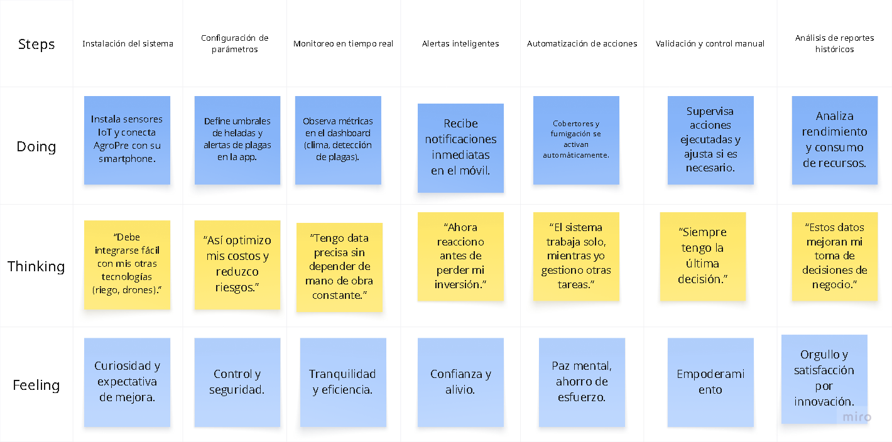
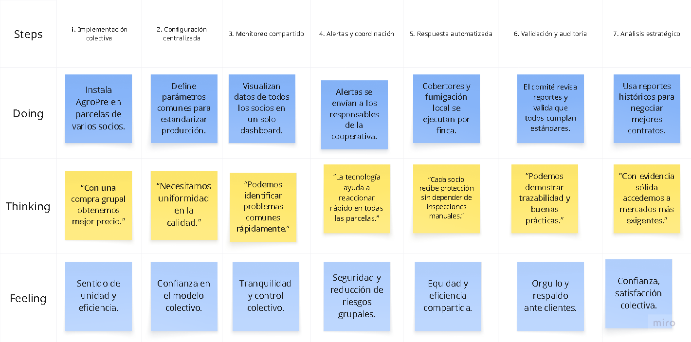

# 
Informe de Trabajo Final

<h3 align="center"> Universidad Peruana de Ciencias Aplicadas </h3>

<h3 align="center"> Ingeniería de Software </h3>

<h3 align="center">Ciclo 2025 - 2</h3>

  

<h1 align="center"> TB1 Report </h1>

<h3 align="center"> Docente: Vera Olivera, David Carlos </h3>

<h3 align="center"> 1ASI0572 - Desarrollo de Soluciones IoT </h3>

<h4 align="center"> NRC: 3355 </h4>

<h3> Startup: ------ </h3>

<h3> Product: ------ </h3>

<h3> Team Members: </h3>

| Member                              |    Code    |
| :---------------------------------- | :--------: |
| ##                                  |     ##     |
| Del Carmen Zorrilla, Ray Alessandro | U202124061 |
| ##                                  |     ##     |
| ##                                  |     ##     |
| ##                                  |     ##     |

<h3 align="center">Agosto, 2025</h3>

  

# Registro de Versiones del Informe

  

# Project Report Collaboration Insights

  

# Contenido

## Tabla de Contenidos

### [Registro de versiones del informe](#registro-de-versiones-del-informe)

### [Project Report Collaboration Insights](#project-report-collaboration-insights)

### [Contenido](#contenido)

### [Student Outcome](#student-outcome-1)

### [Capítulo I: Introducción](#capítulo-i-introducción-1)

- [1.1. Startup Profile](#11-startup-profile)
  - [1.1.1. Descripción de la Startup](#111-descripción-de-la-startup)
  - [1.1.2. Perfiles de integrantes del equipo](#112-perfiles-de-integrantes-del-equipo)
- [1.2. Solution Profile](#12-solution-profile)
  - [1.2.1 Antecedentes y problemática](#121-antecedentes-y-problemática)
  - [1.2.2 Lean UX Process](#122-lean-ux-process)
    - [1.2.2.1. Lean UX Problem Statements](#1221-lean-ux-problem-statements)
    - [1.2.2.2. Lean UX Assumptions](#1222-lean-ux-assumptions)
    - [1.2.2.3. Lean UX Hypothesis Statements](#1223-lean-ux-hyphotesis-statements)
    - [1.2.2.4. Lean UX Canvas](#1224-lean-ux-canvas)
- [1.3. Segmentos objetivo](#13-segmentos-objetivo)

### [Capítulo II: Requirements Elicitation & Analysis](#capítulo-ii-requirements-elicitation--analysis-1)

- [2.1. Competidores](#21-competidores)
  - [2.1.1. Análisis competitivo](#211-análisis-competitivo)
  - [2.1.2. Estrategias y tácticas frente a competidores](#212-estrategias-y-tácticas-frente-a-competidores)
- [2.2. Entrevistas](#22-entrevistas)
  - [2.2.1. Diseño de entrevistas](#221-diseño-de-entrevistas)
  - [2.2.2. Registro de entrevistas](#222-registro-de-entrevistas)
  - [2.2.3. Análisis de entrevistas](#223-análisis-de-entrevistas)
- [2.3. Needfinding](#23-needfinding)
  - [2.3.1. User Personas](#231-user-personas)
  - [2.3.2. User Task Matrix](#232-user-task-matrix)
  - [2.3.3. User Journey Mapping](#233-user-journey-mapping)
  - [2.3.4. Empathy Mapping](#234-empathy-mapping)
  - [2.3.5. As-is Scenario Mapping](#235-as-is-scenario-mapping)
- [2.4. Ubiquitous Language](#24-ubiquitous-language)

### [Capítulo III: Requirements Specification](#capítulo-iii-requirements-specification-1)

- [3.1. To-Be Scenario Mapping](#31-to-be-scenario-mapping)
- [3.2. User Stories](#32-user-stories)
- [3.3. Impact mapping](#33-impact-mapping)
- [3.4. Product Backlog](#34-product-backlog)

### [Capítulo IV: Solutions Software Design](#capítulo-iv-solution-software-design)

- [4.1. Strategic-Level Domain-Driven Design](#41-strategic-level-domain-driven-design)
  - [4.1.1. EventStorming](#411-eventstorming)
    - [4.1.1.1. Candidate Context Discovery](#4111-candidate-context-discovery)
    - [4.1.1.2. Domain Message Flows Modeling](#4112-domain-message-flows-modeling)
    - [4.1.1.3. Bounded COntext Canvases](#4113-bounded-context-canvases)
  - [4.1.2. Context Mapping](#412-context-mapping)
  - [4.1.3. Software Architecture](#413-software-architecture)
    - [4.1.3.1. Software Architecture System Landscape Diagram](#4131-software-architecture-system-landscape-diagram)
    - [4.1.3.2. Software Architecture Context Level Diagrams](#4132-software-architecture-context-level-diagrams)
    - [4.1.3.3. Software Architecture Container Level Diagrams](#4133-software-architecture-container-level-diagrams)
    - [4.1.3.4. Software Architecture Deployment Diagrams](#4134-software-architecture-deployment-diagrams)
- [4.2. Tactical-Level Domain-Driven Design](#42-tactical-level-domain-driven-design)
  - [4.2.X. Bounded Context: <Bounded Context name>](#42x-bounded-context)
    - [4.2.X.1. Domain Layer](#42x1-domain-layer)
    - [4.2.X.2. Interface Layer](#42x2-interface-context)
    - [4.2.X.3. Application Layer](#42x3-application-context)
    - [4.2.X.4. Infrastructure Layer](#42x4-infrastructure-context)
    - [4.2.X.5. Bounded Context Software Architecture Component Level Diagrams](#42x5-bounded-context-software-architecture-component-level-diagrams)
    - [4.2.X.6. Bounded Context Software Architecture Code Level Diagrams](#42x6-bounded-context-software-architecture-code-level-diagrams)
      - [4.2.X.6.1. Bounded Context Domain Layer Class Diagrams](#42x61-bounded-context-domain-layer-class-diagrams)
      - [4.2.X.6.2. Bounded Context Database Design Diagram](#42x62-bounded-context-database-design-diagram)

### [Capítulo V: Solution UI/UX Design](#capítulo-v-solutions-uiux-design)

- [5.1. Style Guidelines](#51-style-guidelines)
  - [5.1.1. General Style Guidelines](#511-general-style-guidelines)
  - [5.1.2. Web, Mobile and IoT Style Guidelines](#512-web-mobile-and-iot-style-guidelines)
- [5.2. Information Architecture](#52-information-architecture)
  - [5.2.1. Organization Systems](#521-organization-systems)
  - [5.2.2. Labeling Systems](#522-labeling-systems)
  - [5.2.3. SEO Tags and Meta Tags](#523-seo-tags-and-meta-tags)
  - [5.2.4. Searching Systems](#524-searching-systems)
  - [5.2.5. Navigation Systems](#525-navigation-systems)
- [5.3. Landing Page UI Design](#53-landing-page-ui-design)
  - [5.3.1. Landing Page Wireframe](#531-landing-page-wireframe)
  - [5.3.2. Landing Page Mock-up](#532-landing-page-mock-up)
- [5.4. Applications UX/UI Design](#54-web-applications-uxui-design)
  - [5.4.1. Applications Wireframes](#541-web-applications-wireframes)
  - [5.4.2. Applications Wireflow Diagrams](#542-web-applications-wireflow-diagrams)
  - [5.4.3. Applications Mock-ups](#543-web-applications-mock-ups)
  - [5.4.4. Applications User Flow Diagrams](#544-web-applications-user-flow-diagrams)
- [5.5. Aplications Prototyping](#55-applications-prototyping)

### [Capítulo VI: Product Implementation, Validation \& Deployment](#capítulo-vi-product-implementation-validation--deployment)

- [6.1. Software Configuration Management](#61-software-configuration-management)
  - [6.1.1. Software Development Environment Configuration](#611-software-development-environment-configuration)
  - [6.1.2. Source Code Management](#612-source-code-management)
  - [6.1.3. Source Code Style Guide \& Conventions](#613-source-code-style-guide--conventions)
  - [6.1.4. Software Deployment Configuration](#614-software-deployment-configuration)
- [6.2. Landing Page, Services \& Applications Implementation](#62-landing-page-services--applications-implementation)
  - [6.2.X. Sprint X](#62x-sprint-n)
    - [6.2.X.1. Sprint Planning 1](#62x1-sprint-planning-n)
    - [6.2.X.2. Sprint Backlog 1](#62x2-sprint-backlog-n)
    - [6.2.X.3. Development Evidence for Sprint Review](#62x3-development-evidence-for-sprint-review)
    - [6.2.X.4. Testing Suite Evidence for Sprint Review](#62x4-testing-suite-evidence-for-sprint-review)
    - [6.2.X.5. Execution Evidence for Sprint Review](#62x5-execution-evidence-for-sprint-review)
    - [6.2.X.6. Services Documentation Evidence for Sprint Review](#62x6-services-documentation-evidence-for-sprint-review)
    - [6.2.X.7. Software Deployment Evidence for Sprint Review](#62x7-software-deployment-evidence-for-sprint-review)
    - [6.2.X.8. Team Collaboration Insights during Sprint](#62x8-team-collaboration-insights-during-sprint)
- [6.3. Validation Interviews](#63-validation-interviews)
  - [6.3.1. Diseño de Entrevistas](#631-diseño-de-entrevistas)
  - [6.3.2. Registro de Entrevistas](#632-registro-de-entrevistas)
  - [6.3.3. Evaluaciones según heurísticas](#633-evaluaciones-según-heurísticas)
- [6.4. Video About-the-Product](#64-video-about-the-product)

### [Conclusiones](#conclusiones-1)

- [Conclusiones y recomendaciones](#conclusiones-y-recomendaciones)
- [Video About-the-Team](#video-about-the-team)

### [Bibliografía](#bibliografía-1)

### [Anexos](#anexos-1)

  

# Student Outcome

<b>ABET – EAC - Student Outcome 5:</b> La capacidad de funcionar efectivamente en un equipo cuyos miembros juntos proporcionan liderazgo, crean un entorno de colaboración e inclusivo, establecen objetivos, planifican tareas y cumplen objetivos.

  

# Capítulo I: Introducción

## 1.1. StartUp Profile

### 1.1.1. Descripción de la StartUp

### 1.1.2. Perfiles de integrantes del equipo

## 1.2. Solution Profile

### 1.2.1. Antecedentes y problemática

### 1.2.2. Lean UX Process

#### 1.2.2.1. Lean UX Problem Statements

#### 1.2.2.2. Lean UX Assumptions

#### 1.2.2.3. Lean UX Hyphotesis Statements

#### 1.2.2.4. Lean UX Canvas

## 1.3. Segmentos objetivo

# Capítulo II: Requirements Elicitation & Analysis

## 2.1. Competidores

### 2.1.1. Análisis competitivo

### 2.1.2. Estrategias y tácticas frente a competidores

## 2.2. Entrevistas

### 2.2.1. Diseño de entrevistas

### 2.2.2. Registro de entrevistas

### 2.2.3. Análisis de entrevistas

## 2.3. Needfinding

### 2.3.1. User Personas

### 2.3.2. User Task Matrix

### 2.3.3. User Journey Mapping

### 2.3.4. Empathy Mapping

### 2.3.5. As-Is Scenario Mapping

## 2.4. Ubiquitous Language

# Capítulo III: Requirements Specification

## 3.1. To-Be Scenario Mapping

### Segmento: Agricultores Tecnificados

Pequeña introducción: Este segmento está compuesto por productores medianos y grandes que buscan tecnología para optimizar sus cultivos y protegerlos de heladas y plagas. AgroPre les permite monitorear, automatizar y controlar su campo de manera remota.

  

*Figura 1. AgroPre para Agricultores Tecnificados. Elaboración propia.*

---

### Segmento: Cooperativas Agrícolas

Pequeña introducción: Este segmento agrupa a pequeños y medianos agricultores que operan de manera colectiva. AgroPre les ofrece un sistema centralizado que permite proteger todas las parcelas de sus socios, mejorar la productividad y garantizar la calidad de la producción.

  

*Figura 2. AgroPre para Cooperativas Agrícolas. Elaboración propia.*

Para una mejor visualizacion del To-Be Scenario Mapping completo en:  
[Acceder al tablero de Miro](https://miro.com/welcomeonboard/U3BNcDZpcm0zV015WWtDNmJYQ1VnUlpZUWZ2STVpREpKVjJsSUdYczNZU2tZVTRuRTZUQkh3MUZiTjZlcG9xVDB2K3NmbXhwZm9rR3FVY0dZb2o0T1JJQzYzaXJPUlNhYWkzcWRkUU10a2ZqNnFLSkdPWUVlaHlJUS80MXB0MmdyVmtkMG5hNDA3dVlncnBvRVB2ZXBnPT0hdjE=?share_link_id=810061349841)

## 3.2. User Stories

Tabla de épicas establecidas para las historias de usuarios de UniverseThing

| **Epic / Story ID** | **Título**                                                | **Descripción**                                                                                                                                  | **Criterios de Aceptación**                                                                                                                                  | **Relacionado con (Epic ID)** |
|---------------------|-----------------------------------------------------------|--------------------------------------------------------------------------------------------------------------------------------------------------|----------------------------------------------------------------------------------------------------------------------------------------------------------------------------------------------------|-------------------------------|
| US001               | Instalar dispositivo con guía visual                      | Como agricultor, quiero instalar el dispositivo con instrucciones paso a paso en la app, para configurarlo sin asistencia técnica especializada. | La app debe mostrar una guía interactiva o visual para la instalación, confirmando la conexión correcta de sensores y cámara.                                | EPIC001                       |
| US002               | Registro automático de sensores                           | Como usuario, quiero que el sistema detecte automáticamente los sensores y cámara al encender el dispositivo, para validar que funciona bien.    | El sistema debe reconocer y mostrar en la app los componentes conectados, confirmando que están activos.                                                     | EPIC001                       |
| US003               | Registro de múltiples dispositivos                        | Como administrador de cooperativa, quiero registrar múltiples dispositivos en una sola cuenta, para gestionarlos colectivamente.                  | La plataforma debe permitir agregar más de un dispositivo bajo un mismo usuario y mostrar su estado en un panel central.                                     | EPIC001                       |
| US004               | Notificaciones tempranas de helada                        | Como agricultor, quiero recibir alertas en mi celular cuando la temperatura se acerque al umbral de helada, para anticipar medidas preventivas.   | El sistema debe enviar notificaciones push o SMS cuando la temperatura descienda a un rango crítico configurado.                                              | EPIC002                       |
| US005               | Visualizar condiciones actuales                           | Como usuario, quiero ver en un panel la temperatura, para entender el estado de mis cultivos en tiempo real.     | El panel debe actualizarse en intervalos regulares y mostrar valores de sensores en tiempo real.                                                             | EPIC002                       |
| US007               | Activación automática de protección térmica               | Como agricultor, quiero que la tela protectora se active automáticamente cuando se detecte riesgo de helada, para proteger mis cultivos.          | El sistema debe accionar la tela cuando la temperatura baje del umbral definido.                                                                             | EPIC003                       |
| US008               | Configuración de umbrales                                 | Como usuario avanzado, quiero configurar los umbrales de activación (ej. -1 °C, -3 °C), para adaptar la protección a mi cultivo específico.       | La app debe permitir al usuario editar valores de activación y guardarlos en el dispositivo.                                                                 | EPIC003                       |
| US009               | Confirmación de activación                                | Como agricultor, quiero recibir una confirmación en la app cuando la protección se active, para estar seguro de que el sistema funciona.          | El sistema debe notificar al usuario con estado y hora exacta de activación de la tela.                                                                       | EPIC003                       |
| US010               | Identificación automática de plagas                       | Como agricultor, quiero que la cámara identifique plagas comunes en tubérculos, para reducir inspecciones manuales.                               | El sistema debe reconocer plagas frecuentes mediante IA y mostrar la alerta en la app.                                                                       | EPIC004                        
| US011               | Consolidación de reportes de plagas                       | Como administrador de cooperativa, quiero que las detecciones de plagas se consoliden en un reporte colectivo, para coordinar estrategias.        | El sistema debe generar un informe compartido con las incidencias detectadas en los dispositivos registrados.                                                 | EPIC004                       |
| US012               | Visualización gráfica de datos                            | Como usuario, quiero ver gráficos de temperatura, heladas y plagas, para tomar decisiones informadas.                                             | La app debe mostrar gráficos de líneas, barras o mapas de calor basados en los datos recolectados.                                                            | EPIC005                       |
| US013               | Exportación de reportes                                   | Como usuario, quiero exportar reportes en PDF o Excel, para compartirlos con asesores técnicos o instituciones.                                   | El sistema debe permitir descargar reportes completos en formatos estándar (PDF, XLSX).                                                                       | EPIC005                       |
| US014               | Integración vía API                                       | Como usuario avanzado, quiero integrar los datos con otros sistemas agrícolas, para unificar mis fuentes de información.                          | La plataforma debe exponer una API REST segura que permita acceder a datos históricos y en tiempo real.                                                       | EPIC005                                                                      
| US015               | Landing page: información del dispositivo                 | Como visitante, quiero ver en la landing page qué es el dispositivo IoT y cómo funciona, para entender sus beneficios.                            | La landing page debe mostrar un bloque con descripción clara, imágenes y beneficios principales del dispositivo.                                              | EPIC005                       |
| US016               | Landing page: formulario de contacto                      | Como visitante, quiero enviar un mensaje o consulta desde la landing page, para recibir más información sobre el producto.                        | El sistema debe permitir enviar un formulario con nombre, email y mensaje, y notificar al administrador.                                                      | EPIC005                       |
| US017               | Landing page: testimonios de agricultores                 | Como visitante, quiero leer testimonios de agricultores, para confiar en la efectividad de la solución.                                           | La landing page debe incluir una sección con al menos 3 testimonios con foto y nombre del agricultor/cooperativa.                                              | EPIC005                       |
| US018               | Landing page: precios y planes                            | Como agricultor, quiero ver planes de precios claros en la landing page, para evaluar si puedo adquirir el dispositivo.                           | La landing page debe mostrar tabla de precios o paquetes de suscripción, diferenciados por tipo de usuario.                                                   | EPIC005                       |
| US019               | Landing page: preguntas frecuentes (FAQ)                  | Como visitante, quiero acceder a un listado de preguntas frecuentes, para resolver dudas sin contactar soporte.                                   | La landing page debe tener un módulo de FAQ con al menos 10 preguntas y respuestas frecuentes.                                                                 | EPIC005                       |
| US020               | Landing page: descarga de brochure                        | Como visitante, quiero descargar un brochure en PDF desde la landing page, para compartir la información del producto.                            | El sistema debe permitir la descarga de un PDF con información resumida del dispositivo y su uso.                                                             | EPIC005                      |
| US021               | Ajuste de idioma en la app                                | Como usuario, quiero cambiar el idioma de la app (español/inglés), para usarla en mi idioma preferido.                                            | La app debe ofrecer un selector de idioma y traducir todos los textos de la interfaz.                                                                         | EPIC005                         |
| US022               | Tema claro/oscuro en la app                               | Como usuario, quiero activar un tema oscuro, para usar la app cómodamente de noche.                                                               | La app debe ofrecer un selector de tema y recordar la preferencia del usuario.                                                                                | EPIC005                       |
| US023               | Recuperar contraseña                                      | Como usuario, quiero recuperar mi contraseña por correo, para volver a acceder si la olvido.                                                       | El sistema debe enviar un enlace seguro al correo registrado del usuario.                                                                                      | EPIC005                       |
| US024               | Notificaciones de mantenimiento                           | Como administrador, quiero recibir alertas de mantenimiento de los dispositivos, para dar soporte preventivo.                                     | El sistema debe enviar notificación cuando un sensor lleve más de X días sin reportar datos.                                                                  | EPIC005                       |
| US025               | Historial de notificaciones                               | Como usuario, quiero ver un historial de todas mis notificaciones pasadas, para revisar eventos previos.                                          | La app debe mostrar un listado de notificaciones con fecha, hora y tipo de evento.                                                                            | EPIC005                       |
| US026               | Perfil de usuario editable                                | Como usuario, quiero editar mis datos básicos (nombre, email, cooperativa), para mantener mi perfil actualizado.                                  | La app debe permitir editar y guardar cambios de perfil con validación de formato de email y datos obligatorios.          
## 3.3 Impact Mapping

 
  
El siguiente diagrama representa la relación entre los objetivos de negocio, los impactos esperados, los entregables y las historias de usuario, segmentadas para los principales actores: Agricultores Tecnificados y Cooperativas Agrícolas. Esta representación permite visualizar cómo cada componente del sistema contribuye a la protección de los cultivos y optimización de recursos (UniverseThing, 2025).
  
   
  <i>Figura 1. Impact Mapping de AgroPre (UniverseThing, 2025)</i>

## 3.4 Product Backlog

  
El siguiente backlog representa las historias de usuario priorizadas y estimadas en Story Points para guiar el desarrollo del sistema de monitoreo y protección de cultivos. Cada historia está vinculada a su épica correspondiente, asegurando trazabilidad entre objetivos de negocio y entregables tecnológicos (UniverseThing, 2025).

| <b>ID</b>  | <b>Epic</b>                          | <b>User Story / Feature</b>                    | <b>Prioridad</b> | <b>Estimación (Story Points)</b> | <b>Estado</b> |
|------------|--------------------------------------|-----------------------------------------------|-----------------|---------------------------------|--------------|
| US001      | Instalación y Configuración Inteligente | Instalar dispositivo con guía visual          | Alta            | 3                               | Pendiente    |
| US002      | Instalación y Configuración Inteligente | Registro automático de sensores               | Alta            | 2                               | Pendiente    |
| US003      | Instalación y Configuración Inteligente | Registro de múltiples dispositivos            | Media           | 5                               | Pendiente    |
| US004      | Monitoreo Climático                  | Notificaciones tempranas de helada            | Alta            | 3                               | Pendiente    |
| US005      | Monitoreo Climático                  | Visualizar condiciones actuales               | Alta            | 3                               | Pendiente    |
| US006      | Monitoreo Climático                  | Reporte histórico de clima                    | Media           | 4                               | Pendiente    |
| US007      | Activación Automática de Protección  | Activación automática de protección térmica   | Alta            | 5                               | Pendiente    |
| US008      | Activación Automática de Protección  | Configuración de umbrales                     | Media           | 3                               | Pendiente    |
| US009      | Activación Automática de Protección  | Confirmación de activación                    | Media           | 2                               | Pendiente    |
| US010      | Detección Inteligente de Plagas      | Identificación automática de plagas           | Alta            | 5                               | Pendiente    |
| US011      | Detección Inteligente de Plagas      | Consolidación de reportes de plagas           | Media           | 3                               | Pendiente    |
| US012      | Plataforma de Datos y Reportes       | Visualización gráfica de datos                | Alta            | 4                               | Pendiente    |
| US013      | Plataforma de Datos y Reportes       | Exportación de reportes                       | Media           | 3                               | Pendiente    |
| US014      | Plataforma de Datos y Reportes       | Integración vía API                           | Media           | 5                               | Pendiente    |
| US015      | Plataforma de Datos y Reportes       | Landing page: información del dispositivo     | Alta            | 3                               | Pendiente    |
| US016      | Plataforma de Datos y Reportes       | Landing page: formulario de contacto          | Alta            | 2                               | Pendiente    |
| US017      | Plataforma de Datos y Reportes       | Landing page: testimonios de agricultores     | Media           | 2                               | Pendiente    |
| US018      | Plataforma de Datos y Reportes       | Landing page: precios y planes                | Alta            | 3                               | Pendiente    |
| US019      | Plataforma de Datos y Reportes       | Landing page: preguntas frecuentes (FAQ)      | Media           | 2                               | Pendiente    |
| US020      | Plataforma de Datos y Reportes       | Landing page: descarga de brochure            | Media           | 2                               | Pendiente    |
| US021      | Plataforma de Datos y Reportes       | Ajuste de idioma en la app                    | Media           | 3                               | Pendiente    |
| US022      | Plataforma de Datos y Reportes       | Tema claro/oscuro en la app                   | Baja            | 2                               | Pendiente    |
| US023      | Plataforma de Datos y Reportes       | Recuperar contraseña                          | Alta            | 2                               | Pendiente    |
| US024      | Plataforma de Datos y Reportes       | Notificaciones de mantenimiento               | Media           | 3                               | Pendiente    |
| US025      | Plataforma de Datos y Reportes       | Historial de notificaciones                   | Media           | 3                               | Pendiente    |
| US026      | Plataforma de Datos y Reportes       | Perfil de usuario editable                    | Alta            | 3                               | Pendiente    |

# Capítulo IV: Solution Software Design

## 4.1. Strategic-Level Domain-Driven Design

### 4.1.1. EventStorming

#### 4.1.1.1. Candidate Context Discovery

#### 4.1.1.2. Domain Message Flows Modeling

#### 4.1.1.3. Bounded Context Canvases

### 4.1.2 Context mapping

### 4.1.3. Software Architecture

#### 4.1.3.1. Software Architecture System Landscape Diagram

#### 4.1.3.2. Software Architecture Context Level Diagrams

#### 4.1.3.3. Software Architecture Container Level Diagrams

#### 4.1.3.4. Software Architecture Deployment Diagrams

## 4.2. Tactical-Level Domain-Driven Design

### 4.2.X. Bounded Context:

#### 4.2.X.1. Domain Layer

#### 4.2.X.2. Interface Context

#### 4.2.X.3. Application Context

#### 4.2.X.4. Infrastructure Context

#### 4.2.X.5. Bounded Context Software Architecture Component Level Diagrams

#### 4.2.X.6. Bounded Context Software Architecture Code Level Diagrams

#### 4.2.X.6.1. Bounded Context Domain Layer Class Diagrams

#### 4.2.X.6.2. Bounded Context Database Design Diagram

# Capítulo V: Solutions UI/UX Design

## 5.1. Style Guidelines

### 5.1.1. General Style Guidelines

### 5.1.2. Web, Mobile and IoT Style Guidelines

## 5.2. Information Architecture

### 5.2.1. Organization Systems

### 5.2.2. Labeling Systems

### 5.2.3. SEO Tags and Meta Tags

### 5.2.4. Searching Systems

### 5.2.5. Navigation Systems

## 5.3. Landing Page UI Design

### 5.3.1. Landing Page Wireframe

### 5.3.2. Landing Page Mock-up

## 5.4. Application UX/UI Design

### 5.4.1. Applications Wireframes

### 5.4.2. Applications Wireflow Diagrams

### 5.4.3. Applications Mock-ups

### 5.4.4. Applications User Flow Diagrams

## 5.5. Applications Prototyping

# Capítulo VI: Product Implementation, Validation & Deployment

## 6.1. Software Configuration Management

### 6.1.1. Software Development Environment Configuration

### 6.1.2. Source Code Management

### 6.1.3. Source Code Style Guide & Conventions

### 6.1.4. Software Deployment Configuration

## 6.2. Landing Page, Services & Applications Implementation

### 6.2.X. Sprint n

#### 6.2.X.1. Sprint Planning n.

#### 6.2.X.2. Sprint Backlog n.

#### 6.2.X.3. Development Evidence for Sprint Review

#### 6.2.X.4. Testing Suite Evidence for Sprint Review.

#### 6.2.X.5. Execution Evidence for Sprint Review.

#### 6.2.X.6. Services Documentation Evidence for Sprint Review.

#### 6.2.X.7. Software Deployment Evidence for Sprint Review.

#### 6.2.X.8. Team Collaboration Insights during Sprint.

## 6.3. Validation Interviews.

### 6.3.1. Diseño de Entrevistas.

### 6.3.2. Registro de Entrevistas.

### 6.3.3. Evaluaciones según heurísticas.

## 6.4. Video About-the-Product.

# Conclusiones

## Conclusiones y recomendaciones

## Video About-the-Team

# Bibliografía

# Anexos
