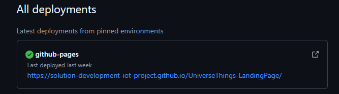
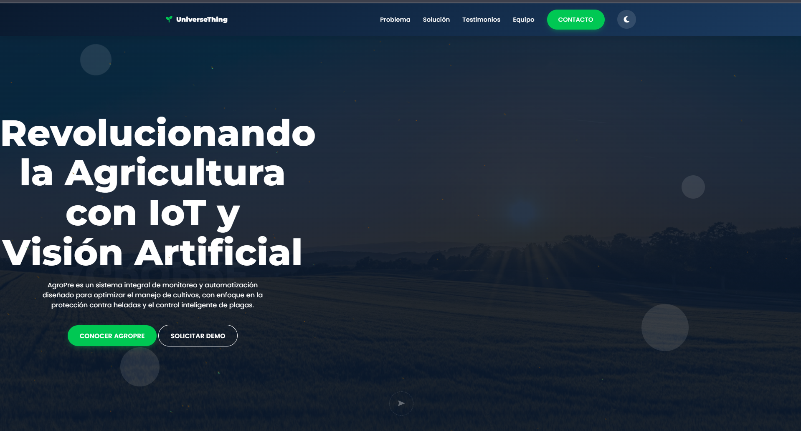
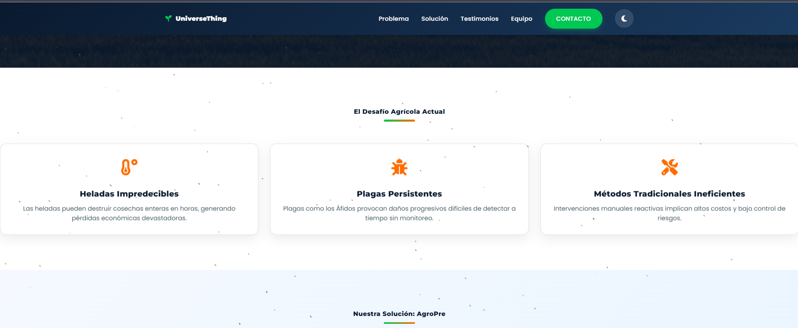

# 
Informe de Trabajo Final

<h3 align="center"> Universidad Peruana de Ciencias Aplicadas </h3>

<h3 align="center"> Ingeniería de Software </h3>

<h3 align="center">Ciclo 2025 - 2</h3>

  

<h1 align="center"> TB1 Report </h1>

<h3 align="center"> Docente: Marco Antonio Leon Baca </h3>

<h3 align="center"> 1ASI0572 - Desarrollo de Soluciones IoT </h3>

<h4 align="center"> NRC: 3414 </h4>

<h3> Startup: UniverseThings </h3>

<h3> Product: AgroProtect </h3>

<h3> Team Members: </h3>

| Member                              |    Code    |
| :---------------------------------- | :--------: |
| Cipriano Chumbes, Bruce Andres      | U20211D640 |
| Loarte Matos, Anthony Brahan        | U20211D563 |
| Riega Salas, Jose Miguel            | U20211D640 |
| Ruiz Torres, Erick Hernan           | U202118946 |
| Quispe Tipo, Godofredo              | U202120772 |

<h3 align="center">Septiembre, 2025</h3>

  

# Registro de Versiones del Informe

Esta sección tiene como propósito detallar las actualizaciones significativas realizadas al informe durante su evolución. Se presenta en una página independiente y se organiza en un cuadro con el formato que se muestra a continuación.

<table align="center">
  <thead>
    <tr>
      <th>Versión</th>
      <th>Fecha</th>
      <th>Autor</th>
      <th>Descripción de modificación</th>
    </tr>
  </thead>
  <tbody>
  <!-- TB1 -->
    <tr>
      <td rowspan="7">TB1</td>
      <td rowspan="7">16/09/2025</td>
    </tr>
    <tr>
      <td>Cipriano Chumbes, Bruce Andres</td>
      <td>xxx xxx xxx xxx xxx xxx 
      </td>
    <tr>
      <td>Loarte Matos, Anthony Brahan</td>
      <td>xxx xxx xxx xxx xxx xxx 
      </td>
    </tr>
    <tr>
      <td>Riega Salas, Jose Miguel</td>
      <td>xxx xxx xxx xxx xxx xxx 
      </td>
    </tr>
        <tr>
      <td>Ruiz Torres, Erick Hernan</td>
      <td>xxx xxx xxx xxx xxx xxx 
      </td>
    </tr>
        <tr>
      <td>Quispe Tipo, Godofredo</td>
      <td>xxx xxx xxx xxx xxx xxx 
      </td>
    </tr>
  <!-- Otras entrega -->
  </tbody>
</table>

  

# Project Report Collaboration Insights
- Link de la organización: https://github.com/Solution-Development-IOT-Project
- Link del reporte: https://github.com/Solution-Development-IOT-Project/UniverseThing-Report
  

# Contenido

## Tabla de Contenidos

### [Registro de versiones del informe](#registro-de-versiones-del-informe)

### [Project Report Collaboration Insights](#project-report-collaboration-insights)

### [Contenido](#contenido)

### [Student Outcome](#student-outcome-1)

### [Capítulo I: Introducción](#capítulo-i-introducción-1)

- [1.1. Startup Profile](#11-startup-profile)
  - [1.1.1. Descripción de la Startup](#111-descripción-de-la-startup)
  - [1.1.2. Perfiles de integrantes del equipo](#112-perfiles-de-integrantes-del-equipo)
- [1.2. Solution Profile](#12-solution-profile)
  - [1.2.1 Antecedentes y problemática](#121-antecedentes-y-problemática)
  - [1.2.2 Lean UX Process](#122-lean-ux-process)
    - [1.2.2.1. Lean UX Problem Statements](#1221-lean-ux-problem-statements)
    - [1.2.2.2. Lean UX Assumptions](#1222-lean-ux-assumptions)
    - [1.2.2.3. Lean UX Hypothesis Statements](#1223-lean-ux-hyphotesis-statements)
    - [1.2.2.4. Lean UX Canvas](#1224-lean-ux-canvas)
- [1.3. Segmentos objetivo](#13-segmentos-objetivo)

### [Capítulo II: Requirements Elicitation & Analysis](#capítulo-ii-requirements-elicitation--analysis-1)

- [2.1. Competidores](#21-competidores)
  - [2.1.1. Análisis competitivo](#211-análisis-competitivo)
  - [2.1.2. Estrategias y tácticas frente a competidores](#212-estrategias-y-tácticas-frente-a-competidores)
- [2.2. Entrevistas](#22-entrevistas)
  - [2.2.1. Diseño de entrevistas](#221-diseño-de-entrevistas)
  - [2.2.2. Registro de entrevistas](#222-registro-de-entrevistas)
  - [2.2.3. Análisis de entrevistas](#223-análisis-de-entrevistas)
- [2.3. Needfinding](#23-needfinding)
  - [2.3.1. User Personas](#231-user-personas)
  - [2.3.2. User Task Matrix](#232-user-task-matrix)
  - [2.3.3. User Journey Mapping](#233-user-journey-mapping)
  - [2.3.4. Empathy Mapping](#234-empathy-mapping)
  - [2.3.5. As-is Scenario Mapping](#235-as-is-scenario-mapping)
- [2.4. Ubiquitous Language](#24-ubiquitous-language)

### [Capítulo III: Requirements Specification](#capítulo-iii-requirements-specification-1)

- [3.1. To-Be Scenario Mapping](#31-to-be-scenario-mapping)
- [3.2. User Stories](#32-user-stories)
- [3.3. Impact mapping](#33-impact-mapping)
- [3.4. Product Backlog](#34-product-backlog)

### [Capítulo IV: Solutions Software Design](#capítulo-iv-solution-software-design)

- [4.1. Strategic-Level Domain-Driven Design](#41-strategic-level-domain-driven-design)
  - [4.1.1. EventStorming](#411-eventstorming)
    - [4.1.1.1. Candidate Context Discovery](#4111-candidate-context-discovery)
    - [4.1.1.2. Domain Message Flows Modeling](#4112-domain-message-flows-modeling)
    - [4.1.1.3. Bounded COntext Canvases](#4113-bounded-context-canvases)
  - [4.1.2. Context Mapping](#412-context-mapping)
  - [4.1.3. Software Architecture](#413-software-architecture)
    - [4.1.3.1. Software Architecture System Landscape Diagram](#4131-software-architecture-system-landscape-diagram)
    - [4.1.3.2. Software Architecture Context Level Diagrams](#4132-software-architecture-context-level-diagrams)
    - [4.1.3.3. Software Architecture Container Level Diagrams](#4133-software-architecture-container-level-diagrams)
    - [4.1.3.4. Software Architecture Deployment Diagrams](#4134-software-architecture-deployment-diagrams)
- [4.2. Tactical-Level Domain-Driven Design](#42-tactical-level-domain-driven-design)
  - [4.2.X. Bounded Context: <Bounded Context name>](#42x-bounded-context)
    - [4.2.X.1. Domain Layer](#42x1-domain-layer)
    - [4.2.X.2. Interface Layer](#42x2-interface-context)
    - [4.2.X.3. Application Layer](#42x3-application-context)
    - [4.2.X.4. Infrastructure Layer](#42x4-infrastructure-context)
    - [4.2.X.5. Bounded Context Software Architecture Component Level Diagrams](#42x5-bounded-context-software-architecture-component-level-diagrams)
    - [4.2.X.6. Bounded Context Software Architecture Code Level Diagrams](#42x6-bounded-context-software-architecture-code-level-diagrams)
      - [4.2.X.6.1. Bounded Context Domain Layer Class Diagrams](#42x61-bounded-context-domain-layer-class-diagrams)
      - [4.2.X.6.2. Bounded Context Database Design Diagram](#42x62-bounded-context-database-design-diagram)

### [Capítulo V: Solution UI/UX Design](#capítulo-v-solutions-uiux-design)

- [5.1. Style Guidelines](#51-style-guidelines)
  - [5.1.1. General Style Guidelines](#511-general-style-guidelines)
  - [5.1.2. Web, Mobile and IoT Style Guidelines](#512-web-mobile-and-iot-style-guidelines)
- [5.2. Information Architecture](#52-information-architecture)
  - [5.2.1. Organization Systems](#521-organization-systems)
  - [5.2.2. Labeling Systems](#522-labeling-systems)
  - [5.2.3. SEO Tags and Meta Tags](#523-seo-tags-and-meta-tags)
  - [5.2.4. Searching Systems](#524-searching-systems)
  - [5.2.5. Navigation Systems](#525-navigation-systems)
- [5.3. Landing Page UI Design](#53-landing-page-ui-design)
  - [5.3.1. Landing Page Wireframe](#531-landing-page-wireframe)
  - [5.3.2. Landing Page Mock-up](#532-landing-page-mock-up)
- [5.4. Applications UX/UI Design](#54-web-applications-uxui-design)
  - [5.4.1. Applications Wireframes](#541-web-applications-wireframes)
  - [5.4.2. Applications Wireflow Diagrams](#542-web-applications-wireflow-diagrams)
  - [5.4.3. Applications Mock-ups](#543-web-applications-mock-ups)
  - [5.4.4. Applications User Flow Diagrams](#544-web-applications-user-flow-diagrams)
- [5.5. Aplications Prototyping](#55-applications-prototyping)

### [Capítulo VI: Product Implementation, Validation \& Deployment](#capítulo-vi-product-implementation-validation--deployment)

- [6.1. Software Configuration Management](#61-software-configuration-management)
  - [6.1.1. Software Development Environment Configuration](#611-software-development-environment-configuration)
  - [6.1.2. Source Code Management](#612-source-code-management)
  - [6.1.3. Source Code Style Guide \& Conventions](#613-source-code-style-guide--conventions)
  - [6.1.4. Software Deployment Configuration](#614-software-deployment-configuration)
- [6.2. Landing Page, Services \& Applications Implementation](#62-landing-page-services--applications-implementation)
  - [6.2.X. Sprint X](#62x-sprint-n)
    - [6.2.X.1. Sprint Planning 1](#62x1-sprint-planning-n)
    - [6.2.X.2. Sprint Backlog 1](#62x2-sprint-backlog-n)
    - [6.2.X.3. Development Evidence for Sprint Review](#62x3-development-evidence-for-sprint-review)
    - [6.2.X.4. Testing Suite Evidence for Sprint Review](#62x4-testing-suite-evidence-for-sprint-review)
    - [6.2.X.5. Execution Evidence for Sprint Review](#62x5-execution-evidence-for-sprint-review)
    - [6.2.X.6. Services Documentation Evidence for Sprint Review](#62x6-services-documentation-evidence-for-sprint-review)
    - [6.2.X.7. Software Deployment Evidence for Sprint Review](#62x7-software-deployment-evidence-for-sprint-review)
    - [6.2.X.8. Team Collaboration Insights during Sprint](#62x8-team-collaboration-insights-during-sprint)
- [6.3. Validation Interviews](#63-validation-interviews)
  - [6.3.1. Diseño de Entrevistas](#631-diseño-de-entrevistas)
  - [6.3.2. Registro de Entrevistas](#632-registro-de-entrevistas)
  - [6.3.3. Evaluaciones según heurísticas](#633-evaluaciones-según-heurísticas)
- [6.4. Video About-the-Product](#64-video-about-the-product)

### [Conclusiones](#conclusiones-1)

- [Conclusiones y recomendaciones](#conclusiones-y-recomendaciones)
- [Video About-the-Team](#video-about-the-team)

### [Bibliografía](#bibliografía-1)

### [Anexos](#anexos-1)

  

# Student Outcome

<b>ABET – EAC - Student Outcome 5:</b> La capacidad de funcionar efectivamente en un equipo cuyos miembros juntos proporcionan liderazgo, crean un entorno de colaboración e inclusivo, establecen objetivos, planifican tareas y cumplen objetivos.

<table align="center">
  <thead>
    <tr>
      <th>Criterio específico</th>
      <th>Acciones realizadas</th>
      <th>Conclusiones</th>
    </tr>
  </thead>
  <tbody>
    <!-- Criterio 1 -->
    <tr>
      <td rowspan="1">
        Trabaja en equipo para proporcionar liderazgo en forma conjunta
      </td>
      <!-- TB1 -->
      <td>
        <table>
          <tr>
            <td rowspan="7"><b>TB1</b></td>
          </tr>
        <!-- Estudiantes -->
          <tr>
            <td align="justify">
              <b>Cipriano Chumbes, Bruce Andres:</b> 
              XXXXX
            </td>
          </tr>
          <tr>
            <td align="justify">
              <b>Loarte Matos, Anthony Brahan</b> 
              XXXXX
            </td>
          </tr>
          <tr>
            <td align="justify">
              <b>Riega Salas, Jose Miguel:</b> 
              XXXXX
            </td>
          </tr>
          <tr>
            <td align="justify">
              <b>Ruiz Torres, Erick Hernan:</b> 
              XXXXX
            </td>
          </tr>
          <tr>
            <td align="justify">
                <b>Quispe Tipo, Godofredo:</b> 
              XXXXX
            </td>
          </tr>
        </table>
      </td>
      <!-- Conclusion TB1 -->
      <td rowspan="1" align="justify">
        XXXXX  
      </td>
    </tr>
    <!-- Criterio 2 -->
    <tr>
      <td rowspan="1" >
        Crea un entorno colaborativo e inclusivo, establece metas, planifica tareas y cumple objetivos.
      </td>
      <!-- TB1 -->
      <td>
        <table>
          <tr>
            <td rowspan="7"><b>TB1</b></td>
          </tr>
        <!-- Estudiantes -->
          <tr>
            <td align="justify">
              <b>Cipriano Chumbes, Bruce Andres:</b> 
              XXXXX
            </td>
          </tr>
          <tr>
            <td align="justify">
              <b>Loarte Matos, Anthony Brahan</b> 
              XXXXX
            </td>
          </tr>
          <tr>
            <td align="justify">
              <b>Riega Salas, Jose Miguel:</b> 
              XXXXX
            </td>
          </tr>
          <tr>
            <td align="justify">
              <b>Ruiz Torres, Erick Hernan:</b> 
              XXXXX
            </td>
          </tr>
          <tr>
            <td align="justify">
                <b>Quispe Tipo, Godofredo:</b> 
              XXXXX
            </td>
          </tr>
        </table>
      </td>
      <!-- Conclusion TB1 -->
      <td rowspan="1" align="justify">
        XXXXX
      </td>
    </tr>
  </tbody>
</table>

  

# Capítulo I: Introducción

## 1.1. StartUp Profile

### 1.1.1. Descripción de la StartUp

### 1.1.2. Perfiles de integrantes del equipo

<table>
  <thead>
    <tr>
      <th>Foto</th>
      <th>Apellidos y Nombres</th>
      <th>Código</th>
      <th>Carrera</th>
      <th>Conocimientos y contribución principal</th>
    </tr>
  </thead>
  <tbody>
    <tr>
      <td></td>
      <td><b>Cipriano Chumbes, Bruce Andres</b></td>
      <td>U20211D640</td>
      <td>Ingeniería de Software</td>
      <td>
         xxxxx
      </td>
    </tr>
    <tr>
      <td></td>
      <td><b>Loarte Matos, Anthony Brahan</b></td>
      <td>U20211D563</td>
      <td>Ingeniería de Software</td>
      <td>
         xxxxx
      </td>
    </tr>
    <tr>
      <td></td>
      <td><b>Riega Salas, Jose Miguel</b></td>
      <td>U20211640</td>
      <td>Ingeniería de Software</td>
      <td>
         xxxxx
      </td>
    </tr>
    <tr>
      <td></td>
      <td><b>Ruiz Torres, Erick Hernan</b></td>
      <td>U202118946</td>
      <td>Ingeniería de Software</td>
      <td>
         xxxxx
      </td>
    </tr>
    <tr>
      <td></td>
      <td><b>Quispe Tipo, Godofredo</b></td>
      <td>U202120772</td>
      <td>Ingeniería de Software</td>
      <td>
         xxxxx
      </td>
    </tr>
  </tbody>
</table>
## 1.2. Solution Profile

### 1.2.1. Antecedentes y problemática

### 1.2.2. Lean UX Process

#### 1.2.2.1. Lean UX Problem Statements

#### 1.2.2.2. Lean UX Assumptions

#### 1.2.2.3. Lean UX Hyphotesis Statements

#### 1.2.2.4. Lean UX Canvas

## 1.3. Segmentos objetivo

# Capítulo II: Requirements Elicitation & Analysis

## 2.1. Competidores

### 2.1.1. Análisis competitivo

### 2.1.2. Estrategias y tácticas frente a competidores

## 2.2. Entrevistas

### 2.2.1. Diseño de entrevistas

### 2.2.2. Registro de entrevistas

### 2.2.3. Análisis de entrevistas

## 2.3. Needfinding

### 2.3.1. User Personas

### 2.3.2. User Task Matrix

### 2.3.3. User Journey Mapping

### 2.3.4. Empathy Mapping

### 2.3.5. As-Is Scenario Mapping

## 2.4. Ubiquitous Language

# Capítulo III: Requirements Specification

## 3.1. To-Be Scenario Mapping

## 3.2. User Stories

<table align=center">
  <thead align="center">
    <tr>
      <th>Epic/User Story ID</th>
      <th>Título</th>
      <th>Descripción</th>
      <th>Criterios de Aceptación</th>
      <th>Relación (EPIC ID)</th>
    </tr>
  </thead>
  <tbody align="center">
    <!-- EP-01 -->
    <tr style="background-color:#F3F8FF; border-left:6px solid #2563EB;">
      <td><strong>EP-01</strong></td>
      <td><strong>XXXXX</strong></td>
      <td align="justify">
        <strong>Como</strong> XXXXX <strong>quiero</strong> XXXXX
        <strong>para</strong>XXXXX
      </td>
      <td align="justify">
        <strong>Escenario 1: XXXXX</strong> 
        <strong>Dado</strong> XXXXX 
        <strong>Cuando</strong> XXXXX 
        <strong>Entonces</strong> XXXXX
      </td>
      <td>–</td>
    </tr>
    <!-- HU-01 -->
    <tr>
      <td><strong>HU-01</strong></td>
      <td>XXXXX</td>
      <td align="justify">
        <strong>Como</strong>XXXXX <strong>quiero</strong>XXXXX
        <strong>para</strong>XXXXX
      </td>
      <td align="justify">
        <strong>Escenario 1: XXXXX</strong> 
        <strong>Dado</strong> XXXXX  
        <strong>Cuando</strong> XXXXX 
        <strong>Entonces</strong> XXXXX
          
        <strong>Escenario 2: XXXXX</strong> 
        <strong>Dado</strong> XXXXX  
        <strong>Cuando</strong> XXXXX 
        <strong>Entonces</strong> XXXXX.
      </td>
      <td>EP-01</td>
    </tr>
    <!-- HU-02 -->
    <tr>
      <td><strong>HU-02</strong></td>
      <td>XXXXX</td>
      <td align="justify">
        <strong>Como</strong>XXXXX <strong>quiero</strong>XXXXX
        <strong>para</strong>XXXXX
      </td>
      <td align="justify">
        <strong>Escenario 1: XXXXX</strong> 
        <strong>Dado</strong> XXXXX  
        <strong>Cuando</strong> XXXXX 
        <strong>Entonces</strong> XXXXX
          
        <strong>Escenario 2: XXXXX</strong> 
        <strong>Dado</strong> XXXXX  
        <strong>Cuando</strong> XXXXX 
        <strong>Entonces</strong> XXXXX.
      </td>
      <td>EP-01</td>
    </tr>
    <!-- HU-03 -->
    <tr>
      <td><strong>HU-03</strong></td>
      <td>XXXXX</td>
      <td align="justify">
        <strong>Como</strong>XXXXX <strong>quiero</strong>XXXXX
        <strong>para</strong>XXXXX
      </td>
      <td align="justify">
        <strong>Escenario 1: XXXXX</strong> 
        <strong>Dado</strong> XXXXX  
        <strong>Cuando</strong> XXXXX 
        <strong>Entonces</strong> XXXXX
          
        <strong>Escenario 2: XXXXX</strong> 
        <strong>Dado</strong> XXXXX  
        <strong>Cuando</strong> XXXXX 
        <strong>Entonces</strong> XXXXX.
      </td>
      <td>EP-01</td>
    </tr>
    <!-- HU-04 -->
    <tr>
      <td><strong>HU-04</strong></td>
      <td>XXXXX</td>
      <td align="justify">
        <strong>Como</strong>XXXXX <strong>quiero</strong>XXXXX
        <strong>para</strong>XXXXX
      </td>
      <td align="justify">
        <strong>Escenario 1: XXXXX</strong> 
        <strong>Dado</strong> XXXXX  
        <strong>Cuando</strong> XXXXX 
        <strong>Entonces</strong> XXXXX
          
        <strong>Escenario 2: XXXXX</strong> 
        <strong>Dado</strong> XXXXX  
        <strong>Cuando</strong> XXXXX 
        <strong>Entonces</strong> XXXXX.
      </td>
      <td>EP-01</td>
    </tr>
    <!-- HU-05 -->
    <tr>
      <td><strong>HU-05</strong></td>
      <td>XXXXX</td>
      <td align="justify">
        <strong>Como</strong>XXXXX <strong>quiero</strong>XXXXX
        <strong>para</strong>XXXXX
      </td>
      <td align="justify">
        <strong>Escenario 1: XXXXX</strong> 
        <strong>Dado</strong> XXXXX  
        <strong>Cuando</strong> XXXXX 
        <strong>Entonces</strong> XXXXX
          
        <strong>Escenario 2: XXXXX</strong> 
        <strong>Dado</strong> XXXXX  
        <strong>Cuando</strong> XXXXX 
        <strong>Entonces</strong> XXXXX.
      </td>
      <td>EP-01</td>
    </tr>
    <!-- EHU-06 -->
    <tr>
      <td><strong>HU-06</strong></td>
      <td>XXXXX</td>
      <td align="justify">
        <strong>Como</strong>XXXXX <strong>quiero</strong>XXXXX
        <strong>para</strong>XXXXX
      </td>
      <td align="justify">
        <strong>Escenario 1: XXXXX</strong> 
        <strong>Dado</strong> XXXXX  
        <strong>Cuando</strong> XXXXX 
        <strong>Entonces</strong> XXXXX
          
        <strong>Escenario 2: XXXXX</strong> 
        <strong>Dado</strong> XXXXX  
        <strong>Cuando</strong> XXXXX 
        <strong>Entonces</strong> XXXXX.
      </td>
      <td>EP-01</td>
    </tr>
  </tbody>
</table>

## 3.3. Impact mapping

## 3.4. Product Backlog

<table align="center" width="100%" cellspacing="0" cellpadding="6" style="border-collapse:collapse;">
  <thead align="center" style="background:#F8FAFC;">
    <tr>
      <th># Orden</th>
      <th>User Story Id</th>
      <th>Título</th>
      <th>Descripción</th>
      <th>Story Points</th>
    </tr>
  </thead>
  <tbody>
    <tr style="text-align:center;">
      <td>1</td>
      <td>HU-01</td>
      <td>XXXXX</td>
      <td align="justify">XXXXX</td>
      <td>2</td>
    </tr>
    <tr style="text-align:center;">
      <td>2</td>
      <td>HU-02</td>
      <td>XXXXX</td>
      <td align="justify">XXXXX</td>
      <td>2</td>
    </tr>
    <tr style="text-align:center;">
      <td>3</td>
      <td>HU-04</td>
      <td>XXXXX</td>
      <td align="justify">XXXXX</td>
      <td>3</td>
    </tr>
    <tr style="text-align:center;">
      <td>4</td>
      <td>HU-05</td>
      <td>XXXXX</td>
      <td align="justify">XXXXX</td>
      <td>3</td>
    </tr>
    <tr style="text-align:center;">
      <td>5</td>
      <td>HU-03</td>
      <td>XXXXX</td>
      <td align="justify">XXXXX</td>
      <td>1</td>
    </tr>
    <tr style="text-align:center;">
      <td>6</td>
      <td>HU-06</td>
      <td>XXXXX</td>
      <td align="justify">XXXXX</td>
      <td>5</td>
    </tr>
  </tbody>
</table>
  

# Capítulo IV: Solution Software Design

## 4.1. Strategic-Level Domain-Driven Design

### 4.1.1. EventStorming

#### 4.1.1.1. Candidate Context Discovery

#### 4.1.1.2. Domain Message Flows Modeling

#### 4.1.1.3. Bounded Context Canvases

### 4.1.2 Context mapping

### 4.1.3. Software Architecture

#### 4.1.3.1. Software Architecture System Landscape Diagram

#### 4.1.3.2. Software Architecture Context Level Diagrams

#### 4.1.3.3. Software Architecture Container Level Diagrams

#### 4.1.3.4. Software Architecture Deployment Diagrams

## 4.2. Tactical-Level Domain-Driven Design

### 4.2.X. Bounded Context:

#### 4.2.X.1. Domain Layer

#### 4.2.X.2. Interface Context

#### 4.2.X.3. Application Context

#### 4.2.X.4. Infrastructure Context

#### 4.2.X.5. Bounded Context Software Architecture Component Level Diagrams

#### 4.2.X.6. Bounded Context Software Architecture Code Level Diagrams

#### 4.2.X.6.1. Bounded Context Domain Layer Class Diagrams

#### 4.2.X.6.2. Bounded Context Database Design Diagram

# Capítulo V: Solutions UI/UX Design

## 5.1. Style Guidelines

### 5.1.1. General Style Guidelines

### 5.1.2. Web, Mobile and IoT Style Guidelines

## 5.2. Information Architecture

### 5.2.1. Organization Systems

### 5.2.2. Labeling Systems

### 5.2.3. SEO Tags and Meta Tags

### 5.2.4. Searching Systems

### 5.2.5. Navigation Systems

## 5.3. Landing Page UI Design

### 5.3.1. Landing Page Wireframe

### 5.3.2. Landing Page Mock-up

## 5.4. Application UX/UI Design

### 5.4.1. Applications Wireframes

### 5.4.2. Applications Wireflow Diagrams

### 5.4.3. Applications Mock-ups

### 5.4.4. Applications User Flow Diagrams

## 5.5. Applications Prototyping

# Capítulo VI: Product Implementation, Validation & Deployment

## 6.1. Software Configuration Management

En esta sección se establece el proceso de implementación, comprobación, despliegue y validación de nuestra solución compuesta por los productos digitales que forman parte del alcance nuestra solución. Este capítulo abarca secciones para la organización del proceso de trabajo en Sprints, la descripción de las prácticas asociadas, evidencias de implementación y la colaboración por Sprint.

### 6.1.1. Software Development Environment Configuration

A continuación se especifica cada uno de los productos de software, que utilizamos para colaborar en el ciclo de vida y desarrollo de los productos para nuestra solución, considerandotodas las herramientas utilizadas en la documentación, especificación de nuestra solución y desarrollo de software, respetando las restricciones indicadas sobre los productos de software y herramientas que debemos utilizar.

#### Project Management

| Producto de Software | Descripción                                                                                                         | Ruta de referencia o de descarga      |
|----------------------|---------------------------------------------------------------------------------------------------------------------|---------------------------------------|
| Trello               | Para el control del proyecto, asignación de tareas y actividades de cada integrante del equipo en base a User Stories. | https://www.trello.com/               |
| Google Meet          | Plataforma virtual para realizar reuniones del grupo para coordinar y asignar actividades.                          | https://meet.google.com               |

#### Requirements Management

| Producto de Software | Descripción                                                                 | Ruta de referencia o de descarga |
|----------------------|-----------------------------------------------------------------------------|----------------------------------|
| UXPressia            | Elaboración de User Personas, Empathy Maps, Journey Maps e Impact Maps.     | https://uxpressia.com/           |
| Miro                 | Elaboración de As-Is y To-Be Scenario Maps.                                 | https://miro.com/                |

#### Product UX/UI Design

| Producto de Software | Descripción                                 | Ruta de referencia o de descarga |
|----------------------|---------------------------------------------|----------------------------------|
| Figma                | Elaboración de Wireframes, Mock-ups y Prototypes. | https://www.figma.com            |

#### Software Development

| Producto de Software | Descripción                                                                                           | Ruta de referencia o de descarga              |
|----------------------|-------------------------------------------------------------------------------------------------------|-----------------------------------------------|
| IntelliJ IDEA        | Entorno de Desarrollo Integrado (IDE) para codificación y desarrollo del lado Backend de la solución. | https://www.jetbrains.com/idea/               |
| Android Studio       | Entorno de Desarrollo Integrado (IDE) para codificación y desarrollo de la aplicación móvil.          | https://developer.android.com/studio          |
| GIT                  | Almacenamiento y control de versiones de código.                                                      | https://git-scm.com                           |
| GitHub               | Gestión de GIT en un repositorio común.                                                               | https://github.com                            |

---

### 6.1.2. Source Code Management

Para el seguimiento de modificaciones en el desarrollo de nuestra solución, utilizamos la plataforma **GitHub** para alojar tanto la documentación como el código de nuestros productos de software. Esta plataforma nos permite realizar seguimiento de las modificaciones en cada parte de los productos desarrollados y también la utilizaremos como sistema de control de versiones. Para asegurar que todo el equipo pueda acceder a la plataforma y que los repositorios que alojarán diferentes partes de nuestra solución sean accesibles por una misma ruta, hemos creado una **organización** en GitHub con el nombre de nuestro producto.

### Organización

| Organización            | URL                                      |
|-------------------------|-------------------------------------------|
| Solution-Development-IOT-Project   | [Solution-Development-IOT-Project ](https://github.com/Solution-Development-IOT-Project)  |

Dentro de nuestra organización en GitHub se encuentran los **repositorios** correspondientes a cada uno de los productos a desarrollar.

### Repositorios por Producto

| Producto                       | URL del Repositorio                                                                 |
|--------------------------------|--------------------------------------------------------------------------------------|
| Landing Page                   | [Solution-Development-IOT-Project-Landing-Page ](https://github.com/Solution-Development-IOT-Project/UniverseThings-LandingPage)                   |
| Backend                        | [Solution-Development-IOT-Project/Backend  ](https://github.com/Solution-Development-IOT-Project/UniverseThings-Backend)                                   |
| Mobile Application             | [hSolution-Development-IOT-Project/mobile  ](https://github.com/Solution-Development-IOT-Project/UniverseThings-Mobile-App)                   |
| Frontend                       | [Solution-Development-IOT-Project-Application-Frontend](https://github.com/Solution-Development-IOT-Project/UniverseThings-Frontend)             |

### Implementación de GitFlow

Para el desarrollo del proyecto, implementaremos **GitFlow** propuesto por Vincent Driessen (“A successful Git branching model”) y lo aplicaremos en todos los repositorios que integran la solución. Para implementar GitFlow, crearemos las siguientes ramas de trabajo en cada repositorio:

| Rama        | Propósito (resumen)                               |
|-------------|----------------------------------------------------|
| `main`      | Línea estable de producción                        |
| `develop`   | Integración de nuevas funcionalidades              |
| `feature/*` | Desarrollo de características aisladas             |
| `release/*` | Preparación de versiones de lanzamiento            |
| `hotfix/*`  | Correcciones críticas sobre producción             |

### Convenciones de Mensajes de Commit (Conventional Commits)

Aplicaremos **Conventional Commits** para los textos de cada commit en todas las ramas de los repositorios. Esto proporciona un conjunto de reglas para crear un historial de commits que describa de manera clara las características, correcciones y cambios importantes realizados.

**Estructura general del mensaje de commit:**

| Elemento | Descripción                                                                 |
|----------|------------------------------------------------------------------------------|
| `type`   | Tipo de cambio (por ejemplo: `feat`, `fix`, `docs`, `style`, `refactor`, …) |
| `scope`  | (Opcional) Alcance del cambio                                               |
| `subject`| Descripción breve del cambio                                                |

**Tipos usados (ejemplos):**

| Tipo       | Uso                                                                 |
|------------|---------------------------------------------------------------------|
| `fix`      | Indica una corrección en el código base                             |
| `feat`     | Introduce una nueva característica                                  |
| `build`    | Cambios que afectan el sistema de build                             |
| `chore`    | Tareas varias (sin afectar código de producción)                    |
| `ci`       | Cambios de configuración de integración continua                    |
| `docs`     | Cambios en documentación                                            |
| `style`    | Formato y estilos (sin cambiar comportamiento)                      |
| `refactor` | Reestructuración sin cambios funcionales                            |
| `perf`     | Mejoras de rendimiento                                              |
| `test`     | Agrega o corrige pruebas                                            |

 
### 6.1.3. Source Code Style Guide & Conventions

Para el desarrollo de nuestra propuesta de solución, el equipo utilizará las convenciones estándar para cada lenguaje durante todo el ciclo de vida del proyecto y en todos los repositorios de trabajo. A continuación, se presentan las referencias para la nomenclatura de los elementos en cada lenguaje, procurando utilizar nomenclatura en inglés y seguir buenas prácticas de programación.

| Lenguaje   | Referencias y Convenciones |
|------------|----------------------------|
| **HTML**   | - Utilizar la estructura de documento propia de HTML, especificando el `<!DOCTYPE html>`. - Cerrar siempre las etiquetas de autocierre con `/>`. - Utilizar minúsculas (“lowercase”) para los nombres de las etiquetas y atributos. - Incluir atributos `alt` en las imágenes para describir su contenido. - Mantener una indentación consistente en el código. |
| **CSS**    | - Utilizar unidades relativas para definir el tamaño de las imágenes. - Separar las palabras con guiones en lugar de espacios o subrayados. - Preferir el uso de propiedades abreviadas cuando sea posible. - Emplear nombres descriptivos para las clases y los identificadores. |
| **JavaScript** | - Documentar el código de manera descriptiva. - Utilizar nombres descriptivos para variables y funciones. - Organizar el código en módulos y componentes. |
| **Java**   | - Las clases e interfaces deben nombrarse con sustantivos en *CamelCase*. - Organizar el código en módulos y componentes. - Limitar la longitud de los métodos para que realicen una única función clara. - Manejar adecuadamente las excepciones con mensajes o acciones concretas. |
| **Kotlin** | - Los nombres de funciones, propiedades y variables locales deben comenzar con una letra minúscula (salvo funciones de fábrica). - Los nombres de las clases deben ser frases nominales que expliquen su contexto. - Evitar la creación de objetos innecesarios. - Utilizar `lazy` para posponer la inicialización de propiedades hasta que sea necesaria. - Los nombres de los paquetes deben escribirse en minúsculas, sin guiones bajos ni concatenar palabras usando *CamelCase*. |
| **Gherkin**| - Usar la estructura **Given / When / Then / And** para escribir casos de prueba. - Uso de archivos `.feature` para cada caso de prueba. - Utilizar un **Feature** por funcionalidad del sistema. - Describir escenarios de forma clara. |

### 6.1.4. Software Deployment Configuration

A continuación se detalla la configuración necesaria para el despliegue de cada producto digital desarrollado. Asimismo, se incluyen los pasos requeridos para llevar a cabo el despliegue y la publicación, partiendo desde los repositorios de código fuente alojados en nuestra organización en la plataforma GitHub.

#### Landing Page

**Requisitos para realizar el despliegue**
- Repositorio en la plataforma GitHub  
- Tener todos los permisos necesarios para modificar el repositorio  
- Archivos con el código fuente de la Landing Page

**Resultado del despliegue**

---

## 6.2. Landing Page, Services & Applications Implementation

### 6.2.X. Sprint 1

Se presenta la planificación del primer Sprint realizado por el equipo para el inicio del desarrollo de la solución UniverseThings. 

| Campo                         | Valor                                                                                                   |
|------------------------------|---------------------------------------------------------------------------------------------------------|
| Sprint #                     | Sprint 1                                                                                                |
| Sprint Planning Background   | Primer Sprint; no hay información previa.                                                               |
| Date                         | 2025-10-2                                                                                              |
| Time                         | 08:00 PM                                                                                                |
| Location                     | Reunión virtual (Meet)                                                                                  |
| Prepared By                  | Quispe Tipo, Godofredo / Riega Salas Jose Miguel/ Loarte Matos, Anthony Brahan/ Ruiz Torres, Erick Hernan/ Cipriano Chumbes, Bruce Andres|
| Attendees                    | Quispe Tipo, Godofredo / Riega Salas Jose Miguel/ Loarte Matos, Anthony Brahan/ Ruiz Torres, Erick Hernan/ Cipriano Chumbes, Bruce Andres|
| Sprint 1-1 Review Summary    | No se dispone de resúmenes ni resultados previos.                                                       |
| Sprint 1-1 Retrospective     | Se destaca trabajo en equipo, organización y necesidad de investigar desarrollo en Android.             |
| Sprint 1 Goal                | Creación de primera version de la landing page y web app frontend                                                         |
| Hipótesis de Valor           | Generará confianza en los agricultores sobre la solución.                                                |
| Criterio de Confirmación     | Pueden acceder a landing y frontend.                                      |
| Sprint 1 Velocity            | 35 (Story Points aceptados)                                                                             |
| Sum of Story Points          | 35                                                                                                      |

---

### 6.2.1.2. Sprint Backlog 1
| User Story | Work-Item / Task | Título / Descripción (extracto)                                                                                                   | Estimación (h) | Assigned To        | Status     |
|------------|-------------------|----------------------------------------------------------------------------------------------------------------------------------|----------------|--------------------|------------|
| US027       | T01               | Crear barra de navegación — Diseñar e implementar barra con logo y enlaces a secciones clave                                    | 2              | Bruce Cipriano     | Done       |
| US028       | T01               | Agregar información destacada — Misión, objetivo y beneficios en la landing                                                     | 3              | Jose Miguel        | Done       |
| US029       | T01               | Crear footer informativo — Contacto, redes sociales y enlaces legales                                                           | 2              | Jose Miguel        | Done       |
| US016       | T01               | Enviar un mensaje o consulta desde la landing page, para recibir más información sobre el producto.                             | 2              | Brice Cipriano     | Done       |
| US017       | T01               | La landing page debe incluir una sección con al menos 3 testimonios con foto y nombre del agricultor/cooperativa.               | 2              | Godofredo Quispe   | To - do    |
| US018       | T01               | La landing page debe mostrar tabla de precios o paquetes de suscripción, diferenciados por tipo de usuario.                     | 2              | Godofredo Quispe   | In-Process |
| US020       | T01               | El sistema debe permitir la descarga de un PDF con información resumida del dispositivo y su uso.                               | 2              | Anthony loarte     | To - do    |
| US21        | T01               | ofrecer un selector de idioma y traducir todos los textos de la interfaz.                                                       | 3              | Anthony loarte     | Done       |
| US22        | T01               | ofrecer un selector de tema y recordar la preferencia del usuario.                                                              | 2              | Erick Ruiz         | Done       |
| US012       | T01               | Visualización gráfica de datos — Página de gráficos (líneas, barras, calor) con filtros por rango y dispositivo                 | 6              | Erick Ruiz         | To - review    |
| US013       | T01               | Exportación de reportes — Generar y descargar reportes en PDF/XLSX desde la Web App                                             | 4              | Anthony loarte     | To - review   |
| US014       | T01               | Integración vía API — Endpoints seguros para datos históricos y en tiempo real                                                  | 6              | Godofredo Quispe   | In-Process |
| US023       | T01               | Recuperar contraseña — Flujo de “olvidé mi contraseña” vía correo con enlace seguro                                             | 3              | Bruce Cipriano     | Done       |
| US024       | T01               | Notificaciones de mantenimiento — Alerta cuando un sensor no reporta por X días                                                 | 3              | Godofredo Quispe   | To - do |
| US025       | T01               | Historial de notificaciones — Listado con fecha, hora y tipo de evento                                                          | 2              | Jose Miguel        | To - review |
| US026       | T01               | Perfil de usuario editable — Editar nombre, email y organización con validaciones                                               | 3              | Brice Cipriano     | Done       |

---

### 6.2.1.3. Development Evidence for Sprint Review
| Repository                                     | Branch       | Commit Id | Commit Message                               | Committed on |
|-----------------------------------------------|--------------|-----------|----------------------------------------------|--------------|
| 2510-356-Solution-Development-IOT-Project-Landing-Page | main         | 1cc1d96  | initial commit                                | 19/7/2025   |
| 2510-356-Solution-Development-IOT-Projecto-Landing-Page  | develop      | 135ccf8   | feat: tus cambios aquí                       | 1/10/2025   |
| 2510-356-Solution-Development-IOT-Project-Landing-Page  | develop      | 403a699   | feat: tus cambios aquí                     | 1/10/2025   |
| 2510-356-Solution-Development-IOT-Project-Landing-Page | develop      | 90089b1   | fix: descripción corta de lo que cambiaste   | 1/10/2025   |

---

### 6.2.1.5. Execution Evidence for Sprint Review

En esta sección presentamos el resumen de lo alcanzado en este Sprint describiendo la visualización y navegación de las principales vistas implementadas para nuestra solución siendo el primer Sprint y nuestro Producto Backlog y el desarrollo descrito en nuestro Sprint Backlog.

Landing Page:

#### 6.2.1.6. Services Documentation Evidence for Sprint Review.

#### 6.2.1.7. Software Deployment Evidence for Sprint Review.

Durante este Sprint se realizaron procesos de despliegue para los productos correspondientes a nuestra solución como son Landing Page.

Landing Page:

luego de tener la configuración terminada el proyecto deberia aparecer en github pages:

Deployment:

#### 6.2.X.8. Team Collaboration Insights during Sprint.

Analíticos de colaboración y commits realizados en la plataforma GitHub, realizados por los
miembros del equipo en desarrollo de cada producto asociado a nuestra solución:  

Report:

Landing Page:

## 6.3. Validation Interviews.

### 6.3.1. Diseño de Entrevistas.

### 6.3.2. Registro de Entrevistas.

### 6.3.3. Evaluaciones según heurísticas.

## 6.4. Video About-the-Product.

# Conclusiones

## Conclusiones y recomendaciones

## Video About-the-Team

# Bibliografía

# Anexos
