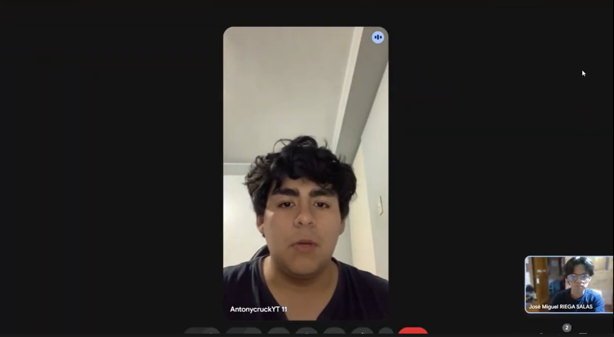
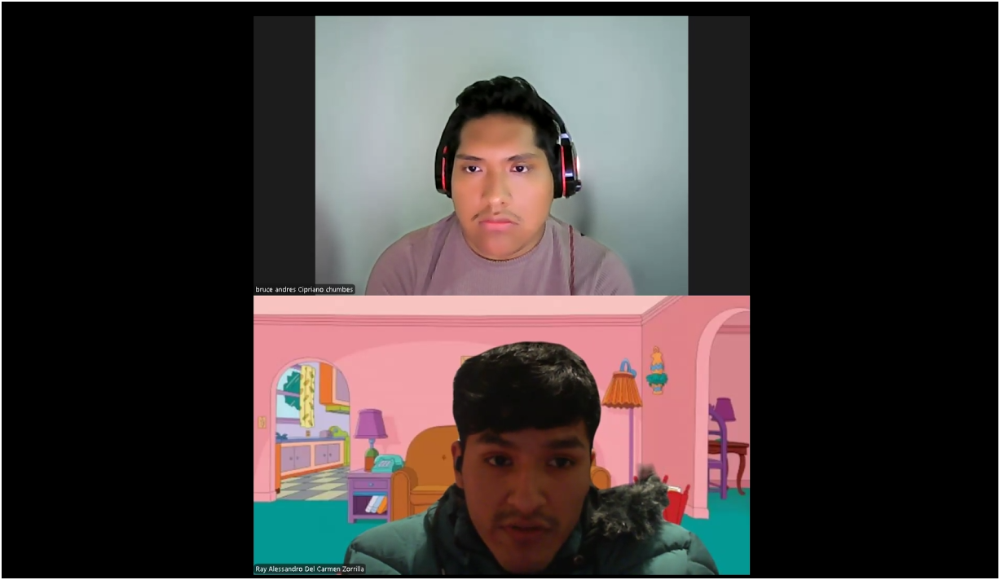
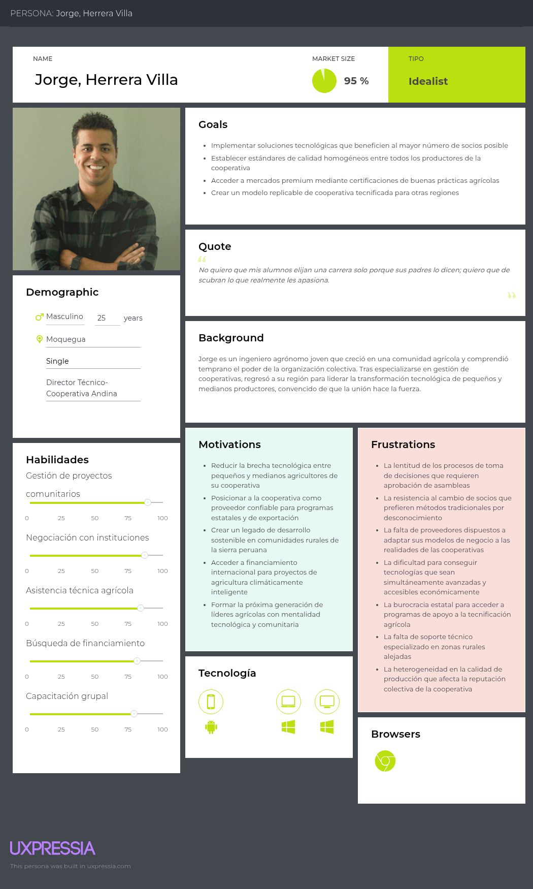
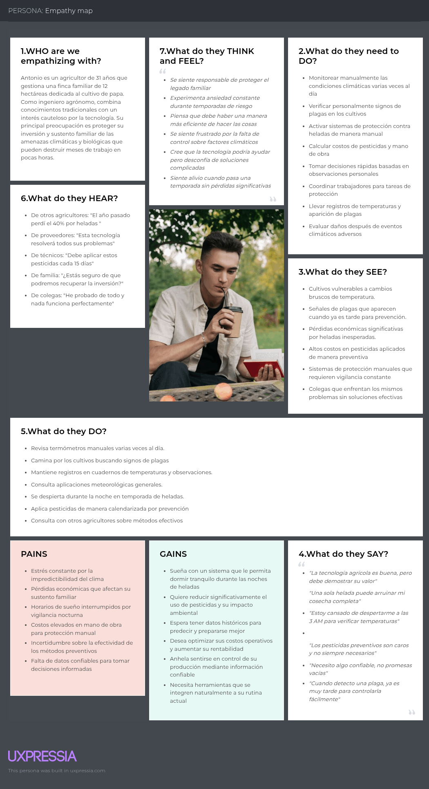

# 
Informe de Trabajo Final

<h3 align="center"> Universidad Peruana de Ciencias Aplicadas </h3>

<h3 align="center"> Ingeniería de Software </h3>

<h3 align="center">Ciclo 2025 - 2</h3>

  

<h1 align="center"> TB1 Report </h1>

<h3 align="center"> Docente: Vera Olivera, David Carlos </h3>

<h3 align="center"> 1ASI0572 - Desarrollo de Soluciones IoT </h3>

<h4 align="center"> NRC: 3355 </h4>

<h3> Startup: UniverseThing </h3>

<h3> Product: AgroPre </h3>

<h3> Team Members: </h3>

| Member                         |    Code    |
|:-------------------------------|:----------:|
| Cipriano Chumbes, Bruce Andres | U20211D640 |
| Loarte Matos, Anthony Brahan   | U20211D563 |
| Riegas Salas, Jose Miguel      | U202211254 |
| Ruiz Torres, Erick Hernan      | U202118946 |
| Quispe Tipo, Godofredo         | U202120772 |

<h3 align="center">Octubre, 2025</h3>

  

### [Registro de versiones del informe](#registro-de-versiones-del-informe)

| Versión |   Fecha    |                                                                                                                                                                                                                                                                                                                                        Descripción                                                                                                                                                                                                                                                                                                                                         |               Autor               |
|:-------:|:----------:|:------------------------------------------------------------------------------------------------------------------------------------------------------------------------------------------------------------------------------------------------------------------------------------------------------------------------------------------------------------------------------------------------------------------------------------------------------------------------------------------------------------------------------------------------------------------------------------------------------------------------------------------------------------------------------------------:|:---------------------------------:|
|   0.1   | 2025-09-18 |                                                                         Desarrollo de los ítems: 1.1. Startup Profile, que incluye los subítems 1.1.1. Descripción de la Startup y 1.1.2. Perfiles de integrantes del equipo. Luego se presenta el 1.2. Solution Profile, que contiene los apartados 1.2.1. Antecedentes y problemática y 1.2.2. Lean UX Process, el cual se desglosa en 1.2.2.1. Lean UX Problem Statements, 1.2.2.2, 1.2.2.3 y 1.2.2.4. Finalmente, se desarrolla la sección 1.3. Lean UX Assumptions, que incluye los ítems Lean UX Hypothesis Statements, Lean UX Canvas y Segmentos objetivo.                                                                         |         Godofredo Quispe          |
|   0.1   | 2025-09-19 | Desarrollo de los ítems: La sección 2 del informe está compuesta por varios apartados clave, comenzando con el 2.1. Competidores, que abarca los subítems 2.1.1. Análisis competitivo y 2.1.2. Estrategias y tácticas frente a competidores. Luego se desarrolla el 2.2. Entrevistas, que incluye 2.2.1. Diseño de entrevistas, 2.2.2. Registro de entrevistas y 2.2.3. Análisis de entrevistas. A continuación, se presenta el 2.3. Needfinding, compuesto por 2.3.1. User Personas, 2.3.2. User Task Matrix, 2.3.3. User Journey Mapping, 2.3.4. Empathy Mapping y 2.3.5. As-is Scenario Mapping. Finalmente, se cierra esta parte del informe con el apartado 2.4. Ubiquitous Language. | Anthony Loarte y Godofredo Quispe |
|   0.1   | 2025-09-20 |                                                                                                                                                                                                                                                                       Desarrollo de los ítems: 3.1. To-Be Scenario Mapping, 3.2. Avance de las User Stories, 3.3. Impact Mapping y 3.4. Avance del Product Backlog.                                                                                                                                                                                                                                                                        |   Bruce Cipriano y Jose Riegas    |
|   0.1   | 2025-09-20 |                                Desarrollo de los ítems: 3.2. Finalizacion de las User Stories, 3.4. Finalizacion del Product Backlog, 4.1. Strategic-Level Domain-Driven Design y comprende los siguientes subítems: 4.1.1. EventStorming, que a su vez incluye 4.1.1.1. Candidate Context Discovery, 4.1.1.2, 4.1.1.3. Domain Message Flows Modeling y Bounded Context Canvases. También se desarrolla el apartado 4.1.2. Context Mapping y 4.1.3. Software Architecture, que contiene 4.1.3.1. Software Architecture Context Level Diagrams, 4.1.3.2. Software Architecture Container Level Diagrams y 4.1.3.3 Software Architecture Deployment Diagrams.                                |           Erick Riegas            |
|   0.1   | 2025-09-20 |                                                                                                                                                                                               Desarrollo de los ítems: 5.1. Style Guidelines-5.1.1. General Style Guidelines-5.1.2. Web, Mobile and IoT Style Guidelines-5.2. Information Architecture-5.2.1. Organization Systems-5.2.2. Labeling Systems-5.2.3. SEO Tags and Meta Tags-5.2.4. Searching Systems-5.2.5. Navigation Systems                                                                                                                                                                                                |         Erick Ruiz Torres         |

  

| Versión |   Fecha    |                                                                                                                                                                                                                                                                                                                                                                    Descripción                                                                                                                                                                                                                                                                                                                                                                    |                                   Autor                                    |
|:-------:|:----------:|:-------------------------------------------------------------------------------------------------------------------------------------------------------------------------------------------------------------------------------------------------------------------------------------------------------------------------------------------------------------------------------------------------------------------------------------------------------------------------------------------------------------------------------------------------------------------------------------------------------------------------------------------------------------------------------------------------------------------------------------------------:|:--------------------------------------------------------------------------:|
|   0.2   | 2025-10-09 |                                                                                                                                                                                                                                                                                                                                                 Desarrollo de los ítems: 1.2.2.4. Lean UX Canvas                                                                                                                                                                                                                                                                                                                                                  |                               Anthony Loarte                               |
|   0.2   | 2025-10-09 |                                                                                                                                                                                                                                                                        Desarrollo de los ítems:   2.3. Needfinding-2.3.1. User Personas-2.3.2. User Task Matrix-2.3.3. User Journey Mapping-2.3.4. Empathy Mapping-2.3.5. As-is Scenario Mapping-2.4. Ubiquitous Language                                                                                                                                                                                                                                                                         |                     Anthony Loarte y Godofredo Quispe                      |
|   0.2   | 2025-10-09 |                                                                                                                                                                                                                         Desarrollo de los ítems:     5.1. Style Guidelines-5.1.1. General Style Guidelines-5.1.2. Web, Mobile and IoT Style Guidelines-5.2. Information Architecture-5.2.1. Organization Systems-5.2.2. Labeling Systems-5.2.3. SEO Tags and Meta Tags-5.2.4. Searching Systems-5.2.5. Navigation Systems                                                                                                                                                                                                                         |              Erick Riegas, Bruce Cipriano y Godofredo Quispe               |
|   0.2   | 2025-10-09 | Desarrollo de los ítems: 6.1. Software Configuration Management.6.1.1. Software Development Environment Configuration.6.1.2. Source Code Management.6.1.3. Source Code Style Guide & Conventions.V1.034/456.1.4. Software Deployment Configuration.6.2. Landing Page, Services & Applications Implementation.6.2.1. Sprint 16.2.1.1. Sprint Planning 1.6.2.1.2. Aspect Leaders and Collaborators.6.2.1.3. Sprint Backlog 1.6.2.1.4. Development Evidence for Sprint Review.6.2.1.5. Testing Suite Evidence for Sprint Review.6.2.1.6. Execution Evidence for Sprint Review.6.2.1.7. Services Documentation Evidence for Sprint Review.6.2.1.8. Software Deployment Evidence for Sprint Review.6.2.1.9. Team Collaboration Insights during Sprint. |                                Jose Riegas                                 |
|   0.1   | 2025-10-09 |                                                                                                                                                                                                                                                                                                                                                     Desarrollo de los ítems:  landing Pages.                                                                                                                                                                                                                                                                                                                                                      |                      Anthony Loarte y Bruce Cipriano                       |
|   0.1   | 2025-10-16 |                                                                                                                                                                                                                                                                                                                                                     Desarrollo de los ítems: Web application                                                                                                                                                                                                                                                                                                                                                      | Bruce Cipriano, Godofredo Quispe, Anthony Loarte, Erick Ruiz y Jose Riegas |

  

### [Project Report Collaboration Insights](#project-report-collaboration-insights)

El enlace a github del reporte del proyecto es el siguiente: <a href="https://github.com/Solution-Development-IOT-Project/UniverseThing-Report">https://github.com/Solution-Development-IOT-Project/UniverseThing-Report</a>
  

Para esta entrega se desarollo el capitulo 5 y 6, en la captura adjuntada se evidencia del trabajo colaborativo de github. Todos los integrantes del grupo trabajaron en el proyecto.

Recapitulando los commits se dividieron de la siguiente manera:

* Cipriano Chumbes, Bruce Andres(BruceACC)
* Loarte Matos, Anthony Brahan(Anthony07LG)  
* Riegas Salas, Jose Miguel(JoseRiega)     
* Ruiz Torres, Erick Hernan(Erickl 30601)     
* Quispe Tipo, Godofredo(GodofredoGT)

### [Contenido](#contenido)

### [Student Outcome](#student-outcome-1)

### [Capítulo I: Introducción](#capítulo-i-introducción-1)

- [1.1. Startup Profile](#11-startup-profile)
  - [1.1.1. Descripción de la Startup](#111-descripción-de-la-startup)
  - [1.1.2. Perfiles de integrantes del equipo](#112-perfiles-de-integrantes-del-equipo)
- [1.2. Solution Profile](#12-solution-profile)
  - [1.2.1 Antecedentes y problemática](#121-antecedentes-y-problemática)
  - [1.2.2 Lean UX Process](#122-lean-ux-process)
    - [1.2.2.1. Lean UX Problem Statements](#1221-lean-ux-problem-statements)
    - [1.2.2.2. Lean UX Assumptions](#1222-lean-ux-assumptions)
    - [1.2.2.3. Lean UX Hypothesis Statements](#1223-lean-ux-hyphotesis-statements)
    - [1.2.2.4. Lean UX Canvas](#1224-lean-ux-canvas)
- [1.3. Segmentos objetivo](#13-segmentos-objetivo)

### [Capítulo II: Requirements Elicitation & Analysis](#capítulo-ii-requirements-elicitation--analysis-1)

- [2.1. Competidores](#21-competidores)
  - [2.1.1. Análisis competitivo](#211-análisis-competitivo)
  - [2.1.2. Estrategias y tácticas frente a competidores](#212-estrategias-y-tácticas-frente-a-competidores)
- [2.2. Entrevistas](#22-entrevistas)
  - [2.2.1. Diseño de entrevistas](#221-diseño-de-entrevistas)
  - [2.2.2. Registro de entrevistas](#222-registro-de-entrevistas)
  - [2.2.3. Análisis de entrevistas](#223-análisis-de-entrevistas)
- [2.3. Needfinding](#23-needfinding)
  - [2.3.1. User Personas](#231-user-personas)
  - [2.3.2. User Task Matrix](#232-user-task-matrix)
  - [2.3.3. User Journey Mapping](#233-user-journey-mapping)
  - [2.3.4. Empathy Mapping](#234-empathy-mapping)
  - [2.3.5. As-is Scenario Mapping](#235-as-is-scenario-mapping)
- [2.4. Ubiquitous Language](#24-ubiquitous-language)

### [Capítulo III: Requirements Specification](#capítulo-iii-requirements-specification-1)

- [3.1. To-Be Scenario Mapping](#31-to-be-scenario-mapping)
- [3.2. User Stories](#32-user-stories)
- [3.3. Impact mapping](#33-impact-mapping)
- [3.4. Product Backlog](#34-product-backlog)

### [Capítulo IV: Solutions Software Design](#capítulo-iv-solution-software-design)

- [4.1. Strategic-Level Domain-Driven Design](#41-strategic-level-domain-driven-design)
  - [4.1.1. EventStorming](#411-eventstorming)
    - [4.1.1.1. Candidate Context Discovery](#4111-candidate-context-discovery)
    - [4.1.1.2. Domain Message Flows Modeling](#4112-domain-message-flows-modeling)
    - [4.1.1.3. Bounded COntext Canvases](#4113-bounded-context-canvases)
  - [4.1.2. Context Mapping](#412-context-mapping)
  - [4.1.3. Software Architecture](#413-software-architecture)
    - [4.1.3.1. Software Architecture System Landscape Diagram](#4131-software-architecture-system-landscape-diagram)
    - [4.1.3.2. Software Architecture Context Level Diagrams](#4132-software-architecture-context-level-diagrams)
    - [4.1.3.3. Software Architecture Container Level Diagrams](#4133-software-architecture-container-level-diagrams)
    - [4.1.3.4. Software Architecture Deployment Diagrams](#4134-software-architecture-deployment-diagrams)
- [4.2. Tactical-Level Domain-Driven Design](#42-tactical-level-domain-driven-design)
  - [4.2.X. Bounded Context: <Bounded Context name>](#42x-bounded-context)
    - [4.2.X.1. Domain Layer](#42x1-domain-layer)
    - [4.2.X.2. Interface Layer](#42x2-interface-context)
    - [4.2.X.3. Application Layer](#42x3-application-context)
    - [4.2.X.4. Infrastructure Layer](#42x4-infrastructure-context)
    - [4.2.X.5. Bounded Context Software Architecture Component Level Diagrams](#42x5-bounded-context-software-architecture-component-level-diagrams)
    - [4.2.X.6. Bounded Context Software Architecture Code Level Diagrams](#42x6-bounded-context-software-architecture-code-level-diagrams)
      - [4.2.X.6.1. Bounded Context Domain Layer Class Diagrams](#42x61-bounded-context-domain-layer-class-diagrams)
      - [4.2.X.6.2. Bounded Context Database Design Diagram](#42x62-bounded-context-database-design-diagram)

### [Capítulo V: Solution UI/UX Design](#capítulo-v-solutions-uiux-design)

- [5.1. Style Guidelines](#51-style-guidelines)
  - [5.1.1. General Style Guidelines](#511-general-style-guidelines)
  - [5.1.2. Web, Mobile and IoT Style Guidelines](#512-web-mobile-and-iot-style-guidelines)
- [5.2. Information Architecture](#52-information-architecture)
  - [5.2.1. Organization Systems](#521-organization-systems)
  - [5.2.2. Labeling Systems](#522-labeling-systems)
  - [5.2.3. SEO Tags and Meta Tags](#523-seo-tags-and-meta-tags)
  - [5.2.4. Searching Systems](#524-searching-systems)
  - [5.2.5. Navigation Systems](#525-navigation-systems)
- [5.3. Landing Page UI Design](#53-landing-page-ui-design)
  - [5.3.1. Landing Page Wireframe](#531-landing-page-wireframe)
  - [5.3.2. Landing Page Mock-up](#532-landing-page-mock-up)
- [5.4. Applications UX/UI Design](#54-web-applications-uxui-design)
  - [5.4.1. Applications Wireframes](#541-web-applications-wireframes)
  - [5.4.2. Applications Wireflow Diagrams](#542-web-applications-wireflow-diagrams)
  - [5.4.3. Applications Mock-ups](#543-web-applications-mock-ups)
  - [5.4.4. Applications User Flow Diagrams](#544-web-applications-user-flow-diagrams)
- [5.5. Aplications Prototyping](#55-applications-prototyping)

### [Capítulo VI: Product Implementation, Validation \& Deployment](#capítulo-vi-product-implementation-validation--deployment)

- [6.1. Software Configuration Management](#61-software-configuration-management)
  - [6.1.1. Software Development Environment Configuration](#611-software-development-environment-configuration)
  - [6.1.2. Source Code Management](#612-source-code-management)
  - [6.1.3. Source Code Style Guide \& Conventions](#613-source-code-style-guide--conventions)
  - [6.1.4. Software Deployment Configuration](#614-software-deployment-configuration)
- [6.2. Landing Page, Services \& Applications Implementation](#62-landing-page-services--applications-implementation)
  - [6.2.X. Sprint X](#62x-sprint-n)
    - [6.2.X.1. Sprint Planning 1](#62x1-sprint-planning-n)
    - [6.2.X.2. Sprint Backlog 1](#62x2-sprint-backlog-n)
    - [6.2.X.3. Development Evidence for Sprint Review](#62x3-development-evidence-for-sprint-review)
    - [6.2.X.4. Testing Suite Evidence for Sprint Review](#62x4-testing-suite-evidence-for-sprint-review)
    - [6.2.X.5. Execution Evidence for Sprint Review](#62x5-execution-evidence-for-sprint-review)
    - [6.2.X.6. Services Documentation Evidence for Sprint Review](#62x6-services-documentation-evidence-for-sprint-review)
    - [6.2.X.7. Software Deployment Evidence for Sprint Review](#62x7-software-deployment-evidence-for-sprint-review)
    - [6.2.X.8. Team Collaboration Insights during Sprint](#62x8-team-collaboration-insights-during-sprint)
- [6.3. Validation Interviews](#63-validation-interviews)
  - [6.3.1. Diseño de Entrevistas](#631-diseño-de-entrevistas)
  - [6.3.2. Registro de Entrevistas](#632-registro-de-entrevistas)
  - [6.3.3. Evaluaciones según heurísticas](#633-evaluaciones-según-heurísticas)
- [6.4. Video About-the-Product](#64-video-about-the-product)

### [Conclusiones](#conclusiones-1)

- [Conclusiones y recomendaciones](#conclusiones-y-recomendaciones)
- [Video About-the-Team](#video-about-the-team)

### [Bibliografía](#bibliografía-1)

### [Anexos](#anexos-1)

  

# Student Outcome

<b>El curso contribuye al cumplimiento del Student Outcome ABET:
ABET – EAC - Student Outcome 5
Criterio: La capacidad de funcionar efectivamente en un equipo cuyos miembros juntos proporcionan liderazgo, crean un entorno de colaboración e inclusivo, establecen objetivos, planifican tareas y cumplen objetivos.
En el siguiente cuadro se describe las acciones realizadas y enunciados de conclusiones por parte del grupo, que permiten sustentar el haber alcanzado el logro del ABET – EAC - Student Outcome 5.

<table>
  <tr>
    <td><strong>Criterio Específico</strong></td>
    <td><strong>Acciones Realizadas</strong></td>
    <td><strong>Conclusiones</strong></td>
  </tr>
  <tr>
    <td>Trabaja en equipo para proporcionar liderazgo en forma conjunta</td>
    <td>
      Erick Ruiz  
        TB1:  Lideré el desarrollo del primer capítulo para tener una visión clara del proyecto. Asimismo, desarollé en conjunto la primera versión de nuestras historias de usuario  
        TP1:    
        TB2:    
        TF1:     
      Jose Riegas 
        TB1:  Para el desarrollo del proyecto he participado de manera activa tanto en la toma de decisiones como en la división de responsabilidades, de la misma manera he ayudado en responsabilidades de mis compañeros con el afán de entregar un mejor producto.  
        TP1:      
        TB2:    
        TF1:     
      Anthony Loarte 
        TB1:  Durante el proyecto Bliss, mi enfoque ha sido mantener la cohesión del equipo, facilitando una comunicación fluida y asegurando que todas las voces fueran escuchadas. He trabajado mano a mano con mis compañeros para resolver conflictos y establecer un liderazgo compartido, lo que ha sido clave para el éxito del equipo.  
        TP1:    
        TB2:    
        TF1:     
      Bruce Cipriano 
        TB1:  He contribuido activamente en el liderazgo compartido, facilitando la toma de decisiones y promoviendo la responsabilidad colectiva.  
        TP1:     
        TB2:       
        TF1:    
      Godofredo Quispe 
        TB1:  Durante la entrega, completé las tareas asignadas de manera eficiente, asegurándome de reportar el progreso regularmente. Participé activamente en las reuniones del equipo, compartiendo sugerencias, atendiendo las opiniones de los demás y colaborando en la solución de los desafíos presentados. 
        TP1:   
        TB2:   
        TF1:   
</td>
    <td>
      TB1:  A lo largo del desarrollo del proyecto, hemos demostrado una fuerte capacidad de liderazgo compartido, destacando la importancia de la toma de decisiones conjunta y la distribución equitativa de responsabilidades. Cada miembro del equipo ha aportado activamente, promoviendo una comunicación abierta y colaborando para superar desafíos, lo cual ha fortalecido la cohesión y efectividad del grupo. La responsabilidad colectiva y el apoyo mutuo han sido pilares clave que nos han permitido dirigir el proyecto hacia el cumplimiento exitoso de nuestros objetivos. Este enfoque de liderazgo conjunto ha sido fundamental para crear un entorno de trabajo inclusivo y productivo. 
    </td>
  </tr>
  <tr>
    <td>Crea un entorno colaborativo e inclusivo, establece metas, planifica tareas y cumple objetivos.</td>
    <td>
      Erick Ruiz 
        TB1:  Tomé la mayor parte de la responsabilidad del desarrollo del primer y segundo capítulo.   
        TP1:      
        TB2:     
        TF1:     
      Jose Riegas 
        TB1:  Durante el proyecto fue de mi prioridad ayudar a mis compañeros en la realización de sus tareas, por este motivo he revisado todo el proyecto, corregido errores, como también aportado a la creación de ítems externos a mis responsabilidades asignadas.  
        TP1:    
        TB2:    
        TF1:   
      Anthony Loarte 
        TB1:  A lo largo del proyecto Bliss, me he centrado en establecer un entorno de trabajo colaborativo e inclusivo, asegurándome de que cada miembro del equipo tuviera las herramientas y el apoyo necesarios para cumplir con sus tareas. Además, he liderado la planificación de actividades y el establecimiento de metas alcanzables para cumplir con los objetivos de manera eficiente. 
        TP1:    
        TB2:    
        TF1:     
      Bruce Cipriano 
        TB1:  He fomentado un entorno inclusivo, definiendo metas claras, planificando tareas, y asegurando el cumplimiento de los objetivos del proyecto.  
        TP1:     
        TB2:  .    
        TF1:    
      Godofredo Quispe 
         TB1:  Durante la entrega, fomenté un entorno colaborativo e inclusivo asegurándome de que todos los integrantes tuvieran la oportunidad de participar activamente. Establecí objetivos claros y prioricé una planificación efectiva, asegurando el cumplimiento de mis responsabilidades mediante una comunicación constante. 
         TP1:  . 
         TB2:  . 
         TF1:   
</td>
    <td>
       Durante el proyecto, hemos logrado crear un entorno inclusivo y colaborativo que ha facilitado la participación activa de todos los miembros del equipo. Hemos definido metas claras y planificado tareas detalladamente, lo que ha permitido un seguimiento efectivo del progreso y el cumplimiento de los objetivos. La colaboración y el apoyo mutuo han sido esenciales para asegurar que cada miembro del equipo se sintiera valorado y comprometido. Este enfoque ha contribuido significativamente a la eficiencia y éxito del proyecto. 
    </td>
  </tr>
</table>

  

| Criterio específico                          |  Acciones realizadas   |  Conclusiones   |
| :---------------------------------- | :--------: |:--------: |
| Trabaja en equipo para proporcionar liderazgo en forma conjunta    |  <b>TB1 </b>    Erick Hernan Ruiz Torres    Elabore el EventStorming, asignando roles para identificar eventos de dominio, comandos, reglas de negocio y vistas. Además, se promovió la participación equitativa del equipo en la definición de los Bounded Contexts y en la construcción de los diagramas C4, distribuyendo responsabilidades de acuerdo con las fortalezas de cada integrante.   xxxx    xxxxx    xxxx     xxxx       <b>TP1 </b>    Erick Hernan Ruiz Torres     Se distribuyeron responsabilidades para el desarrollo de las secciones del capítulo, donde cada integrante lideró la creación de partes específicas del diseño, en mi caso realice (Style Guidelines, Information Architecture, Navigation Systems). Se promovió la revisión cruzada entre los miembros para garantizar coherencia visual y conceptual.    xxxx    xxxxx    xxxx     xxxx    |   <b>TB1 </b>     - El trabajo permitió desarrollar habilidades de liderazgo compartido y comunicación efectiva, garantizando la coherencia entre los modelos generados y los objetivos del proyecto.      <b>TP1 </b>    - Se reforzaron las competencias de liderazgo compartido y pensamiento crítico en el diseño de interfaces, logrando un resultado unificado y alineado con la experiencia de usuario esperada. | 
|Crea un entorno colaborativo e inclusivo, establece metas, planifica tareas y cumple objetivos.  |   <b>TB1 </b>    Erick Hernan Ruiz Torres     Se establecieron reuniones semanales para revisar avances y definir metas alcanzables. Se usaron herramientas colaborativas como Miro y Structurizr para fomentar la participación activa y el consenso en decisiones de arquitectura.    xxxx    xxxxx    xxxx     xxxx       <b>TP1 </b>    Erick Hernan Ruiz Torres     El equipo planificó un cronograma de entregas intermedias para validar cada subcomponente del diseño UI/UX. Se fomentó la participación equitativa, la retroalimentación constante y la adaptación de ideas.    xxxx    xxxxx    xxxx     xxxx    |   <b>TB1 </b>     - El equipo logró cumplir los plazos establecidos con un alto nivel de organización y sinergia, fortaleciendo la capacidad de trabajo conjunto y la integración de ideas diversas.     <b>TP1 </b>    - Se cumplió con los objetivos del capítulo de manera eficiente, evidenciando la capacidad del grupo para planificar, colaborar e integrar distintas perspectivas dentro de un entorno de trabajo inclusivo.|

# Capítulo I: Introducción

## 1.1. StartUp Profile

### 1.1.1. Descripción de la StartUp

**UniverseThing** es una startup de agrotech que desarrolla soluciones de IoT para la agricultura de precisión. Nuestro producto principal, **AgroPre**, es un sistema integral de monitoreo y automatización diseñado para optimizar el manejo de cultivos, con enfoque en la protección contra heladas y el control inteligente de plagas. **AgroPre** combina hardware robusto, visión artificial y análisis de datos en tiempo real para ofrecer a los agricultores una herramienta capaz de transformar la gestión de riesgos climáticos y biológicos en sus cultivos.

**Misión:**
Empoderar a los agricultores con tecnología accesible y automatizada que maximice el rendimiento de sus cultivos, reduzca pérdidas por factores ambientales y promueva prácticas agrícolas sostenibles mediante el uso eficiente de recursos.

**Visión:**
Ser la plataforma líder en soluciones de IoT para la agricultura de precisión en América Latina, reconocida por su innovación, confiabilidad y impacto positivo en la seguridad alimentaria y la economía rural.

**Problema Identificado:**
La agricultura enfrenta desafíos críticos debido a la imprevisibilidad climática y la creciente incidencia de plagas. Las heladas, por ejemplo, pueden destruir cosechas enteras en horas, mientras que las plagas como Áfidos generan pérdidas silenciosas pero igualmente devastadoras. Los métodos tradicionales de protección (como coberturas manuales o fumigaciones calendarizadas) son ineficientes, costosos y reactivos. Además, la falta de datos en tiempo real y la dependencia de la mano de obra limitan la capacidad de los agricultores para responder a tiempo ante estas amenazas.

**Solución Propuesta:**
**AgroPre** ofrece un sistema modular y escalable que incluye:

- **Monitoreo en tiempo real:** Sensores de temperatura ambiental, sensor de luz y cámaras con visión artificial para detectar riesgos de heladas y plagas.
- **Automatización inteligente:** Activación automática de mecanismos de protección (como cubiertas térmicas motorizadas y fumigación localizada) basada en umbrales predefinidos o detección de plagas.
- **Plataforma digital:** Una interfaz web y móvil que permite a los agricultores visualizar datos, recibir alertas y controlar el sistema de forma remota.
- **Sostenibilidad:** Reducción del uso de agua, insecticidas y mano de obra mediante intervenciones precisas y basadas en datos.

### 1.1.2. Perfiles de integrantes del equipo

|                  Foto                  |                                                                                                                                                                                                                                                                   Descripción                                                                                                                                                                                                                                                                   |
|:--------------------------------------:|:-----------------------------------------------------------------------------------------------------------------------------------------------------------------------------------------------------------------------------------------------------------------------------------------------------------------------------------------------------------------------------------------------------------------------------------------------------------------------------------------------------------------------------------------------:|
|  | **Nombre:** Mi nombre es Godofredo y actualmente me encuentro cursando la carrera de Ingeniería de Software, un campo que me apasiona profundamente. Mi interés por las nuevas tecnologías es constante, y estoy siempre al tanto de las últimas innovaciones que están redefiniendo el panorama tecnológico. Me considero un entusiasta de la programación, área en la que he adquirido un dominio en diversos lenguajes, tales como Python, C++ y Assembler, lo que me ha permitido abordar una amplia gama de proyectos y desafíos técnicos . |
|  | **Nombre:** Mi nombre es Erick Ruiz y actualmente me encuentro cursando la carrera de Ingeniería de Software, la cual decidi estudiar porque me gusta la tecnologia. Me considero una persona que le gusta aprender nuevas tecnologias ,  manejo varias herramientas y tambien lenguajes, tales como Python, C++ y Kotlin, lo que me ha permitidodesarrollar una amplia gama de proyectos nuevos . |
|  | **Nombre:** Soy Bruce, estudiante de Ingeniería de Software en la UPC (Universidad Peruana de Ciencias Aplicadas). Siempre me ha fascinado la tecnología y cómo funciona. Disfruto programar, ser responsable y trabajar en equipo. Tengo conocimientos básicos en C#, Java, JavaScript, HTML y CSS, y conocimientos intermedios en C++, SQL y MongoDB. Mi objetivo es contribuir al mundo de la tecnología mientras desarrollo mi carrera profesional como ingeniero de software. |
|  | **Nombre:** Soy Anthony Brahan Loarte Matos, estudiante de Ingeniería de Software en la UPC (Universidad Peruana de Ciencias Aplicadas). Me apasiona todo lo relacionado a la tecnología, los avances tecnológicos y los procesos de arquitectura para el desarrollo de software. Asimismo, cuento con la capacidad para innovar en el diseño y desarrollo de proyectos. Finalmente, poseo conocimientos intermedios en C++, SQL Server, Html y CSS. |
|  | **Nombre:** Mi nombre es Jose y actualmente me encuentro cursando la carrera de Ingeniería de Software, la cual decidi estudiar porque me gusta la tecnologia. Me considero una persona que le gusta aprender nuevas tecnologias ,  manejo varias herramientas y tambien lenguajes, tales como Python, C++ y Kotlin, lo que me ha permitidodesarrollar una amplia gama de proyectos nuevos . |

## 1.2. Solution Profile

**Problema identificado:** Los agricultores de papa, especialmente aquellos con cultivos medianos y grandes, enfrentan pérdidas significativas debido a dos factores principales: las heladas impredecibles que queman los cultivos y las plagas (Áfidos) que dañan las plantas y reducen el rendimiento. Los métodos tradicionales de protección (como quema de heno o fumigar de forma preventiva) son intensivos en mano de obra, poco precisos, costosos y a menudo reactivos en lugar de preventivos. La falta de monitoreo en tiempo real y automatización conduce a la toma de decisiones tardía, resultan en daños económicos sustanciales.

**Solución propuesta:**
**AgroPre** es un sistema integral de IoT que automatiza la protección de cultivos contra heladas y plagas, permitiendo a los agricultores monitorear y actuar de forma remota.

- **Desde el rol del agricultor o administrador:** Puede visualizar en tiempo real la temperatura ambiental y alertas de plagas en su finca a través de una app web y móvil. Recibe notificaciones automáticas cuando se detecta una helada inminente o una plaga. Tiene el control para activar manualmente los sistemas de protección (telas, fumigación) o confiar en la automatización total.
- **Desde el rol del sistema (automatizado):** El sistema monitorea constantemente las condiciones ambientales. Para heladas: Activa automáticamente motores que deslizan una cubierta térmica sobre los cultivos cuando la temperatura cae por debajo de un umbral predefinido. Para plagas: Utiliza cámaras con visión artificial para detectar insectos en las plantas. Al confirmar una plaga, activa un mecanismo de sacudida para derribar las plagas a una plataforma y luego fumiga el área.
- Gracias a la automatización, el monitoreo en tiempo real y la respuesta precisa, **AgroPre** convierte al agricultor en un gestor de datos, reduce pérdidas, optimiza recursos (insecticida, mano de obra) y promueve una agricultura más sostenible y precisa.

### 1.2.1. Antecedentes y problemática

**What (Qué)**

- **¿Cuál es el problema?** Pérdida de cultivos y reducción de la rentabilidad debido a heladas y plagas, combinado con métodos de control manuales, ineficientes y que no escalan.
- **¿Cuál es la relación con la persona en cuestión?** **AgroPre** empodera al agricultor con tecnología accesible que automatiza las tareas más críticas y estresantes, permitiéndole proteger su inversión de forma proactiva y desde cualquier lugar.

**When (Cuándo)**

- **¿Cuándo sucede el problema?** Las heladas son más frecuentes en las madrugadas durante el invierno. Las plagas pueden aparecer en cualquier momento, especialmente en temporadas cálidas, y su detección temprana es crucial.
- **¿Cuándo utiliza el cliente el producto?** El cliente utiliza el dashboard de **AgroPre** diariamente para monitorear el estado de su cultivo. El sistema actúa de forma autónoma durante eventos críticos (noches frías, detección de plagas), pero el cliente recibe alertas inmediatas en esos momentos.

**Where (Dónde)**

- **¿Dónde está el cliente cuando usa el producto?** En cualquier lugar con conexión a internet: su oficina, su casa, o incluso mientras viaja, a través de su teléfono móvil o computador.
- **¿Dónde surge el problema?** Directamente en el campo, en las parcelas de cultivo de papa.

**Who (Quién)**

- **¿Quiénes se ven involucrados en el problema?**

1. **Agricultores Tecnificados (Medianos/Grandes):** Pierden dinero e inversión. Su dolor es económico y de gestión.
2. **Cooperativas:** Ven afectada la productividad y calidad consistente de sus socios, impactando su competitividad en el mercado.
3. **Ingenieros Agrónomos:** Necesitan herramientas mejores para asesorar a sus clientes de manera efectiva y basada en datos.

**Why (Por qué)**

- **¿Cuáles son las causas del problema?**

- **Clima impredecible:** El cambio climático aumenta la frecuencia de eventos extremos como heladas.
- **Métodos reactivos:** Los agricultores a menudo actúan cuando el daño ya está hecho.
- **Altos costos de mano de obra:** Estar las 24 horas vigilando el campo es inviable y caro.
- **Fumigación indiscriminada:** Aumenta costos, daña el medio ambiente y puede generar resistencia en las plagas.

**How (Cómo)**

- **¿En qué condiciones los clientes usan nuestro producto?** Lo usan como parte de su rutina diaria de gestión agrícola y confían en que funcione de forma autónoma en condiciones climáticas adversas o de detección de plagas, often mientras ellos se dedican a otras actividades.

**How Much (Cuánto)**

- **¿Cuál es la magnitud del problema?** Las pérdidas pueden ser devastadoras. Una sola helada fuerte puede destruir el 100% de una cosecha. Según la FAO, las plagas y enfermedades de las plantas causan pérdidas de hasta el 40% de la producción agrícola mundial anualmente. Para un agricultor mediano, esto puede representar la diferencia entre la rentabilidad y la quiebra.

### 1.2.2. Lean UX Process

#### 1.2.2.1. Lean UX Problem Statements

En el sector agrícola actual, los productores de papa se enfrentan a pérdidas económicas recurrentes y significativas debido a la incapacidad de responder a tiempo ante amenazas ambientales como heladas y plagas. Las soluciones existentes (monitoreo manual, fumigación preventiva) son ineficientes, costosas y no escalables. Esto crea una necesidad crítica de un sistema integrado, automatizado y basado en datos que permita una protección preventiva y precisa, transformando la gestión del riesgo climático y sanitario de un arte reactivo a una ciencia predecible.

#### 1.2.2.2. Lean UX Assumptions

**User Assumptions (Suposiciones de Usuario)**

- **¿Quién es el usuario?** Un agricultor mediano/grande o representante de una cooperativa, con cierto nivel de tecnificación y acceso a un smartphone.
- **¿Dónde encaja nuestro producto en su trabajo o vida?** Encaja como una herramienta de gestión crítica para proteger su principal activo que es **su cultivo**. Es una extensión de su toma de decisiones.
- **¿Qué problemas resuelve nuestro producto?** **Resuelve** la ansiedad por las **heladas**, la detección tardía de **plagas**, el gasto excesivo en insecticidas y la dependencia de la mano de obra para vigilancia.
- **¿Cuándo y cómo se usa nuestro producto?** Se usa **diariamente** para monitoreo y de forma automática **durante la noche** o en **alertas.** La interfaz debe ser simple para usarse en el campo.
- **¿Qué características son importantes?** **Alertas en tiempo real**, dashboard claro con datos históricos, **control manual remoto** y confiabilidad absoluta del **sistema automático**.
- **¿Cómo debe verse y comportarse nuestro producto?** Debe verse robusto y profesional, pero simple. Debe inspirar confianza. La app debe funcionar offline en modo básico.

**Business Assumptions (Suposiciones de Negocio)**

- **Necesidades y problemas:** Creemos que los agricultores pagarán por una solución que reduzca tangiblemente el riesgo de perder su cosecha.
- **Plataforma:** La necesidad se resuelve con un sistema físico (hardware) + una plataforma digital (software/App).
- **Segmentación:** Nuestros usuarios son agricultores tecnificados y cooperativas.
- **Comportamientos:** El valor principal es la paz mental y la reducción de pérdidas.
- **Beneficios:** Los usuarios obtendrán mayores rendimientos, ahorro en insumos y mano de obra, y datos valiosos para tomar mejores decisiones.
- **Captación de clientes:** A través de ingenieros agrónomos influyentes, ferias agrícolas y demostraciones en campo.
- **Modelo de ingresos:** Venta del hardware (kit) + suscripción anual por software, datos y soporte.
- **Competencia:** Soluciones fragmentadas (estaciones meteorológicas simples, apps de monitoreo, servicios de fumigación manual).
- **Ventaja competitiva:** La integración total automatización + visión artificial + fumigación precisa en un solo sistema.

**Technical Assumptions (Suposiciones Técnicas)**

- **Tecnología utilizada:** Podemos usar microcontroladores (ESP32), Raspberry Pi para visión artificial, sensores industriales, y desarrollar una Web en Angular y una app Mobil en Flutter.
- **Escalabilidad:** El sistema debe ser escalable para fincas de diferentes tamaños.

**Market Assumptions (Suposiciones de Mercado)**

- **Tamaño del mercado:** El mercado de agricultura de precisión y IoT agrícola está creciendo rápidamente a nivel global y en Latinoamérica.
- **Competencia:** Existen empresas grandes (como John Deere, Bosch) pero con soluciones mucho más caras y complejas. Nuestra competencia directa son soluciones locales menos integradas.
- **Tendencias:** La agricultura de precisión es una tendencia imparable impulsada por la necesidad de eficiencia y sostenibilidad.

**Design Assumptions (Suposiciones de Diseño)**

- **Interacción del usuario:** La interacción debe ser mínima. El agricultor quiere "configurar y olvidar". Las alertas deben ser muy claras (notificaciones push, SMS).
- **Experiencia del usuario:** Debe ser simple, confiable y visible en condiciones de luz solar intensa.
- **Colores y la tipografía:** Colores que transmitan confianza (verdes, azules), tipografía grande y legible.
- **Preferencias visuales:** Mapas de calor de la finca, gráficos simples de tendencias de temperatura, fotos de las detecciones de plagas.
- **Prototipos y pruebas:** Es crucial probar el hardware en condiciones reales extremas (lluvia, polvo, calor) y la app con los usuarios reales en el campo.

#### 1.2.2.3. Lean UX Hyphotesis Statements

- **Hipótesis 01:** Creemos que los agricultores tecnificados necesitan automatizar la protección contra heladas. Sabremos que es correcto cuando el 70% de los agricultores probadores diga que la activación automática de la tela es la funcionalidad más valiosa.
- **Hipótesis 02:** Creemos que la detección automática de plagas con IA reducirá el uso de insecticidas en al menos un 30%. Sabremos que es correcto midiendo el volumen de insecticida usado antes y después de instalar el sistema en una parcela de prueba.
- **Hipótesis 03:** Creemos que los agricultores pagarán una suscripción anual por el software y los datos. Sabremos que es correcto si al menos el 60% de los que compran el hardware se suscriben al segundo año.
- **Hipótesis 04:** Creemos que la app móvil es el canal principal de interacción. Sabremos que es correcto si el 90% de las alertas son visualizadas primero en el móvil frente a la web.
- **Hipótesis 05:** Creemos que la confiabilidad del sistema es más importante que el precio. Sabremos que es correcto si las entrevistas revelan que el "que no falle" es la principal preocupación, por encima del costo.
- **Hipótesis 06:** Creemos que las cooperativas son el canal de venta más efectivo. Sabremos que es correcto si el 50% de nuestras ventas del primer año provienen de este segmento.

#### 1.2.2.4. Lean UX Canvas

 

## 1.3. Segmentos objetivo

**Segmento Objetivo #1: Agricultores Tecnificados (Los Decisores y Beneficiarios Directos)**

Este grupo está compuesto por productores agrícolas medianos y grandes, propietarios o administradores de fundos, que tienen la capacidad de inversión y la mentalidad para adoptar tecnología que mejore la productividad y reduzca riesgos. Son pragmáticos y buscan soluciones con un retorno de la inversión claro y tangible. Características clave:

- **Edad:** 20 a 65 años
- **Género:** Predominantemente masculino, aunque con una creciente participación femenina.
- **Contexto:** Agricultura comercial de medianas a grandes escalas (de 5 a 500+ hectáreas). Su operación ya cuenta con cierto nivel de tecnificación (riego por goteo, uso de fertilizantes con precision, talvez drones para monitoreo).
- **Ocupación:** Propietario de fundo, administrador agrícola, gerente de campo.
- **Uso de tecnología:** Usuarios intermedios de smartphones; utilizan apps del banco, WhatsApp para negocios, y pueden estar familiarizados con software básico de gestión agrícola o estaciones meteorológicas simples. Valoran la funcionalidad por sobre la complejidad.
- **Necesidades y Puntos de Dolor:**

  - **Reducir el riesgo económico:** Evitar pérdidas catastróficas por heladas o plagas.
  - **Optimizar costos:** Reducir el gasto en mano de obra para vigilancia nocturna y en aplicaciones preventivas de insecticidas.
  - **Tomar decisiones basadas en datos:** Tener información en tiempo real para actuar de manera proactiva, no reactiva.
  - **Escalabilidad:** Gestionar múltiples campos o parcelas de manera eficiente.
  - **Paz mental:** Poder monitorear sus cultivos de forma remota y confiar en que el sistema responderá automáticamente a las amenazas.

**Segmento Objetivo #2: Cooperativas Agrícolas (Los Multiplicadores, Facilitadores y Comunidades)**

Corresponde a las juntas directivas y gerentes técnicos de asociaciones o cooperativas de productores de papa. Su objetivo es mejorar la productividad, calidad y rentabilidad de todos sus socios para fortalecer la posición competitiva del grupo en el mercado. Actúan como un canal de distribución y validación masiva. Características clave:

- **Edad:** 20 a 65 años (integrantes de la junta directiva y gerencia).
- **Género:** Ambos.
- **Contexto:** Organizaciones que agrupan a decenas o cientos de pequeños y medianos agricultores para conseguir mejores precios, comprar insumos al por mayor y acceder a tecnología y financiamiento.
- **Ocupación:** Presidente, gerente, ingeniero agrónomo jefe de la cooperativa.
- **Uso de tecnología:** Buscan soluciones tecnológicas que puedan implementarse a escala en las parcelas de sus socios. Están abiertos a modelos de negocio B2B (empresa a empresa) y suelen tener acceso a programas de subsidio o crédito gubernamental.
- **Necesidades y Puntos de Dolor:**

  - **Beneficio colectivo:** Implementar soluciones que mejoren los resultados de todos sus asociados de manera homogénea.
  - **Control de calidad y estandarización:** Asegurar que la producción de todos los socios cumpla con ciertos estándares (ej: libres de plagas, uso racional de agroquímicos) para acceder a mercados más exigentes.
  - **Trazabilidad:** Generar data y historiales que certifiquen las buenas prácticas agrícolas del grupo.
  - **Sostenibilidad del modelo:** Atraer y retener socios ofreciendo tecnología de punta como un beneficio tangible de pertenecer a la cooperativa.
  - **Negociación:** Adquirir tecnología a un mejor precio mediante compras agrupadas.

# Capítulo II: Requirements Elicitation & Analysis

## 2.1. Competidores

A continuación, se presenta un análisis competitivo que examina a las principales empresas que rivalizan con nuestra startup. Hemos identificado tanto competidores directos, aquellos que ofrecen una solución de software centralizada en la monitoreo del clima para toma de deciciones, como indirectos que, si bien no son idénticos, compiten en áreas prevencion y medidas contra plagas. Este análisis se centra en aquellos que ofrecen soluciones que se superponen con las de **AgroPre**.

1. **Sencrop**  
     
   **Descripción:**  
   Una red de estaciones meteorológicas conectadas que proporciona datos hiperlocales y alertas para la gestión climática de cultivos.

   **Características principales**

   - Red de estaciones meteorológicas modulares (viento, lluvia, temperatura).
   - Plataforma y app con datos en tiempo real y alertas personalizadas (heladas, lluvia).
   - Modelo de suscripción claro y precios transparentes.
   - Enfoque en la comunidad y el intercambio de datos entre agricultores.

---

2. **Semios**  
     
   **Descripción:**  
   Una plataforma integral de gestión de riesgos que utiliza una extensa red de sensores IoT para el monitoreo de clima, plagas y agua.

   **Características principales**

   - Plataforma todo-en-uno (monitoreo de heladas, plagas, agua y nutrientes).
   - Red de sensores propios y trampas de feromonas inteligentes para control de plagas.
   - Modelos predictivos de enfermedades y alertas de riesgo.
   - Enfoque enterprise para grandes productores y agroindustria.

---

3. **Trapview**  
     
   **Descripción:**  
   Un sistema automatizado de monitoreo de plagas que utiliza trampas con visión artificial e IA para identificar y predecir infestaciones.

   **Características principales**

   - Trampas inteligentes con cámara e IA para identificación automática de insectos.
   - Plataforma con alertas en tiempo real y mapas de calor de infestaciones.
   - Especialización best-in-class en el monitoreo de plagas para cultivos de alto valor.
   - Modelo de venta B2B con precios bajo consulta.

### 2.1.1 Análisis competitivo

<table> 
  <tr>
    <th colspan="6"> Competitive Analysis Landscape </th>
  </tr>
  <tr>
    <td colspan="2" rowspan="2">¿Por qué llevar acabo este análisis? </td>
    <td colspan="4"> Pregunta </td>
  </tr>
  <tr>
    <td colspan="4"> Deberíamos llevar a cabo este análisis para conocer el entorno, la competencia, tomar decisiones de desarrollo y construir nuestra propuesta de valor. </td>
  </tr>
  <tr>
    <td colspan="2"> Productos </td>
    <td> AgroPre </td>
    <td> Sencrop </td>
    <td> Semios </td>
    <td> Trapview </td>
  </tr>
  <tr>
    <td rowspan="2">Perfil</td>
    <td>Overview</td>
    <td> Sistema integral de IoT asequible que combina el monitoreo de temperatura y la vision artificial para automatizar la protecciòn contra heladas y el control inteligente de plagas. </td>
    <td> Red de estaciones meteorológicas conectadas para monitoreo hiperlocal del clima. </td>
    <td> Plataforma integral de IoT para la gestión de riesgos climáticos, de plagas y recursos. </td>
    <td> Trampas inteligentes con IA para el monitoreo automático y predicción de plagas. </td>
  </tr>
  <tr>
    <td>Ventaja
    competitiva
    ¿Qué valor
    ofrece a los
    clientes?</td>
    <td> <b>Solución integral y accesible.</b> Ofrece una plataforma todo-en-uno (temperatura + plagas) con automatización, dirigida a un mercado medio tradicionalmente desatendido por soluciones premium, con un fuerte enfoque en la sostenibilidad y el ahorro de recursos.   </td>
    <td> <b>Simplicidad y comunidad.</b> Ofrece datos accesibles, precios transparentes y una red colaborativa de agricultores que comparten datos.	</td>
    <td> <b>Integración total.</b> Solución todo-en-uno (clima, plagas, agua) con modelos predictivos propios para grandes extensiones. </td>
    <td> <b>Precisión y automatización.</b> Tecnología best-in-class en identificación de plagas con IA, que elimina el monitoreo manual. </td>
  </tr>
  <tr>
    <td rowspan="2">Perfil de Marketing</td>
    <td> Mercado Objetivo </td>
    <td> <b>Agricultores medianos y cooperativas en Latinoamérica</b>, que cultivan tuberculo(papa), que buscan tecnología efectiva pero no pueden pagar soluciones empresariales.  </td>
    <td> Agricultores medianos y cooperativas en Europa (cereales, viñedos, frutales). </td>
    <td> Grandes empresas agroindustriales y productores de alto valor a nivel global. </td>
    <td> Productores de cultivos de alto valor (vid, cítricos, hortalizas) con problemas graves de plagas. </td>
  </tr>
  <tr>
    <td> Estrategias de Marketing </td>
    <td> Marketing digital localizado (redes sociales, seminarios), alianzas con asociaciones agrícolas y cooperativas, demostraciones en field days (días de campo), y un modelo de precios claro publicado en la web. </td>
    <td> Marketing de contenidos, demostraciones online, precios transparentes en la web y alianzas con distribuidores locales. </td>
    <td> Ventas directas B2B, asistencia a ferias globales, "request a demo" y casos de estudio de ROI para grandes clientes. </td>
    <td> Marketing de precisión, ventas directas especializadas, presencia en ferias técnicas y demostraciones en el sitio. </td>
  </tr>
  <tr>

  </tr>
  <tr>
    <td rowspan="3">Perfil de Producto</td>
    <td> Productos & Servicios </td>
    <td> <b>Sistema modular:</b><ul><li><b>Módulo Clima:</b> Sensores de temperatura ambiental y luz.</li>   <li><b>Módulo Plagas:</b> Cámaras con IA para detección de áfidos/plagas.</li> <li><b>Actuadores:</b> Sistema de fumigación localizada. </li> <li><b>Suscripción</b> a la plataforma con alertas, dashboard y control remoto.</li></ul> </td>
    <td> Venta de sensores modulares (Raincrop, Windcrop) + suscripción a plataforma web/app con alertas. </td>
    <td> Venta/leasing de una red de sensores (clima, suelo, trampas) + plataforma SaaS de gestión y analytics. </td>
    <td> Venta de trampas inteligentes autónomas (Trapview) + suscripción a la plataforma de monitoreo y alertas. </td>
  </tr>
  <tr>
    <td> Precios & Costos </td>
    <td> <b>Modelo de negocio escalable y transparente:</b><ul> <li>Costo inicial por kit de hardware (módulo base + sensores).</li> <li>Suscripción mensual/anual asequible por plataforma y servicios de alertas. Precios públicos para generar confianza.</li> </ul></td>
    <td> <b>Modelo claro:</b> Costo inicial del hardware + suscripción anual/mensual. Precios públicos en la web. </td>
    <td> <b>Modelo enterprise:</b> Precios altos y personalizados. Requiere contacto con ventas. Costo significativo por hectárea. </td>
    <td> <b>Modelo premium:</b> Precios altos no publicados. Orientado a cultivos donde el ROI por evitar pérdidas es claro. </td>
  </tr>
  <tr> 
    <td>Canales de distribución (Web y/o Móvil)</td>
    <td> Venta directa online, red de distribuidores técnicos agropecuarios locales y alianzas con cooperativas para llegar directamente al agricultor. </td>
    <td> Venta online directa y a través de una red de distribuidores y partners locales. </td>
    <td> Fuerza de ventas directa propia y canales enterprise. </td>
    <td> Venta directa y a través de partners especializados en protección de cultivos. </td>
  </tr>
  <tr>
    <td rowspan="4"> Análisis SWOT </td>
    <td> Fortalezas </td>
    <td>  <ul><li>Solución dual única (clima + plagas) en su segmento de precio.</li><li>Fácil instalación y usabilidad.</li><li>Modelo de precios transparente.</li><li>Enfoque en problemas específicos de la región (heladas, áfidos).</li> </ul></td>
    <td> Simplicidad, precio transparente, fácil instalación, fuerte comunidad de usuarios. </td>
    <td> Plataforma más completa del mercado, robusta tecnología, datos predictivos, escalable. </td>
    <td> Tecnología líder en IA para plagas, ahorro de mano de obra, datos extremadamente precisos. </td>
  </tr>
  <tr>
    <td> Debilidades </td>
    <td> <ul>    <li>Marca nueva y desconocida frente a competidores establecidos.</li>    <li>Capacidad limitada de Investigació y Desarrollo e inversión inicial comparado con grandes empresas del sector.</li>    <li>La necesidad de educación del mercado sobre los beneficios del IoT.</li></ul> </td>
    <td> Solución limitada solo al clima, no aborda plagas ni riego. Depende de la densidad de su red. </td>
    <td> Muy costosa para el agricultor medio. Compleja de implementar e integrar. </td>
    <td> Enfoque muy niche (solo plagas). No es una solución integral. Alto costo inicial. </td>
  </tr>
  <tr>
    <td> Oportunidades </td>
    <td> <ul><li>Gran mercado no atendido de agricultores medianos en Latam.</li> <li>Tendencia global hacia la agricultura sostenible y de precisión.</li> <li>Posibilidad de integración con financieras o aseguradoras para ofrecer descuentos por uso.</li>  </ul> </td>
    <td> Expandirse a nuevos mercados (ej. Latinoamérica) y agregar más tipos de sensores. </td>
    <td> Vender módulos por separado a mercados medianos y asociarse con grandes fabricantes. </td>
    <td> Integrarse como módulo especializado en plataformas más grandes. </td>
  </tr>
  <tr>
    <td> Amenazas </td>
    <td> Competencia de soluciones gratuitas y  la desconfianza inicial del agricultor hacia la tecnología nueva. </td>
    <td> La llegada de competidores con precios más agresivos o funcionalidades integradas. </td>
    <td> La aparición de soluciones más baratas y simples que capturen el mercado medio. </td>
    <td> Avance de la visión artificial en smartphones que podría simplificar el monitoreo. </td>
  </tr>
</table>

### 2.1.2. Estrategias y tácticas frente a competidores

1. **Estrategia de Diferenciación por Especialización Local y Sostenibilidad**

**Objetivo:**Posicionar a AgroPre como la solución especializada en los problemas específicos del agricultor latinoamericano (heladas y plagas como áfidos en papa), con un fuerte enfoque en la sostenibilidad y el ahorro de recursos.

**Tacticas:**

- Desarrollar y promocionar algoritmos de IA entrenados específicamente con imágenes de plagas y datos climáticos de la región andina.
- Enfocar el mensaje de marketing en el ahorro de agua y pesticidas gracias a la fumigación localizada automatizada, un beneficio tangible y de alto valor.
- En comparación con Semios (muy genérico y costoso) y Sencrop (solo clima), enfatizar: **"Protección hecha a la medida de tu cultivo y tu bolsillo"**.

2. **Estrategia de Enfoque en el Agricultor Mediano y Cooperativas**

**Objetivo:**Dominar el segmento de agricultores medianos y cooperativas de papa en Latinoamérica, un mercado masivo históricamente ignorado por las soluciones empresariales.
**Tacticas:**

- Crear **kits modulares preempaquetados** asequibles: "Kit Básico Heladas", "Kit Completo Papa" (clima + plagas), para simplificar la decisión de compra.
- Establecer alianzas estratégicas con **gremios agrícolas, cooperativas y ministerios de agricultura** para llegar directamente al cliente final con demostraciones y financiamiento.
- Desarrollar funcionalidades colaborativas donde una cooperativa pueda monitorear múltiples parcelas de sus asociados en un solo dashboard.

3. **Estrategia de Humanización, Confianza y Educación**

**Objetivo:**Romper la barrera de desconfianza hacia la tecnología nueva mediante educación, soporte cercano y un lenguaje claro.
**Tacticas:**

- Ofrecer soporte técnico local en español y quechua/aymara (según la región), con agronomos que entiendan el negocio del cliente, no solo la tecnología.
- Crear contenido educativo masivo y accesible: tutoriales en video desde el campo, podcasts con expertos agronómicos locales y guías prácticas para el manejo del cultivo.
- Utilizar un lenguaje claro y evita tecnicismos complejos. A diferencia de Semios, AgroPre debe sentirse como "**un vecino que sabe de tecnología**" y no como una corporación fría.

4. **Estrategia de Precio Ultra-Transparente y de Bajo Costo de Entrada**

**Objetivo:**Eliminar la fricción financiera y generar confianza con un modelo de precios claro y accesible que no requiera contactar a ventas.
**Tacticas:**

- Publicar todos los precios directamente en la web: costo de cada sensor, kit y el precio de la suscripción mensual. Esto contrasta fuertemente con la opacidad de Semios y Trapview.
- Ofrecer un plan de financiamiento o renting para el hardware, permitiendo pagos bajos mensuales que incluyan tanto el dispositivo como la suscripción.
- Diseñar un plan gratuito que permita monitorizar una pequeña parcela de forma básica, para que el agricultor experimente el valor del dato antes de comprometerse financieramente.

## 2.2. Entrevistas

### 2.2.1. Diseño de entrevistas

1. **Entrevista para el Agricultor Tecnificado** (Dueño o Encargado de Finca)
   Preguntas principales:

   1. ¿Podría contarme un poco sobre usted y su finca? (edad, tipo de cultivo principal, extensión de tierra, ubicación).
   2. ¿Cómo describiría su enfoque hacia la tecnología en su trabajo diario? ¿Se considera innovador, tradicional, o un poco de ambos?
   3. ¿Cuál es el mayor desafío que enfrenta actualmente en la producción? (Espontáneo, luego profundizar en heladas/plagas)
      Preguntas:
   4. Para el control de heladas/plagas, ¿qué métodos utiliza actualmente? ¿Podría describirme el proceso paso a paso?
   5. ¿Ha probado alguna vez alguna tecnología o herramienta digital para ayudarse con estos problemas? (ej. una app del clima, algún sensor). ¿Cómo le fue?
   6. Imagine un sistema que le avise al celular en tiempo real cuando ocurre una helada y active automáticamente su sistema de proteccion. ¿Qué le parecería?
   7. ¿Qué tan importante es para usted el ahorro de agua y pesticidas? ¿Lleva un registro de estos costos?
   8. A la hora de invertir en su finca, ¿qué pesa más: el precio inicial de una herramienta o el retorno de la inversión a largo plazo?
   9. ¿Quién decide si usted se involucra en la decisión de comprar una tecnología nueva o un equipo costoso?
   10. ¿Qué es lo primero que mira o pregunta cuando un proveedor le ofrece una nueva tecnología para su cultivo?

2. **Entrevista para el Representante de una Cooperativa Agrícola** (Gerente, Director Técnico, Líder de Proyectos u otro participante directo)

Preguntas principales:

1.  ¿Podría contarme sobre el rol de la cooperativa y su participación en ella? (número de socios, cultivos principales, zona de influencia).
2.  Desde su perspectiva, ¿cuáles son los dos problemas técnicos más recurrentes que afectan la productividad de sus socios?
3.  ¿Qué tipo de programas o servicios ofrece actualmente la cooperativa para ayudar a sus socios a mitigar estos problemas? (ej. asistencia técnica, compra conjunta de insumos).
    Preguntas complementarias:

4.  ¿Cómo es el proceso típico para evaluar y adoptar una nueva tecnología que beneficie a los socios? ¿Quiénes están involucrados en esa decisión?
5.  El costo de la tecnología, ¿suele ser una barrera infranqueable para sus socios? ¿Han explorado modelos de financiamiento o subsidios para ello?
6.  ¿Qué tan valuable sería para la cooperativa tener datos agregados y en tiempo real sobre las alertas de heladas o plagas en las parcelas de sus socios? ¿Cómo usarían esa información?
7.  Además del precio, ¿qué otros factores son críticos para que la cooperativa confíe en un proveedor? (soporte técnico, garantías, capacitación, etc.).
8.  ¿Ven más viable un modelo de negocio donde los socios paguen una suscripción mensual baja en lugar de una gran inversión inicial?
9.  ¿Qué tipo de alianza o colaboración le resultaría más atractiva con una empresa como la nuestra? (ej. ser un punto de demostración, un canal de distribución, etc.).
10. Si pudiéramos implementar un piloto gratuito con 5 de sus socios, ¿estaría interesado en colaborar? ¿Qué necesitaría para que esto suceda?

### 2.2.2. Registro de entrevistas

#### Segmento 1 – Agricultor tecnificado

| **Entrevistador:**  | José Miguel Riega                                                                     |
|---------------------|---------------------------------------------------------------------------------------|
| **Entrevistado 1:** | Antonio Chávez                                                                        |
| **Edad:**           | 31 años                                                                               |
| **Ocupación:**      | Agricultor                                                                            |
| **Imagen:**         |                                      |
| **Descripción:**    | El entrevistado, productor frutícola en Tunuyán (Mendoza) con 12 ha de perales, ciruelos y algo de duraznos, combina una actitud pragmática hacia la tecnología (prueba lo nuevo si ve ROI) con un manejo actual manual de heladas (torres de viento y aspersión activadas a las 3–4 a.m. según termómetro), donde su mayor dolor son las heladas tardías —por encima de plagas como la carpocapsa— y su “producto ideal” sería un sistema que avise en tiempo real y active automáticamente la protección; además, le preocupan el ahorro de agua y fitosanitarios, hoy lleva registros manuales, valora automatizarlos, decide inversiones priorizando confiabilidad y retorno y exige casos reales y costos de operación claros antes de adoptar.                    |
| **Inicio: Min**     | 00:00:01                                                                              |
| **Finaliza: Min**   | 00:03:53                                                                              |
| **Link del video:** | [Ver video](https://drive.google.com/drive/folders/1okh-RLcmiiJ_Hv2pB_4FqVP2Vx35tvwA) |

| **Entrevistador:**  | Bruce Cipriano                                                                                                                                                                                                                                                                                                                                                                                                                                                                              |
|---------------------|---------------------------------------------------------------------------------------------------------------------------------------------------------------------------------------------------------------------------------------------------------------------------------------------------------------------------------------------------------------------------------------------------------------------------------------------------------------------------------------------|
| **Entrevistado 2:** | Agustino Alejandro Aguilar                                                                                                                                                                                                                                                                                                                                                                                                                                                                  |
| **Edad:**           | 30 años                                                                                                                                                                                                                                                                                                                                                                                                                                                                                     |
| **Ocupación:**      | Agricultor independiente                                                                                                                                                                                                                                                                                                                                                                                                                                                                    |
| **Imagen:**         |                                                                                                                                                                                                                                                                                                                                                                                                                                                |
| **Descripción:**    | Agricultor con 5 hectáreas en Ica, dedicado al cultivo de papas, yucas y tubérculos. Su trabajo es principalmente manual, con escaso uso de tecnología. Afronta problemas frecuentes como plagas y heladas que afectan fuertemente su producción. No lleva un control digital de agua ni pesticidas, solo registros básicos en Excel. Considera importante la inversión a largo plazo y estaría interesado en tecnologías que den alertas tempranas y sistemas de protección automatizados. |
| **Inicio: Min**     | 00:00                                                                                                                                                                                                                                                                                                                                                                                                                                                                                       |
| **Finaliza: Min**   | ~08:30 (aprox.)                                                                                                                                                                                                                                                                                                                                                                                                                                                                             |
| **Link del video:** | [Ver video](https://upcedupe-my.sharepoint.com/:v:/g/personal/u20211d640_upc_edu_pe/EW51pZIeuPhLvPUvYzMCgO0BEcdUzqcSBHBJlGp3ffVv5Q?e=SoDV1V )                                                                                                                                                                                                                                                                                                                                               |

| **Entrevistador:**   | Godofredo Quispe Tipo                                                                                                                                                                                                                                                                                                                                                                                                                                                                                                                                                                                                                                                                                                                                                                                                                                                                                                                                                                                                                                                                                                                                                                                                                                                                                                                                                   |
|----------------------|-------------------------------------------------------------------------------------------------------------------------------------------------------------------------------------------------------------------------------------------------------------------------------------------------------------------------------------------------------------------------------------------------------------------------------------------------------------------------------------------------------------------------------------------------------------------------------------------------------------------------------------------------------------------------------------------------------------------------------------------------------------------------------------------------------------------------------------------------------------------------------------------------------------------------------------------------------------------------------------------------------------------------------------------------------------------------------------------------------------------------------------------------------------------------------------------------------------------------------------------------------------------------------------------------------------------------------------------------------------------------|
| **Entrevistado:**    | Huber René, Calizaya Juanillo                                                                                                                                                                                                                                                                                                                                                                                                                                                                                                                                                                                                                                                                                                                                                                                                                                                                                                                                                                                                                                                                                                                                                                                                                                                                                                                                           |
| **Edad:**            | 22 años                                                                                                                                                                                                                                                                                                                                                                                                                                                                                                                                                                                                                                                                                                                                                                                                                                                                                                                                                                                                                                                                                                                                                                                                                                                                                                                                                                 |
| **Ocupación:**       | Ingeniero Agrónomo                                                                                                                                                                                                                                                                                                                                                                                                                                                                                                                                                                                                                                                                                                                                                                                                                                                                                                                                                                                                                                                                                                                                                                                                                                                                                                                                                      |
| **Imagen:**          |                                                                                                                                                                                                                                                                                                                                                                                                                                                                                                                                                                                                                                                                                                                                                                                                                                                                                                                                                                                                                                                                                                                                                                                                                                                                                                                              |
| **Descripción:**     | Huber administra la finca familiar en Ica, enfocada en el cultivo de uva. Aunque su padre prefiere métodos tradicionales, Huber, un recién egresado, busca integrar tecnología a su trabajo. Su principal desafío es el control de plagas, que pueden infectar toda la cosecha y requieren monitoreo diario, seguido ocasionalmente por las heladas. Actualmente, combate las plagas con la compra de insecticidas y gestiona las heladas absteniéndose de cosechar en esos periodos, utilizando solo aplicaciones digitales para el clima y sin implementar soluciones físicas. Huber vería con agrado un sistema para activar insecticidas automáticamente y una capa para proteger contra heladas, lo que reduciría la complejidad de sus procesos. Destaca la importancia crítica del ahorro de agua y pesticidas, ya que el agua es racionada por día entre socios y el uso excesivo de insecticidas representa un gasto económico innecesario. Para realizar inversiones en la finca, el factor más importante es el retorno de inversión a largo plazo y la seguridad de que la tecnología será efectiva y sostenible, siendo la familia en conjunto quien toma las decisiones sobre compras costosas. Al evaluar a un proveedor, Huber prioriza la efectividad demostrada de la solución, especialmente si está enfocada específicamente en el sector agrícola. |
| **Inicio: Min**      | 00:00:01                                                                                                                                                                                                                                                                                                                                                                                                                                                                                                                                                                                                                                                                                                                                                                                                                                                                                                                                                                                                                                                                                                                                                                                                                                                                                                                                                                |
| **Finaliza: Min**    | 00:03:53                                                                                                                                                                                                                                                                                                                                                                                                                                                                                                                                                                                                                                                                                                                                                                                                                                                                                                                                                                                                                                                                                                                                                                                                                                                                                                                                                                |
| **Link del video:**  | [Ver video](https://drive.google.com/file/d/1Pg0Q6OzwZXZFl8FnqABUqNqWngHDVyKM/view?usp=drive_link)                                                                                                                                                                                                                                                                                                                                                                                                                                                                                                                                                                                                                                                                                                                                                                                                                                                                                                                                                                                                                                                                                                                                                                                                                                                                      |

#### Segmento 2 – Representante de una Cooperativa Agrícola 

| **Entrevistador:**  | Erick Ruiz Torres                                                                                   |
|---------------------|-----------------------------------------------------------------------------------------------------|
| **Entrevistado 1:** | Alex Salazar                                                                                        |
| **Edad:**           | 25 años                                                                                             |
| **Ocupación:**      | Miembro de Cooperativa                                                                              |
| **Imagen:**         |                                      |
| **Descripción:**    | Alex Salazar, joven ingeniero agrícola de 25 años y miembro de una cooperativa agrícola ubicada en la costa del Perú, conformada por 40 socios. La cooperativa maneja cultivos de vid, palta, maíz y hortalizas, abarcando una extensión significativa de terreno productivo en la región. Alex cumple un rol activo en la coordinación técnica, apoyando a los socios en temas de buenas prácticas agrícolas, uso eficiente del riego, control de plagas y gestión sostenible del suelo. Entre los principales desafíos que identifica se encuentran la escasez de agua, las variaciones climáticas y el incremento de los costos de insumos agrícolas. La cooperativa ofrece servicios de asistencia técnica, capacitación continua y gestión de compras conjuntas para optimizar recursos. Alex se muestra abierto a la adopción de tecnologías agrícolas, especialmente aquellas relacionadas con sensores de humedad, monitoreo remoto y plataformas digitales de gestión de cultivos. Además, valora los modelos de suscripción accesibles y las alianzas con empresas tecnológicas que puedan brindar soporte técnico y formación práctica a los productores.                      |
| **Inicio: Min**     | 00:00:01                                                                                            |
| **Finaliza: Min**   | 00:05:37                                                                                            |
| **Link del video:** | [Ver video](https://drive.google.com/file/d/1SRAPa4cC9q1jEgf0V4_538xNbMy3ZNGP/view?usp=drive_link ) |

| **Entrevistador:**  | Bruce Cipriano                                                                                                                                                                                                                                                                                                                                                                                                                                                                                                                                                                                                               |
|---------------------|------------------------------------------------------------------------------------------------------------------------------------------------------------------------------------------------------------------------------------------------------------------------------------------------------------------------------------------------------------------------------------------------------------------------------------------------------------------------------------------------------------------------------------------------------------------------------------------------------------------------------|
| **Entrevistado 2:** | Ray Alessandro Carmen zorrillo                                                                                                                                                                                                                                                                                                                                                                                                                                                                                                                                                                                               |
| **Edad:**           | 25 años                                                                                                                                                                                                                                                                                                                                                                                                                                                                                                                                                                                                                      |
| **Ocupación:**      | Director técnico de cooperativa agrícola                                                                                                                                                                                                                                                                                                                                                                                                                                                                                                                                                                                     |
| **Imagen:**         |                                                                                                                                                                                                                                                                                                                                                                                                                                                                                                                                                                        |
| **Descripción:**    | Ingeniero agrícola y miembro de una cooperativa en Huánuco con más de 150 socios y 1,200 hectáreas en total. Se dedica a papa, yuca, camote y tubérculos. Su rol es acompañar a los socios en asistencia técnica, transferencia de tecnología, capacitaciones y gestión de proyectos. Reconoce como principales problemas las plagas y las condiciones climáticas extremas. La cooperativa brinda asistencia técnica, capacitaciones y compras conjuntas. Está abierto a implementar pilotos tecnológicos, valora modelos de suscripción accesibles y alianzas con empresas tecnológicas que brinden soporte y capacitación. |
| **Inicio: Min**     | 00:00                                                                                                                                                                                                                                                                                                                                                                                                                                                                                                                                                                                                                        |
| **Finaliza: Min**   | ~12:00 (aprox.)                                                                                                                                                                                                                                                                                                                                                                                                                                                                                                                                                                                                              |
| **Link del video:** | [Ver video](https://upcedupe-my.sharepoint.com/:v:/g/personal/u20211d640_upc_edu_pe/EYRm1wt0RulFjRnAMsRu06UB5CcrEeWbirazb04fKiDNIQ?e=Y2d7AT )                                                                                                                                                                                                                                                                                                                                                                                                                                                                                |

| **Entrevistador:**  | Godofredo Quispe Tipo                                                                                                                                                                                                                                                                                                                                                                                                                                                                                                                                                                                                                                                                                                                                                                                                                                                                                                                                                                                                                                                                                                                                                                                                                                                                                                                                                                                                                                                                                                                                                                             |
|---------------------|---------------------------------------------------------------------------------------------------------------------------------------------------------------------------------------------------------------------------------------------------------------------------------------------------------------------------------------------------------------------------------------------------------------------------------------------------------------------------------------------------------------------------------------------------------------------------------------------------------------------------------------------------------------------------------------------------------------------------------------------------------------------------------------------------------------------------------------------------------------------------------------------------------------------------------------------------------------------------------------------------------------------------------------------------------------------------------------------------------------------------------------------------------------------------------------------------------------------------------------------------------------------------------------------------------------------------------------------------------------------------------------------------------------------------------------------------------------------------------------------------------------------------------------------------------------------------------------------------|
| **Entrevistado 3:** | Brayan Quichca Licapa                                                                                                                                                                                                                                                                                                                                                                                                                                                                                                                                                                                                                                                                                                                                                                                                                                                                                                                                                                                                                                                                                                                                                                                                                                                                                                                                                                                                                                                                                                                                                                             |
| **Edad:**           | 25 años                                                                                                                                                                                                                                                                                                                                                                                                                                                                                                                                                                                                                                                                                                                                                                                                                                                                                                                                                                                                                                                                                                                                                                                                                                                                                                                                                                                                                                                                                                                                                                                           |
| **Ocupación:**      | Director técnico de cooperativa agrícola Andina SumacPallpa                                                                                                                                                                                                                                                                                                                                                                                                                                                                                                                                                                                                                                                                                                                                                                                                                                                                                                                                                                                                                                                                                                                                                                                                                                                                                                                                                                                                                                                                                                                                       |
| **Imagen:**         |                                                                                                                                                                                                                                                                                                                                                                                                                                                                                                                                                                                                                                                                                                                                                                                                                                                                                                                                                                                                                                                                                                                                                                                                                                                                                                                                                                                                                                                                                                                                       |
| **Descripción:**    | El agrónomo Brayan se desempeña como director técnico de la agraria Sumac-Jallpa, una cooperativa en Ayacucho,Apurímac, Huancavelica y Junin con 50 socios principales que se enfoca en la cosecha de papa, maíz y quinua para programas locales y su exportación. Su rol principal es organizar y mejorar la productividad mediante asistencia técnica y gestión de proyectos, enfrentando desafíos significativos como plagas y heladas, además de pérdidas por la falta de riego tecnificado en épocas secas. La cooperativa ofrece asistencia técnica a los socios agricultores, gestiona la compra de fertilizantes orgánicos y semillas mejoradas, y mantiene convenios con SENASA y universidades para capacitaciones sobre manejo de plagas, así como la administración de un fondo rotatorio de créditos. El proceso para adoptar una nueva tecnología incluye la evaluación de viabilidad por el equipo técnico, una prueba piloto con 5 a 10 productores, y la aprobación final de la cooperativa, el director y la asamblea de socios, buscando activamente financiación con municipalidades y ONGs para superar la barrera del alto costo inicial. Brayan subraya la importancia de las alertas de plagas y heladas y la necesidad de proveedores confiables que ofrezcan soporte técnico continuo, garantías, pruebas de campo y prefieran modelos de suscripción baja sobre grandes inversiones iniciales. Finalmente, muestra interés en realizar una prueba piloto de una tecnología con 5 de sus socios, solicitando un convenio formal, capacitación y acompañamiento técnico. |
| **Inicio: Min**     | 00:00                                                                                                                                                                                                                                                                                                                                                                                                                                                                                                                                                                                                                                                                                                                                                                                                                                                                                                                                                                                                                                                                                                                                                                                                                                                                                                                                                                                                                                                                                                                                                                                             |
| **Finaliza: Min**   | ~12:00 (aprox.)                                                                                                                                                                                                                                                                                                                                                                                                                                                                                                                                                                                                                                                                                                                                                                                                                                                                                                                                                                                                                                                                                                                                                                                                                                                                                                                                                                                                                                                                                                                                                                                   |
| **Link del video:** | [Ver video](https://drive.google.com/file/d/1Pg0Q6OzwZXZFl8FnqABUqNqWngHDVyKM/view )                                                                                                                                                                                                                                                                                                                                                                                                                                                                                                                                                                                                                                                                                                                                                                                                                                                                                                                                                                                                                                                                                                                                                                                                                                                                                                                                                                                                                                                                                                              |

### 2.2.3. Análisis de entrevistas

#### Segmento 1 – Agricultor tecnificado

| **Campo**             | **Descripción**                                                                                                                                                                                                                                                                                                                                                                                                     |
|-----------------------|---------------------------------------------------------------------------------------------------------------------------------------------------------------------------------------------------------------------------------------------------------------------------------------------------------------------------------------------------------------------------------------------------------------------|
| **Entrevista 1**      | El entrevistado es un productor de 31 años con más de tres décadas de experiencia en su finca de 12 hectáreas en Tunuyán, Mendoza, donde cultiva principalmente perales, ciruelos y algunos duraznos. Se define como alguien que combina lo tradicional con lo innovador: le interesa probar nuevas tecnologías, pero con cautela, siempre evaluando costos, resultados y referencias locales antes de arriesgarse. |
| **Desafíos**          | Su mayor desafío son las heladas tardías, que pueden arruinar la producción en pocas noches, y actualmente las enfrenta con torres de viento, riego por aspersión y un control manual muy demandante.                                                                                                                                                                                                               |
| **Recursos y visión** | Considera clave el uso eficiente de agua y pesticidas, llevando registros manuales que le gustaría automatizar. Está abierto a herramientas digitales, como sensores o sistemas de alerta y respuesta automática contra heladas, siempre que sean confiables y ofrezcan un retorno claro de la inversión.                                                                                                           |
| **Decisiones**        | En la toma de decisiones, aunque consulta con ingenieros agrónomos o familiares, la última palabra la tiene él, priorizando la practicidad y la seguridad económica. Segmento 2: Cooperativas                                                                                                                                                                                                                       |

| **Campo**             | **Descripción**                                                                                                                                                                                                                                                                                                                                                                                                        |
|-----------------------|------------------------------------------------------------------------------------------------------------------------------------------------------------------------------------------------------------------------------------------------------------------------------------------------------------------------------------------------------------------------------------------------------------------------|
| **Entrevista 2**      | El entrevistado es un agricultor de 30 años con 5 hectáreas en Ica, donde cultiva papas, yucas y tubérculos. Su trabajo es principalmente manual, con escaso uso de tecnología. Registra datos básicos en Excel pero no tiene sistemas digitales avanzados de control. Está interesado en herramientas que le den mayor control sobre agua, pesticidas y especialmente sobre riesgos climáticos como heladas y plagas. |
| **Desafíos**          | Los principales desafíos son las plagas y las heladas, que pueden afectar gravemente su producción y reducir sus ingresos. Además, la falta de herramientas tecnológicas hace que la reacción ante estos problemas sea lenta y dependiente del trabajo manual.                                                                                                                                                         |
| **Recursos y visión** | Sus recursos son limitados y prioriza la inversión que garantice rentabilidad a largo plazo. Se muestra receptivo a tecnologías que brinden alertas tempranas y soluciones automatizadas, siempre que sean accesibles y fáciles de usar.                                                                                                                                                                               |
| **Decisiones**        | Las decisiones las toma él mismo, evaluando costos y beneficios. Aunque consulta ocasionalmente con otros agricultores, lo que más influye es la practicidad y la posibilidad de mantener sus cultivos sin gastos excesivos.                                                                                                                                                                                           |

#### Segmento 2 – Representante de una Cooperativa Agrícola 

| **Segmento**          | **Descripción**                                                                                                                                                                                                                                                                                                                                                        |
|-----------------------|------------------------------------------------------------------------------------------------------------------------------------------------------------------------------------------------------------------------------------------------------------------------------------------------------------------------------------------------------------------------|
| **Entrevista 2**      | El entrevistado es un ingeniero agrícola de 25 años, director técnico en una cooperativa de Huánuco con más de 150 socios y alrededor de 1,200 hectáreas de producción conjunta. La cooperativa cultiva papa, yuca, camote y tubérculos. Su rol principal es la asistencia técnica, capacitación, gestión de proyectos y transferencia de tecnología hacia los socios. |
| **Desafíos**          | Los desafíos más relevantes son las plagas y los cambios climáticos extremos que afectan grandes volúmenes de producción. Otro reto es la heterogeneidad en el nivel tecnológico de los socios, lo que dificulta una adopción homogénea de nuevas soluciones.                                                                                                          |
| **Recursos y visión** | Cuentan con cierta capacidad de inversión conjunta y organizan compras colectivas para reducir costos. Valoran las herramientas digitales que mejoren la producción, especialmente aquellas que permitan prevenir problemas y optimizar recursos. Están abiertos a implementar pilotos tecnológicos, siempre que haya capacitación y soporte constante.                |
| **Decisiones**        | Las decisiones importantes se toman de manera colectiva en la cooperativa, pero dependen de la validación técnica del director y del consenso de los socios. Buscan soluciones que sean sostenibles, escalables y que puedan aplicarse de manera uniforme en la mayoría de las parcelas.                                                                               |

## 2.3. Needfinding

### 2.3.1. User Personas
 * **Segmento 1** – Agricultor tecnificado

 

 * **Segmento 2** – Representante de una Cooperativa Agrícola
   

### 2.3.2. User Task Matrix

* **Segmento 1** – Agricultor tecnificado
  Para la elaboración de esta sección hemos considerado como segmento objetivo a los agricultores tecnificados, propietarios o administradores de fincas medianas y grandes, quienes se encuentran en una etapa de modernización de sus operaciones y buscan soluciones confiables que optimicen su productividad y reduzcan riesgos climáticos.

<table border="1">
  <tr>
    <td rowspan="2">Task Matrix</td>
    <td colspan="2">Antonio, Chávez Fuente</td>
  </tr>
  <tr>
    <td>Frecuencia</td>
    <td>Importancia</td>
  </tr>
  <tr>
    <td>Monitorear condiciones climáticas en sus cultivos</td>
    <td>Alta</td>
    <td>Alta</td>
  </tr>
  <tr>
    <td>Verificar riesgo de heladas durante la noche</td>
    <td>Alta (en temporada)</td>
    <td>Alta</td>
  </tr>
  <tr>
    <td>Controlar manualmente sistemas de protección contra heladas</td>
    <td>Media</td>
    <td>Alta</td>
  </tr>
  <tr>
    <td>Aplicar pesticidas de forma preventiva</td>
    <td>Media</td>
    <td>Alta</td>
  </tr>
  <tr>
    <td>Calcular costos de mano de obra para vigilancia</td>
    <td>Media</td>
    <td>Alta</td>
  </tr>
  <tr>
    <td>Revisar estado de plagas en campo</td>
    <td>Media</td>
    <td>Alta</td>
  </tr>
  <tr>
    <td>Consultar aplicaciones meteorológicas</td>
    <td>Alta</td>
    <td>Media</td>
  </tr>
  <tr>
    <td>Llevar registros manuales de temperaturas y plagas</td>
    <td>Baja</td>
    <td>Media</td>
  </tr>
  <tr>
    <td>Evaluar nuevas tecnologías agrícolas</td>
    <td>Baja</td>
    <td>Media</td>
  </tr>
  <tr>
    <td>Coordinar con trabajadores para tareas de protección</td>
    <td>Media</td>
    <td>Media</td>
  </tr>
</table>

En relación con el User Task Matrix, y la necesidad de proteger sus cultivos de manera eficiente y confiable, podemos concluir lo siguiente:

Los tasks que tienen mayor relevancia para este segmento son aquellos que requieren monitoreo constante y respuesta inmediata a amenazas climáticas, como verificar condiciones de heladas, controlar sistemas de protección y aplicar pesticidas preventivos. Se identifica una alta dependencia de métodos manuales y vigilancia personal, especialmente durante las noches de temporada de heladas, y al mismo tiempo, una falta de herramientas automatizadas que permitan una respuesta rápida y precisa sin requerir intervención constante del agricultor.

* **Segmento 2** – Representante de una Cooperativa Agrícola
  
Para la elaboración de esta sección hemos considerado como segmento objetivo a los directores técnicos y gerentes de cooperativas agrícolas, quienes buscan implementar soluciones tecnológicas que beneficien de manera colectiva a todos sus socios, mejorando la productividad homogénea y el acceso a mercados más exigentes.

<table border="1">
  <tr>
    <td rowspan="2">Task Matrix</td>
    <td colspan="2">Jorge, Herrera Villa</td>
  </tr>
  <tr>
    <td>Frecuencia</td>
    <td>Importancia</td>
  </tr>
  <tr>
    <td>Evaluar tecnologías para implementación grupal</td>
    <td>Media</td>
    <td>Alta</td>
  </tr>
  <tr>
    <td>Gestionar procesos de aprobación en asambleas</td>
    <td>Media</td>
    <td>Alta</td>
  </tr>
  <tr>
    <td>Buscar financiamiento para tecnologías agrícolas</td>
    <td>Alta</td>
    <td>Alta</td>
  </tr>
  <tr>
    <td>Capacitar a socios en nuevas herramientas</td>
    <td>Media</td>
    <td>Alta</td>
  </tr>
  <tr>
    <td>Establecer estándares de calidad homogéneos</td>
    <td>Alta</td>
    <td>Alta</td>
  </tr>
  <tr>
    <td>Coordinar compras colectivas de insumos</td>
    <td>Media</td>
    <td>Alta</td>
  </tr>
  <tr>
    <td>Monitorear resultados de pilotos tecnológicos</td>
    <td>Media</td>
    <td>Alta</td>
  </tr>
  <tr>
    <td>Elaborar reportes para instituciones y financiadores</td>
    <td>Media</td>
    <td>Media</td>
  </tr>
  <tr>
    <td>Negociar con proveedores de tecnología</td>
    <td>Baja</td>
    <td>Alta</td>
  </tr>
  <tr>
    <td>Visitar parcelas de socios para evaluación</td>
    <td>Media</td>
    <td>Media</td>
  </tr>
</table>

En relación con el User Task Matrix, y la necesidad de implementar soluciones escalables que beneficien a toda la comunidad de socios, podemos concluir lo siguiente:

Los tasks que tienen mayor relevancia para este segmento son aquellos que permiten evaluar, financiar e implementar tecnologías de manera colectiva, como gestionar procesos de aprobación, buscar financiamiento y establecer estándares de calidad uniformes. Se identifica una alta dependencia de procesos democráticos y validación grupal para la toma de decisiones, y al mismo tiempo, una falta de modelos de negocio flexibles que se adapten a las realidades económicas y operativas de las cooperativas agrícolas.

### 2.3.3. User Journey Mapping

* **Segmento 1** – Agricultor tecnificado

* **Segmento 2** – Representante de una Cooperativa Agrícola

### 2.3.4. Empathy Mapping

* **Segmento 1** – Agricultor tecnificado

* **Segmento 2** – Representante de una Cooperativa Agrícola

### 2.3.5. As-Is Scenario Mapping

El As-Is Scenario Mapping describe la situación actual sin AgroPre: el proceso manual, ineficiente y estresante que enfrentan los agricultores para monitorear y proteger sus cultivos de las heladas y plagas, y cómo esta falta de estandarización afecta negativamente a las cooperativas en términos de calidad y gestión de riesgos.

**Segmento 1: Agricultor tecnificado**

 

**Segmento 2: Cooperativa Agrícola**

 
    <thead>
        <tr>
            <th>Categoría</th>
            <th>Término</th>
            <th>Definición</th>
        </tr>
    </thead>
    <tbody>
        <tr>
            <td><strong>Usuarios</strong></td>
            <td>Agricultor Tecnificado</td>
            <td>Usuario final, dueño de la finca que usa el dashboard y el sistema de alerta para protección.</td>
        </tr>
        <tr>
            <td></td>
            <td>Gerente de Cooperativa</td>
            <td>Usuario estratégico, el cliente que busca estandarización y revisa datos agregados para múltiples fincas.</td>
        </tr>
        <tr>
            <td><strong>Problema</strong></td>
            <td>Helada Crítica</td>
            <td>Evento climático que dispara una alerta y la necesidad de una acción protectora (puede ser automática o manual).</td>
        </tr>
        <tr>
            <td></td>
            <td>Riesgo de Plaga</td>
            <td>Detección temprana de insectos que requiere fumigación o acción preventiva.</td>
        </tr>
        <tr>
            <td><strong>Solución</strong></td>
            <td>AgroPre</td>
            <td>El producto, un sistema integral de IoT para la agricultura.</td>
        </tr>
        <tr>
            <td></td>
            <td>Módulo de Clima</td>
            <td>Sensores IoT que miden temperatura, humedad y otros datos ambientales clave.</td>
        </tr>
        <tr>
            <td></td>
            <td>Módulo de Plagas</td>
            <td>Sensores o cámaras con visión artificial para la detección de insectos en el cultivo.</td>
        </tr>
        <tr>
            <td></td>
            <td>Dashboard (Móvil/Web)</td>
            <td>La interfaz central donde el usuario visualiza, recibe alertas y configura el sistema.</td>
        </tr>
        <tr>
            <td><strong>Acción</strong></td>
            <td>Activación Automática</td>
            <td>La función clave donde el sistema AgroPre inicia los mecanismos de protección, sin intervención humana.</td>
        </tr>
        <tr>
            <td></td>
            <td>Alerta Crítica</td>
            <td>Notificación push que exige atención inmediata del usuario temperatura &lt; umbral de helada.</td>
        </tr>
        <tr>
            <td></td>
            <td>Trazabilidad</td>
            <td>La capacidad de la Cooperativa de rastrear el origen de los datos de cultivo de una finca específica para garantizar la calidad y obtener certificaciones.</td>
        </tr>
        <tr>
            <td></td>
            <td>Umbral de Alerta</td>
            <td>El valor de temperatura o la densidad de plagas que, una vez alcanzado, dispara la Alerta Crítica.</td>
        </tr>
    </tbody>
</table>
 

# Capítulo III: Requirements Specification

## 3.1. To-Be Scenario Mapping

### Segmento: Agricultores Tecnificados

Pequeña introducción: Este segmento está compuesto por productores medianos y grandes que buscan tecnología para optimizar sus cultivos y protegerlos de heladas y plagas. AgroPre les permite monitorear, automatizar y controlar su campo de manera remota.

  

*Figura 1. AgroPre para Agricultores Tecnificados. Elaboración propia.*

---

### Segmento: Cooperativas Agrícolas

Pequeña introducción: Este segmento agrupa a pequeños y medianos agricultores que operan de manera colectiva. AgroPre les ofrece un sistema centralizado que permite proteger todas las parcelas de sus socios, mejorar la productividad y garantizar la calidad de la producción.

  

*Figura 2. AgroPre para Cooperativas Agrícolas. Elaboración propia.*

Para una mejor visualizacion del To-Be Scenario Mapping completo en:  
[Acceder al tablero de Miro](https://miro.com/welcomeonboard/U3BNcDZpcm0zV015WWtDNmJYQ1VnUlpZUWZ2STVpREpKVjJsSUdYczNZU2tZVTRuRTZUQkh3MUZiTjZlcG9xVDB2K3NmbXhwZm9rR3FVY0dZb2o0T1JJQzYzaXJPUlNhYWkzcWRkUU10a2ZqNnFLSkdPWUVlaHlJUS80MXB0MmdyVmtkMG5hNDA3dVlncnBvRVB2ZXBnPT0hdjE=?share_link_id=810061349841)

## 3.2. User Stories

Tabla de épicas establecidas para las historias de usuarios de UniverseThing

| # | Épica | Objetivo |
|---|-------|----------|
| 1 | **Onboarding de Dispositivos & Provisionamiento** | Registrar, provisionar y administrar “things” (dispositivos IoT) de forma segura y controlada. |
| 2 | **Ingesta de Telemetría & Pipeline de Datos** | Recibir, validar y almacenar telemetría de dispositivos a escala para su posterior análisis. |
| 3 | **Monitoreo, Alertas & Notificaciones** | Detectar condiciones anómalas y notificar oportunamente a usuarios/operaciones para reducir MTTA/MTTR. |
| 4 | **Análisis, Insights & Reportes** | Ofrecer visualizaciones y reportes accionables que permitan entender el desempeño y tendencias del sistema. |
| 5 | **Plataforma Web (Web App) — Portal de Usuario** | Proveer una interfaz autenticada para operar el sistema: gestionar dispositivos, reglas y visualizar datos. |
| 6 | **Landing Page (Sitio Público)** | Comunicar la propuesta de valor y convertir visitantes en registros/solicitudes de demo con métricas de conversión. |

| **Epic / Story ID** | **Título**                                                | **Descripción**                                                                                                                                  | **Criterios de Aceptación**                                                                                                                                                                                                 | **Relacionado con (Epic ID)** |
|---------------------|-----------------------------------------------------------|--------------------------------------------------------------------------------------------------------------------------------------------------|-----------------------------------------------------------------------------------------------------------------------------------------------------------------------------------------------------------------------------|-------------------------------|
| US001               | Instalar dispositivo con guía visual                      | Como agricultor, quiero instalar el dispositivo con instrucciones paso a paso en la app, para configurarlo sin asistencia técnica especializada. | **Dado que** el usuario encendió el dispositivo y abrió la guía en la app, **cuando** completa los pasos y confirma las conexiones, **entonces** la app valida sensores/cámara y marca la instalación como correcta.         | EPIC001                       |
| US002               | Registro automático de sensores                           | Como usuario, quiero que el sistema detecte automáticamente los sensores y cámara al encender el dispositivo, para validar que funciona bien.    | **Dado que** el dispositivo está encendido, **cuando** el sistema escanea el hardware, **Entonces** detecta sensores y cámara y los muestra como “activos” en la app.                                                       | EPIC001                       |
| US003               | Registro de múltiples dispositivos                        | Como administrador de cooperativa, quiero registrar múltiples dispositivos en una sola cuenta, para gestionarlos colectivamente.                  | **Dado que** el usuario tiene sesión iniciada, **cuando** registra un nuevo dispositivo con datos válidos, **entonces** el panel central lo lista con su estado y metadatos.                                                | EPIC001                       |
| US004               | Notificaciones tempranas de helada                        | Como agricultor, quiero recibir alertas en mi celular cuando la temperatura se acerque al umbral de helada, para anticipar medidas preventivas.  | **Dado que** existe un umbral de helada configurado, **cuando** la temperatura medida entra al rango crítico, **entonces** el sistema envía una notificación (push/SMS) única por evento.                                  | EPIC002                       |
| US005               | Visualizar condiciones actuales                           | Como usuario, quiero ver en un panel la temperatura, para entender el estado de mis cultivos en tiempo real.                                     | **Dado que** hay telemetría reciente, **cuando** el usuario abre el panel, **entonces** ve la temperatura actual y el panel se actualiza en intervalos definidos.                                                           | EPIC002                       |
| US007               | Activación automática de protección térmica               | Como agricultor, quiero que la tela protectora se active automáticamente cuando se detecte riesgo de helada, para proteger mis cultivos.         | **Dado que** el umbral de activación está definido, **cuando** la temperatura baja del umbral, **entonces** el sistema acciona la tela protectora y registra el evento.                                                     | EPIC003                       |
| US008               | Configuración de umbrales                                 | Como usuario avanzado, quiero configurar los umbrales de activación (ej. -1 °C, -3 °C), para adaptar la protección a mi cultivo específico.      | **Dado que** el usuario abre “Configuración”, **cuando** edita y guarda umbrales válidos, **entonces** el dispositivo aplica la nueva configuración y la app confirma el cambio.                                            | EPIC003                       |
| US009               | Confirmación de activación                                | Como agricultor, quiero recibir una confirmación en la app cuando la protección se active, para estar seguro de que el sistema funciona.         | **Dado que** se activó la protección, **cuando** la app recibe el evento, **entonces** muestra confirmación con estado y hora exacta.                                                                                       | EPIC003                       |
| US010               | Identificación automática de plagas                       | Como agricultor, quiero que la cámara identifique plagas comunes en tubérculos, para reducir inspecciones manuales.                              | **Dado que** la cámara está operativa, **cuando** detecta una plaga dentro del catálogo, **entonces** el sistema la clasifica mediante IA y muestra una alerta en la app.                                                   | EPIC004                       |
| US011               | Consolidación de reportes de plagas                       | Como administrador de cooperativa, quiero que las detecciones de plagas se consoliden en un reporte colectivo, para coordinar estrategias.       | **Dado que** existen detecciones en múltiples dispositivos, **cuando** el administrador solicita el reporte, **entonces** el sistema genera un informe consolidado con incidencias por dispositivo.                         | EPIC004                       |
| US012               | Visualización gráfica de datos                            | Como usuario, quiero ver gráficos de temperatura, heladas y plagas, para tomar decisiones informadas.                                            | **Dado que** hay datos históricos, **cuando** el usuario accede a “Gráficos”, **entonces** visualiza líneas/barras/calor con filtros de rango y dispositivo.                                                                | EPIC005                       |
| US013               | Exportación de reportes                                   | Como usuario, quiero exportar reportes en PDF o Excel, para compartirlos con asesores técnicos o instituciones.                                  | **Dado que** el usuario abre “Exportar”, **cuando** elige PDF o XLSX y confirma, **entonces** el sistema genera y descarga el archivo con los datos seleccionados.                                                           | EPIC005                       |
| US014               | Integración vía API                                       | Como usuario avanzado, quiero integrar los datos con otros sistemas agrícolas, para unificar mis fuentes de información.                         | **Dado que** el usuario posee token válido, **cuando** consume los endpoints de la API REST, **entonces** obtiene datos históricos y en tiempo real según permisos.                                                          | EPIC005                       |
| US015               | Landing page: información del dispositivo                 | Como visitante, quiero ver en la landing page qué es el dispositivo IoT y cómo funciona, para entender sus beneficios.                           | **Dado que** el visitante navega a “Qué es y cómo funciona”, **cuando** la sección carga, **entonces** visualiza descripción clara, imágenes y beneficios principales.                                                       | EPIC006                       |
| US016               | Landing page: formulario de contacto                      | Como visitante, quiero enviar un mensaje o consulta desde la landing page, para recibir más información sobre el producto.                       | **Dado que** el visitante completa nombre/email/mensaje válidos, **cuando** envía el formulario, **entonces** el sistema registra la solicitud/notifica al administrador y muestra confirmación al usuario.                 | EPIC006                       |
| US017               | Landing page: testimonios de agricultores                 | Como visitante, quiero leer testimonios de agricultores, para confiar en la efectividad de la solución.                                          | **Dado que** la sección “Testimonios” está activa, **cuando** el visitante la visualiza, **entonces** se muestran al menos 3 testimonios con foto y nombre.                                                                  | EPIC006                       |
| US018               | Landing page: precios y planes                            | Como agricultor, quiero ver planes de precios claros en la landing page, para evaluar si puedo adquirir el dispositivo.                          | **Dado que** hay planes configurados, **cuando** el visitante abre “Precios”, **entonces** ve una tabla/paquetes con diferencias claras por tipo de usuario.                                                                 | EPIC006                       |
| US019               | Landing page: preguntas frecuentes (FAQ)                  | Como visitante, quiero acceder a un listado de preguntas frecuentes, para resolver dudas sin contactar soporte.                                  | **Dado que** el visitante abre la sección FAQ, **cuando** selecciona una pregunta, **entonces** se despliega su respuesta y puede colapsarla.                                                                               | EPIC006                       |
| US020               | Landing page: descarga de brochure                        | Como visitante, quiero descargar un brochure en PDF desde la landing page, para compartir la información del producto.                           | **Dado que** el visitante hace clic en “Descargar brochure”, **cuando** el enlace es válido, **entonces** se descarga el PDF actualizado.                                                                                   | EPIC006                       |
| US021               | Ajuste de idioma en la app                                | Como usuario, quiero cambiar el idioma de la app (español/inglés), para usarla en mi idioma preferido.                                           | **Dado que** el usuario abre “Idioma”, **cuando** selecciona el idioma y guarda, **entonces** la app cambia todos los textos y recuerda la preferencia.                                                                     | EPIC005                       |
| US022               | Tema claro/oscuro en la app                               | Como usuario, quiero activar un tema oscuro, para usar la app cómodamente de noche.                                                              | **Dado que** el usuario abre “Tema”, **cuando** selecciona “Oscuro” y confirma, **entonces** la interfaz cambia y la preferencia persiste entre sesiones.                                                                    | EPIC005                       |
| US023               | Recuperar contraseña                                      | Como usuario, quiero recuperar mi contraseña por correo, para volver a acceder si la olvido.                                                      | **Dado que** el usuario olvidó su clave, **cuando** solicita recuperación con un email registrado, **entonces** el sistema envía un enlace seguro y registra el evento.                                                      | EPIC005                       |
| US024               | Notificaciones de mantenimiento                           | Como administrador, quiero recibir alertas de mantenimiento de los dispositivos, para dar soporte preventivo.                                    | **Dado que** existe un sensor sin reportar por *X* días, **cuando** se cumple el umbral, **entonces** el administrador recibe una notificación de mantenimiento.                                                             | EPIC005                       |
| US025               | Historial de notificaciones                               | Como usuario, quiero ver un historial de todas mis notificaciones pasadas, para revisar eventos previos.                                         | **Dado que** el usuario abre “Historial”, **cuando** consulta notificaciones, **entonces** visualiza un listado con fecha, hora y tipo de evento.                                                                            | EPIC005                       |
| US026               | Perfil de usuario editable                                | Como usuario, quiero editar mis datos básicos (nombre, email, cooperativa), para mantener mi perfil actualizado.                                 | **Dado que** el usuario abre su perfil, **cuando** edita y guarda datos válidos, **entonces** el sistema persiste los cambios y confirma la actualización.                                                                   | EPIC005                       |
| US027               | Crear barra de navegación                                 | Como usuario, quiero contar con una barra de navegación para desplazarme en la página.                                                            | **Dado que** el visitante ingresa a la landing page, **cuando** se encuentra en la parte superior de la página, **entonces** visualiza una barra con logo y enlaces a secciones clave y la navegación funciona correctamente. | EPIC006                       |
| US028               | Agregar información destacada                             | Como visitante, quiero entender qué hace la solución y sus beneficios principales para decidir si explorar más.                                  | **Dado que** el visitante navega la landing, **cuando** accede a “Información destacada”, **entonces** visualiza misión, objetivo y beneficios de la solución en un bloque claro.                                           | EPIC006                       |
| US029               | Crear footer informativo                                  | Como usuario, quiero poder contactar con la empresa de forma accesible, para poder contratar los servicios o obtener más información.            | **Dado que** el visitante llega al final de la landing, **cuando** visualiza el footer, **entonces** encuentra datos de contacto, redes y enlaces legales visibles y funcionales.                                            | EPIC006                       |

## 3.3 Impact Mapping

 
  
El siguiente diagrama representa la relación entre los objetivos de negocio, los impactos esperados, los entregables y las historias de usuario, segmentadas para los principales actores: Agricultores Tecnificados y Cooperativas Agrícolas. Esta representación permite visualizar cómo cada componente del sistema contribuye a la protección de los cultivos y optimización de recursos (UniverseThing, 2025).
  
   
  <i>Figura 1. Impact Mapping de AgroPre (UniverseThing, 2025)</i>

## 3.4 Product Backlog

  
El siguiente backlog representa las historias de usuario priorizadas y estimadas en Story Points para guiar el desarrollo del sistema de monitoreo y protección de cultivos. Cada historia está vinculada a su épica correspondiente, asegurando trazabilidad entre objetivos de negocio y entregables tecnológicos (UniverseThing, 2025).

| <b>ID</b>  | <b>Epic</b>                          | <b>User Story / Feature</b>                    | <b>Prioridad</b> | <b>Estimación (Story Points)</b> | <b>Estado</b> |
|------------|--------------------------------------|-----------------------------------------------|-----------------|---------------------------------|--------------|
| US001      | Instalación y Configuración Inteligente | Instalar dispositivo con guía visual          | Alta            | 3                               | Pendiente    |
| US002      | Instalación y Configuración Inteligente | Registro automático de sensores               | Alta            | 2                               | Pendiente    |
| US003      | Instalación y Configuración Inteligente | Registro de múltiples dispositivos            | Media           | 5                               | Pendiente    |
| US004      | Monitoreo Climático                  | Notificaciones tempranas de helada            | Alta            | 3                               | Pendiente    |
| US005      | Monitoreo Climático                  | Visualizar condiciones actuales               | Alta            | 3                               | Pendiente    |
| US006      | Monitoreo Climático                  | Reporte histórico de clima                    | Media           | 4                               | Pendiente    |
| US007      | Activación Automática de Protección  | Activación automática de protección térmica   | Alta            | 5                               | Pendiente    |
| US008      | Activación Automática de Protección  | Configuración de umbrales                     | Media           | 3                               | Pendiente    |
| US009      | Activación Automática de Protección  | Confirmación de activación                    | Media           | 2                               | Pendiente    |
| US010      | Detección Inteligente de Plagas      | Identificación automática de plagas           | Alta            | 5                               | Pendiente    |
| US011      | Detección Inteligente de Plagas      | Consolidación de reportes de plagas           | Media           | 3                               | Pendiente    |
| US012      | Plataforma de Datos y Reportes       | Visualización gráfica de datos                | Alta            | 4                               | Pendiente    |
| US013      | Plataforma de Datos y Reportes       | Exportación de reportes                       | Media           | 3                               | Pendiente    |
| US014      | Plataforma de Datos y Reportes       | Integración vía API                           | Media           | 5                               | Pendiente    |
| US015      | Plataforma de Datos y Reportes       | Landing page: información del dispositivo     | Alta            | 3                               | Pendiente    |
| US016      | Plataforma de Datos y Reportes       | Landing page: formulario de contacto          | Alta            | 2                               | Pendiente    |
| US017      | Plataforma de Datos y Reportes       | Landing page: testimonios de agricultores     | Media           | 2                               | Pendiente    |
| US018      | Plataforma de Datos y Reportes       | Landing page: precios y planes                | Alta            | 3                               | Pendiente    |
| US019      | Plataforma de Datos y Reportes       | Landing page: preguntas frecuentes (FAQ)      | Media           | 2                               | Pendiente    |
| US020      | Plataforma de Datos y Reportes       | Landing page: descarga de brochure            | Media           | 2                               | Pendiente    |
| US021      | Plataforma de Datos y Reportes       | Ajuste de idioma en la app                    | Media           | 3                               | Pendiente    |
| US022      | Plataforma de Datos y Reportes       | Tema claro/oscuro en la app                   | Baja            | 2                               | Pendiente    |
| US023      | Plataforma de Datos y Reportes       | Recuperar contraseña                          | Alta            | 2                               | Pendiente    |
| US024      | Plataforma de Datos y Reportes       | Notificaciones de mantenimiento               | Media           | 3                               | Pendiente    |
| US025      | Plataforma de Datos y Reportes       | Historial de notificaciones                   | Media           | 3                               | Pendiente    |
| US026      | Plataforma de Datos y Reportes       | Perfil de usuario editable                    | Alta            | 3                               | Pendiente    |
| US027      | Plataforma de Datos y Reportes       | Perfil de usuario editable                    | Alta            | 3                               | Pendiente    |
| US028      | Plataforma de Datos y Reportes       | Perfil de usuario editable                    | Alta            | 3                               | Pendiente    |
| US029      | Plataforma de Datos y Reportes       | Perfil de usuario editable                    | Alta            | 3                               | Pendiente    |

# Capítulo IV: Solution Software Design

## 4.1. Strategic-Level Domain-Driven Design

### 4.1.1. EventStorming

#### 4.1.1.1. Candidate Context Discovery

#### 4.1.1.2. Domain Message Flows Modeling

#### 4.1.1.3. Bounded Context Canvases

### 4.1.2 Context mapping

### 4.1.3. Software Architecture

#### 4.1.3.1. Software Architecture System Landscape Diagram

#### 4.1.3.2. Software Architecture Context Level Diagrams

#### 4.1.3.3. Software Architecture Container Level Diagrams

#### 4.1.3.4. Software Architecture Deployment Diagrams

## 4.2. Tactical-Level Domain-Driven Design

### 4.2.X. Bounded Context:

#### 4.2.X.1. Domain Layer

#### 4.2.X.2. Interface Context

#### 4.2.X.3. Application Context

#### 4.2.X.4. Infrastructure Context

#### 4.2.X.5. Bounded Context Software Architecture Component Level Diagrams

#### 4.2.X.6. Bounded Context Software Architecture Code Level Diagrams

#### 4.2.X.6.1. Bounded Context Domain Layer Class Diagrams

#### 4.2.X.6.2. Bounded Context Database Design Diagram

# Capítulo V: Solutions UI/UX Design

## 5.1. Style Guidelines

### 5.1.1. General Style Guidelines

### 5.1.2. Web, Mobile and IoT Style Guidelines

## 5.2. Information Architecture

### 5.2.1. Organization Systems

### 5.2.2. Labeling Systems

### 5.2.3. SEO Tags and Meta Tags

### 5.2.4. Searching Systems

### 5.2.5. Navigation Systems

## 5.3. Landing Page UI Design

### 5.3.1. Landing Page Wireframe

### 5.3.2. Landing Page Mock-up

## 5.4. Application UX/UI Design

### 5.4.1. Applications Wireframes

### 5.4.2. Applications Wireflow Diagrams

### 5.4.3. Applications Mock-ups

### 5.4.4. Applications User Flow Diagrams

## 5.5. Applications Prototyping

# Capítulo VI: Product Implementation, Validation & Deployment

## 6.1. Software Configuration Management

### 6.1.1. Software Development Environment Configuration

### 6.1.2. Source Code Management

### 6.1.3. Source Code Style Guide & Conventions

### 6.1.4. Software Deployment Configuration

## 6.2. Landing Page, Services & Applications Implementation

### 6.2.X. Sprint n

#### 6.2.X.1. Sprint Planning n.

#### 6.2.X.2. Sprint Backlog n.

#### 6.2.X.3. Development Evidence for Sprint Review

#### 6.2.X.4. Testing Suite Evidence for Sprint Review.

#### 6.2.X.5. Execution Evidence for Sprint Review.

#### 6.2.X.6. Services Documentation Evidence for Sprint Review.

#### 6.2.X.7. Software Deployment Evidence for Sprint Review.

#### 6.2.X.8. Team Collaboration Insights during Sprint.

## 6.3. Validation Interviews.

### 6.3.1. Diseño de Entrevistas.

### 6.3.2. Registro de Entrevistas.

### 6.3.3. Evaluaciones según heurísticas.

## 6.4. Video About-the-Product.

# Conclusiones

## Conclusiones y recomendaciones

## Video About-the-Team

# Bibliografía

# Anexos
