

# 
Informe de Trabajo Final

<h3 align="center"> Universidad Peruana de Ciencias Aplicadas </h3>

<h3 align="center"> Ingeniería de Software </h3>

<h3 align="center">Ciclo 2025 - 2</h3>

  

<h1 align="center"> TB1 Report </h1>

<h3 align="center"> Docente: Vera Olivera, David Carlos </h3>

<h3 align="center"> 1ASI0572 - Desarrollo de Soluciones IoT </h3>

<h4 align="center"> NRC: 3355 </h4>

<h3> Startup: ------ </h3>

<h3> Product: ------ </h3>

<h3> Team Members: </h3>

| Member                              |    Code    |
| :---------------------------------- | :--------: |
| ##                                  |     ##     |
| ##                                  |     ##     |
| ##                                  |     ##     |
| ##                                  |     ##     |
| ##                                  |     ##     |

<h3 align="center">Agosto, 2025</h3>

  

# Registro de Versiones del Informe

  

# Project Report Collaboration Insights

  

# Contenido

## Tabla de Contenidos

### [Registro de versiones del informe](#registro-de-versiones-del-informe)

### [Project Report Collaboration Insights](#project-report-collaboration-insights)

### [Contenido](#contenido)

### [Student Outcome](#student-outcome-1)

### [Capítulo I: Introducción](#capítulo-i-introducción-1)

- [1.1. Startup Profile](#11-startup-profile)
  - [1.1.1. Descripción de la Startup](#111-descripción-de-la-startup)
  - [1.1.2. Perfiles de integrantes del equipo](#112-perfiles-de-integrantes-del-equipo)
- [1.2. Solution Profile](#12-solution-profile)
  - [1.2.1 Antecedentes y problemática](#121-antecedentes-y-problemática)
  - [1.2.2 Lean UX Process](#122-lean-ux-process)
    - [1.2.2.1. Lean UX Problem Statements](#1221-lean-ux-problem-statements)
    - [1.2.2.2. Lean UX Assumptions](#1222-lean-ux-assumptions)
    - [1.2.2.3. Lean UX Hypothesis Statements](#1223-lean-ux-hyphotesis-statements)
    - [1.2.2.4. Lean UX Canvas](#1224-lean-ux-canvas)
- [1.3. Segmentos objetivo](#13-segmentos-objetivo)

### [Capítulo II: Requirements Elicitation & Analysis](#capítulo-ii-requirements-elicitation--analysis-1)

- [2.1. Competidores](#21-competidores)
  - [2.1.1. Análisis competitivo](#211-análisis-competitivo)
  - [2.1.2. Estrategias y tácticas frente a competidores](#212-estrategias-y-tácticas-frente-a-competidores)
- [2.2. Entrevistas](#22-entrevistas)
  - [2.2.1. Diseño de entrevistas](#221-diseño-de-entrevistas)
  - [2.2.2. Registro de entrevistas](#222-registro-de-entrevistas)
  - [2.2.3. Análisis de entrevistas](#223-análisis-de-entrevistas)
- [2.3. Needfinding](#23-needfinding)
  - [2.3.1. User Personas](#231-user-personas)
  - [2.3.2. User Task Matrix](#232-user-task-matrix)
  - [2.3.3. User Journey Mapping](#233-user-journey-mapping)
  - [2.3.4. Empathy Mapping](#234-empathy-mapping)
  - [2.3.5. As-is Scenario Mapping](#235-as-is-scenario-mapping)
- [2.4. Ubiquitous Language](#24-ubiquitous-language)

### [Capítulo III: Requirements Specification](#capítulo-iii-requirements-specification-1)

- [3.1. To-Be Scenario Mapping](#31-to-be-scenario-mapping)
- [3.2. User Stories](#32-user-stories)
- [3.3. Impact mapping](#33-impact-mapping)
- [3.4. Product Backlog](#34-product-backlog)

### [Capítulo IV: Solutions Software Design](#capítulo-iv-solution-software-design)

- [4.1. Strategic-Level Domain-Driven Design](#41-strategic-level-domain-driven-design)
  - [4.1.1. EventStorming](#411-eventstorming)
    - [4.1.1.1. Candidate Context Discovery](#4111-candidate-context-discovery)
    - [4.1.1.2. Domain Message Flows Modeling](#4112-domain-message-flows-modeling)
    - [4.1.1.3. Bounded COntext Canvases](#4113-bounded-context-canvases)
  - [4.1.2. Context Mapping](#412-context-mapping)
  - [4.1.3. Software Architecture](#413-software-architecture)
    - [4.1.3.1. Software Architecture System Landscape Diagram](#4131-software-architecture-system-landscape-diagram)
    - [4.1.3.2. Software Architecture Context Level Diagrams](#4132-software-architecture-context-level-diagrams)
    - [4.1.3.3. Software Architecture Container Level Diagrams](#4133-software-architecture-container-level-diagrams)
    - [4.1.3.4. Software Architecture Deployment Diagrams](#4134-software-architecture-deployment-diagrams)
- [4.2. Tactical-Level Domain-Driven Design](#42-tactical-level-domain-driven-design)
  - [4.2.X. Bounded Context: <Bounded Context name>](#42x-bounded-context)
    - [4.2.X.1. Domain Layer](#42x1-domain-layer)
    - [4.2.X.2. Interface Layer](#42x2-interface-context)
    - [4.2.X.3. Application Layer](#42x3-application-context)
    - [4.2.X.4. Infrastructure Layer](#42x4-infrastructure-context)
    - [4.2.X.5. Bounded Context Software Architecture Component Level Diagrams](#42x5-bounded-context-software-architecture-component-level-diagrams)
    - [4.2.X.6. Bounded Context Software Architecture Code Level Diagrams](#42x6-bounded-context-software-architecture-code-level-diagrams)
      - [4.2.X.6.1. Bounded Context Domain Layer Class Diagrams](#42x61-bounded-context-domain-layer-class-diagrams)
      - [4.2.X.6.2. Bounded Context Database Design Diagram](#42x62-bounded-context-database-design-diagram)

### [Capítulo V: Solution UI/UX Design](#capítulo-v-solutions-uiux-design)

- [5.1. Style Guidelines](#51-style-guidelines)
  - [5.1.1. General Style Guidelines](#511-general-style-guidelines)
  - [5.1.2. Web, Mobile and IoT Style Guidelines](#512-web-mobile-and-iot-style-guidelines)
- [5.2. Information Architecture](#52-information-architecture)
  - [5.2.1. Organization Systems](#521-organization-systems)
  - [5.2.2. Labeling Systems](#522-labeling-systems)
  - [5.2.3. SEO Tags and Meta Tags](#523-seo-tags-and-meta-tags)
  - [5.2.4. Searching Systems](#524-searching-systems)
  - [5.2.5. Navigation Systems](#525-navigation-systems)
- [5.3. Landing Page UI Design](#53-landing-page-ui-design)
  - [5.3.1. Landing Page Wireframe](#531-landing-page-wireframe)
  - [5.3.2. Landing Page Mock-up](#532-landing-page-mock-up)
- [5.4. Applications UX/UI Design](#54-web-applications-uxui-design)
  - [5.4.1. Applications Wireframes](#541-web-applications-wireframes)
  - [5.4.2. Applications Wireflow Diagrams](#542-web-applications-wireflow-diagrams)
  - [5.4.3. Applications Mock-ups](#543-web-applications-mock-ups)
  - [5.4.4. Applications User Flow Diagrams](#544-web-applications-user-flow-diagrams)
- [5.5. Aplications Prototyping](#55-applications-prototyping)

### [Capítulo VI: Product Implementation, Validation \& Deployment](#capítulo-vi-product-implementation-validation--deployment)

- [6.1. Software Configuration Management](#61-software-configuration-management)
  - [6.1.1. Software Development Environment Configuration](#611-software-development-environment-configuration)
  - [6.1.2. Source Code Management](#612-source-code-management)
  - [6.1.3. Source Code Style Guide \& Conventions](#613-source-code-style-guide--conventions)
  - [6.1.4. Software Deployment Configuration](#614-software-deployment-configuration)
- [6.2. Landing Page, Services \& Applications Implementation](#62-landing-page-services--applications-implementation)
  - [6.2.X. Sprint X](#62x-sprint-n)
    - [6.2.X.1. Sprint Planning 1](#62x1-sprint-planning-n)
    - [6.2.X.2. Sprint Backlog 1](#62x2-sprint-backlog-n)
    - [6.2.X.3. Development Evidence for Sprint Review](#62x3-development-evidence-for-sprint-review)
    - [6.2.X.4. Testing Suite Evidence for Sprint Review](#62x4-testing-suite-evidence-for-sprint-review)
    - [6.2.X.5. Execution Evidence for Sprint Review](#62x5-execution-evidence-for-sprint-review)
    - [6.2.X.6. Services Documentation Evidence for Sprint Review](#62x6-services-documentation-evidence-for-sprint-review)
    - [6.2.X.7. Software Deployment Evidence for Sprint Review](#62x7-software-deployment-evidence-for-sprint-review)
    - [6.2.X.8. Team Collaboration Insights during Sprint](#62x8-team-collaboration-insights-during-sprint)
- [6.3. Validation Interviews](#63-validation-interviews)
  - [6.3.1. Diseño de Entrevistas](#631-diseño-de-entrevistas)
  - [6.3.2. Registro de Entrevistas](#632-registro-de-entrevistas)
  - [6.3.3. Evaluaciones según heurísticas](#633-evaluaciones-según-heurísticas)
- [6.4. Video About-the-Product](#64-video-about-the-product)

### [Conclusiones](#conclusiones-1)

- [Conclusiones y recomendaciones](#conclusiones-y-recomendaciones)
- [Video About-the-Team](#video-about-the-team)

### [Bibliografía](#bibliografía-1)

### [Anexos](#anexos-1)

  

# Student Outcome

<b>ABET – EAC - Student Outcome 5:</b> La capacidad de funcionar efectivamente en un equipo cuyos miembros juntos proporcionan liderazgo, crean un entorno de colaboración e inclusivo, establecen objetivos, planifican tareas y cumplen objetivos.

  

# Capítulo I: Introducción

## 1.1. StartUp Profile

### 1.1.1. Descripción de la StartUp

### 1.1.2. Perfiles de integrantes del equipo

## 1.2. Solution Profile

### 1.2.1. Antecedentes y problemática

### 1.2.2. Lean UX Process

#### 1.2.2.1. Lean UX Problem Statements

#### 1.2.2.2. Lean UX Assumptions

#### 1.2.2.3. Lean UX Hyphotesis Statements

#### 1.2.2.4. Lean UX Canvas

## 1.3. Segmentos objetivo

# Capítulo II: Requirements Elicitation & Analysis

## 2.1. Competidores

### 2.1.1. Análisis competitivo

### 2.1.2. Estrategias y tácticas frente a competidores

## 2.2. Entrevistas

### 2.2.1. Diseño de entrevistas

### 2.2.2. Registro de entrevistas

### 2.2.3. Análisis de entrevistas

## 2.3. Needfinding

### 2.3.1. User Personas

### 2.3.2. User Task Matrix

### 2.3.3. User Journey Mapping

### 2.3.4. Empathy Mapping

### 2.3.5. As-Is Scenario Mapping

## 2.4. Ubiquitous Language

# Capítulo III: Requirements Specification

## 3.1. To-Be Scenario Mapping

## 3.2. User Stories

## 3.3. Impact mapping

## 3.4. Product Backlog

# Capítulo IV: Solution Software Design

## 4.1. Strategic-Level Domain-Driven Design <b>

En esta parte se describe el proceso de toma de decisiones estratégicas en el diseño de software a partir de Domain-Driven Design (DDD). El enfoque se centra en reconocer los subdominios esenciales y los contextos delimitados, garantizando que el diseño se mantenga alineado con las metas del negocio. A través de dinámicas colaborativas como EventStorming, se representaron los flujos de mensajes y se definieron los contextos junto con sus interacciones. Posteriormente, mediante Context Mapping, se establecieron relaciones y patrones de integración que sirvieron de base para la arquitectura. Se exponen aquí los pasos principales, desde la fase de descubrimiento hasta la definición de la arquitectura final, siempre sustentados en los principios de DDD. 
</b>

### 4.1.1. EventStorming 

Para llevar a cabo el EventStorming, el equipo se coordinó con el objetivo de obtener una primera aproximación al modelado del dominio de nuestro proyecto. Para ello, seguimos una secuencia de nueve pasos.

<b>Paso 1: Recolección de Eventos de Dominio</b>
En esta primera fase, se identifican los eventos más relevantes del dominio que ocurren en el sistema. Estos eventos reflejan hechos significativos dentro del proceso de negocio, y se documentan utilizando notas adhesivas de color naranja.

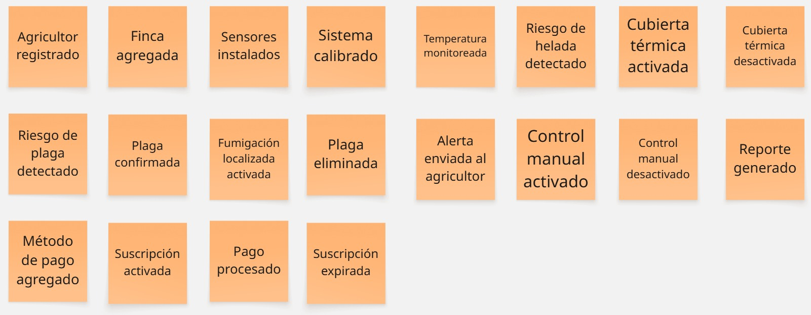

<b>Paso 2: Línea de Tiempo</b>
En esta etapa se ordenan todos los eventos previamente identificados dentro de una secuencia temporal. De esta manera, se colocan de forma cronológica para facilitar la visualización del flujo del proceso y comprender el orden natural en que ocurren las acciones dentro del sistema.

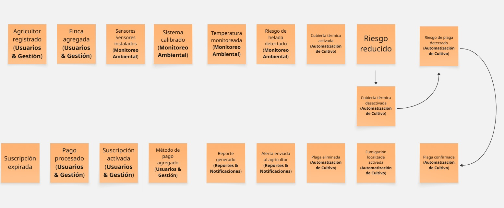

<b>Paso 3: Puntos Problemáticos y Momentos Clave</b>
En esta fase se detectan tanto las dificultades presentes en el proceso (pain points) como los momentos determinantes (pivotal points). Estos aspectos señalan áreas que necesitan especial atención o que resultan críticas para el correcto desempeño del sistema.

<b> Paso 4: Comandos </b>
En este paso se incorporan los comandos, representados con notas adhesivas de color azul, que dan origen a los eventos. Estos comandos corresponden a las acciones que realizan los usuarios o sistemas externos con el fin de generar cambios dentro del sistema.

<b>Paso 5: Políticas</b>
En esta etapa se establecen las políticas o reglas de negocio, representadas con notas adhesivas moradas. Estas reaccionan ante determinados eventos y, como consecuencia, generan nuevos eventos. Su función principal es automatizar decisiones en función de lo que haya ocurrido previamente.

<b>Paso 6: Modelos de Lectura</b>
En este paso se definen los modelos de lectura o vistas que requieren los usuarios para poder tomar decisiones. Estos modelos representan la información que debe estar accesible en momentos específicos dentro del proceso.

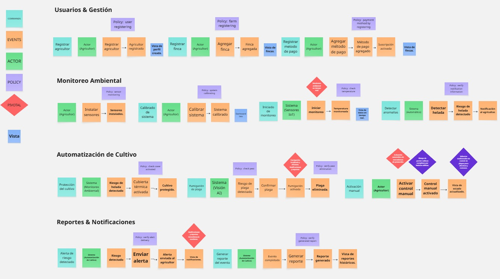

<b>Paso 7: Sistemas Externos</b>
En esta fase se señalan los sistemas externos, representados con notas adhesivas de color rosado, que interactúan con la solución. Se trata de componentes que no están bajo control directo, pero que influyen en el desarrollo del proceso.

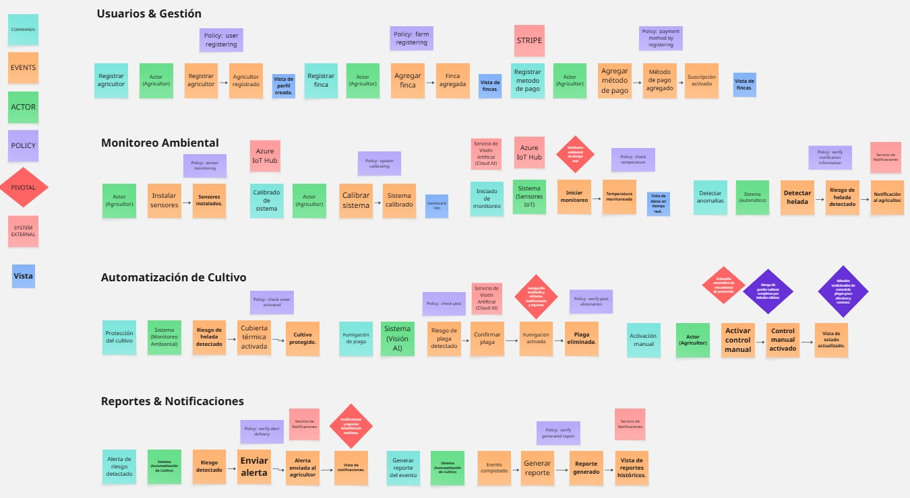

<b>Paso 8: Agregados</b>
En esta etapa se organizan los comandos y eventos vinculados en unidades lógicas denominadas agregados, representadas con notas adhesivas de color amarillo. Cada agregado concentra y encapsula un conjunto coherente de funcionalidades.

<b>Paso 9: Bounded Context</b>
Finalmente, se reconocen los bounded contexts o contextos delimitados, que representan áreas de responsabilidad claramente definidas dentro del sistema.

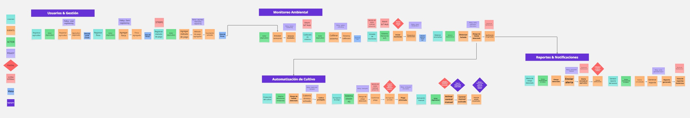

#### 4.1.1.1. Candidate Context Discovery

A partir del EventStorming desarrollado en Miro, nuestro equipo realizó una sesión de Candidate Context Discovery con el objetivo de identificar los bounded contexts de la solución. Durante esta dinámica se aplicó principalmente la técnica look-for-pivotal-events.

Proceso de identificación
El trabajo comenzó con una revisión detallada del modelo completo previamente construido, poniendo especial énfasis en los eventos pivote y en los agregados que habían sido definidos.

 

Detección de agrupaciones naturales: Se identificaron patrones y conjuntos lógicos de comandos, eventos y políticas que interactuaban sobre las mismas entidades o procesos, lo que permitió reconocer relaciones coherentes dentro del sistema.

Nos centramos en eventos clave, como la configuración de notificaciones y alertas, los cuales señalaban con claridad las transiciones entre distintos contextos.

Definición de límites :Se delimitaron fronteras en torno a los grupos previamente identificados, con el fin de establecer los límites iniciales de los bounded contexts.

Nomenclatura y validación
Se asignó un nombre a cada bounded context de acuerdo con su responsabilidad principal, verificando además que mantuvieran coherencia interna y límites claramente definidos.

#### 4.1.1.2. Domain Message Flows Modeling

<b>Escenario 1: Registro de Agricultor y Activación de Suscripción</b>

Descripción: Un agricultor crea su cuenta, agrega su finca y activa una suscripción mediante un método de pago.

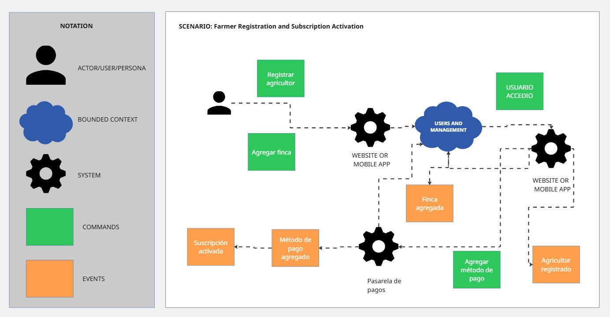

<b>Escenario 2: Monitoreo y Detección de Helada</b>

Descripción: El sistema detecta temperaturas bajas y activa automáticamente la protección contra heladas.

<b>Escenario 3: Detección y Control de Plaga</b>

Descripción: La visión artificial detecta una plaga y se activa el sistema de fumigación localizada.

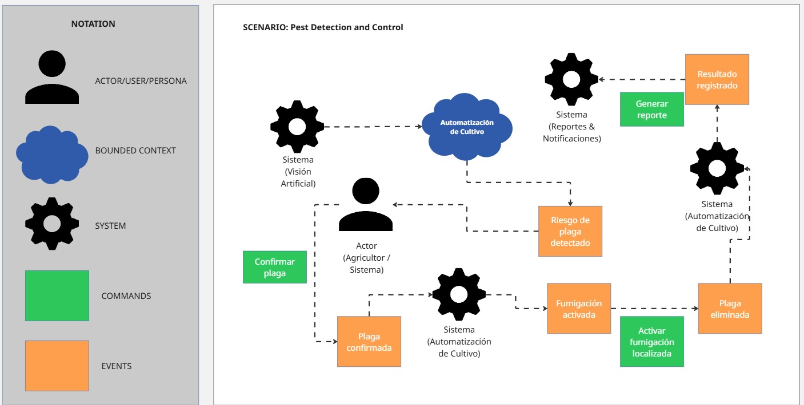

<b>Escenario 4: Notificaciones y Reportes</b>

Descripción: El agricultor recibe notificaciones y consulta reportes históricos.

#### 4.1.1.3. Bounded Context Canvases
Se elaboraron lienzos de Bounded Context para cada uno de los contextos definidos durante el EventStorming. Estos lienzos permiten delimitar con claridad el alcance de cada contexto, sus responsabilidades principales y la manera en que se relaciona con los demás.

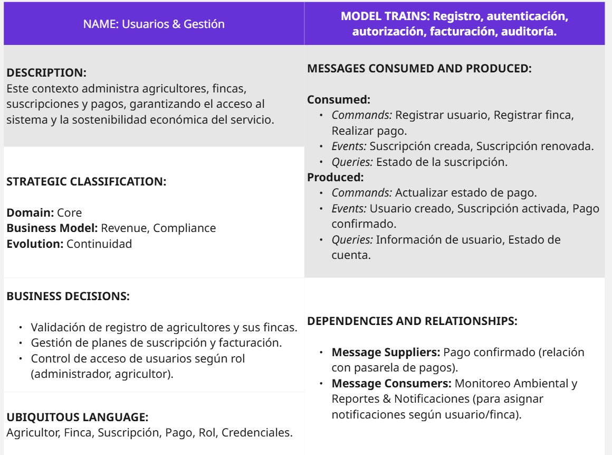
<b></b>

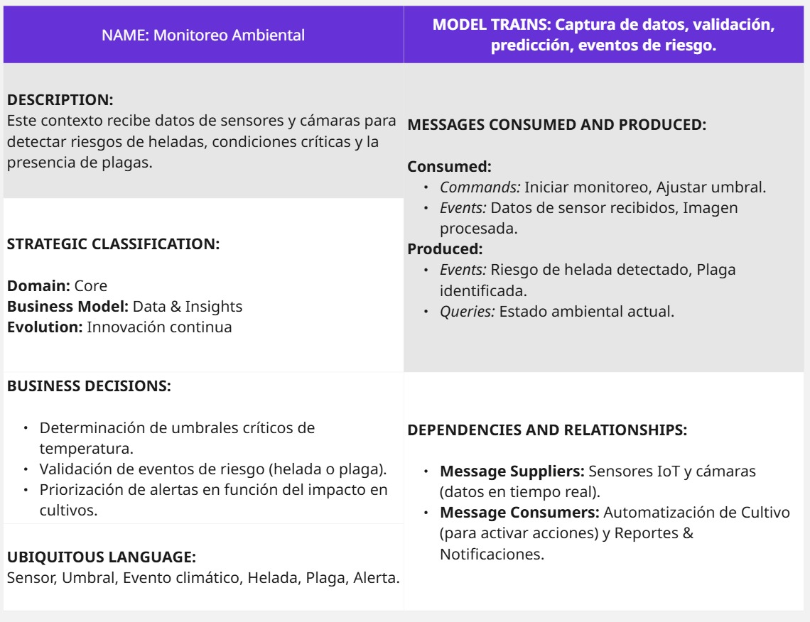
<b></b>

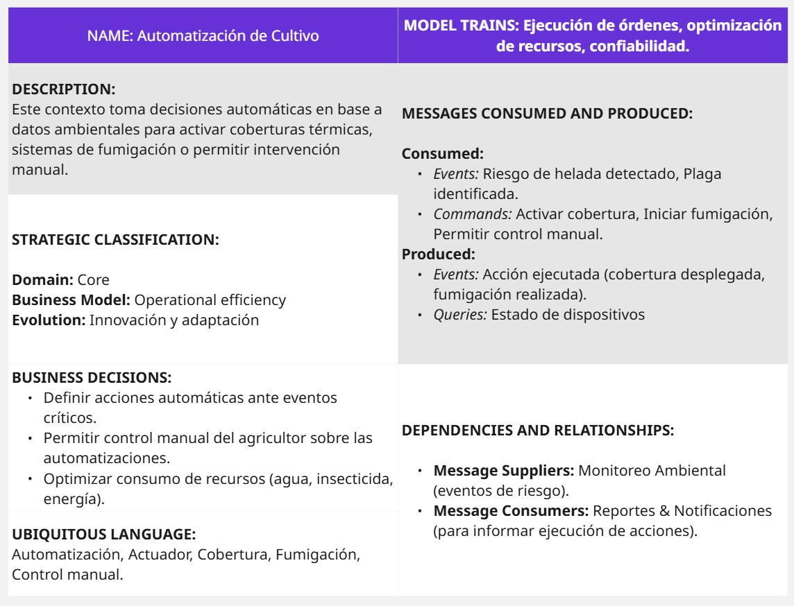
<b></b>

<b></b>

### 4.1.2 Context mapping

Luego de identificar los bounded contexts a través del EventStorming, pasamos a analizar cómo se relacionan entre sí con el fin de construir un context mapping claro y útil. Este ejercicio fue clave para entender las interacciones, responsabilidades y límites de cada contexto dentro de la solución.

<b>Exploración de Alternativas de Diseño</b>
Durante las sesiones de trabajo surgieron varias alternativas de diseño que nos ayudaron a evaluar diferentes enfoques.

<b>Primera alternativa: Mapa inicial</b>
- <b> Usuarios & Gestión </b>→ Todos los demás: funciona como Shared Kernel, dado que la información de usuarios, fincas, pagos y suscripciones es esencial para que el resto de contextos opere.
- <b> Monitoreo Ambiental</b> → <b>Reportes & Notificaciones</b>: se establece una relación , ya que el monitoreo entrega datos de sensores y heladas que son usados por reportes para generar alertas.
- <b>Monitoreo Ambiental</b> →<b> Automatización de Cultivo</b>: aquí se observa un patrón Upstream/Downstream, donde el monitoreo detecta condiciones y la automatización responde con acciones físicas.
- <b>Automatización de Cultivo</b> → <b>Reportes & Notificaciones</b>: también bajo un esquema Customer/Supplier, porque las acciones de cultivo generan datos que se registran en reportes.
- <b>Reportes & Notificaciones</b> → <b>Usuarios & Gestión</b>: se comporta como un Conformist, ya que los reportes deben alinearse con la estructura de usuarios, fincas y suscripciones.

<b>Segunda alternativa: Fusión de Monitoreo y Automatización</b>

Nos preguntamos si sería viable unificar Monitoreo Ambiental y Automatización de Cultivo en un único contexto.

- Este nuevo contexto podría llamarse Control de Cultivo Inteligente.
- El beneficio sería simplificar la integración entre datos ambientales y ejecución de acciones.
- No obstante, notamos que las responsabilidades son distintas: mientras el monitoreo mide y calibra, la automatización ejecuta acciones concretas.

<b>Tercera alternativa: Uso de un Anti-corruption Layer</b>

También analizamos la posibilidad de aislar ciertos contextos para evitar que los cambios internos afecten a otros.

- Incorporamos un Anti-corruption Layer entre Monitoreo Ambiental y Reportes & Notificaciones para proteger la lógica de reportes de variaciones en los modelos de sensores.
- Se aplicó lo mismo entre Automatización de Cultivo y Reportes & Notificaciones, con el fin de mantener separados los procesos físicos de la generación de reportes.
- Esto ofrece mayor independencia evolutiva para cada contexto.

<b>Cuarta alternativa: Servicio compartido de notificaciones</b>

Otra opción fue pensar en un servicio centralizado para gestionar todas las notificaciones.

- Se propuso extraer la lógica de envío de alertas y notificaciones a un nuevo contexto llamado Notification Service.
- Con esto se eliminaría la duplicación de código y se centralizaría la comunicación con los usuarios.
- Los contextos de Monitoreo Ambiental, Automatización de Cultivo y Reportes & Notificaciones pasarían a ser consumidores de este servicio compartido.

_____________________

<b>Evaluación de Alternativas</b>

Cada alternativa fue evaluada tomando en cuenta cuatro criterios principales:

- Cohesión y acoplamiento: nivel de claridad y dependencia entre los contextos.
- Alineación con el negocio: qué tanto se ajusta a las necesidades reales de los usuarios.
- Facilidad de evolución: posibilidad de evolucionar cada contexto de manera autónoma.
Complejidad técnica: grado de dificultad en la implementación.

<b>Context Map Final</b>

Después del análisis, la mejor opción resultó ser una combinación de la tercera y cuarta alternativa:

- Usuarios & Gestión como Shared Kernel: sigue siendo el núcleo que provee datos de usuarios, fincas y pagos a todos los contextos.
- Monitoreo Ambiental como proveedor principal (Upstream): entrega los datos de sensores con un Anti-corruption Layer para que no impacten directamente a otros contextos.
- Automatización de Cultivo como Downstream de Monitoreo: recibe información del ambiente y ejecuta acciones, manteniendo un ACL hacia los reportes.
- Notification Service como servicio compartido: concentra el manejo de notificaciones y alertas, consumido por los demás contextos.
- Reportes & Notificaciones como Conformist: se adapta a la estructura de usuarios y a los datos provenientes de monitoreo y automatización para generar reportes y alertas.

Este diseño final logra un balance adecuado entre cohesión, bajo acoplamiento y flexibilidad, permitiendo que cada contexto pueda evolucionar por separado, mientras se mantiene un marco claro de responsabilidades y relaciones.

### 4.1.3. Software Architecture
En esta parte se presenta la Arquitectura de Software de la solución empleando el C4 Model como recurso de representación visual, mediante la herramienta Structurizr. Se expone la estructura global del sistema, iniciando con una vista de alto nivel (Context Level Diagram) y profundizando en las interacciones y componentes principales (Container Level Diagrams), con el fin de ofrecer una visión clara y entendible de la arquitectura propuesta.

#### 4.1.3.1. Software Architecture System Landscape Diagram

A continuación, se presenta el diagrama de contexto correspondiente a la arquitectura de software de la solución propuesta. En él se ilustran los actores externos que interactúan con el sistema, así como los sistemas externos con los que este mantiene comunicación.

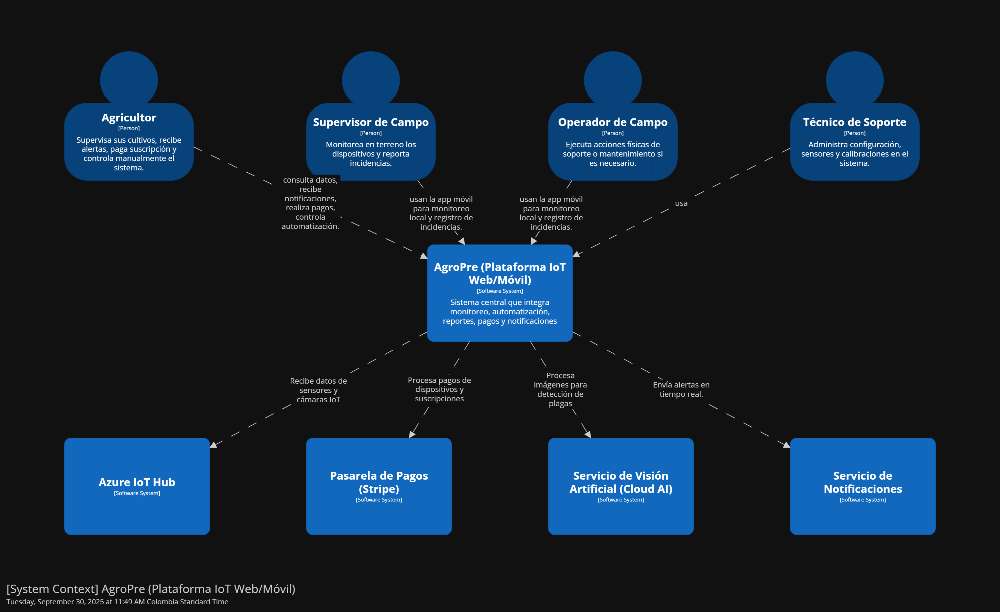
<b></b>

#### 4.1.3.2. Software Architecture Context Level Diagrams

 En este diagrama se describe como AGROPRE  se relaciona con sus usuarios y con sistemas externos como IOT hub  y el dispositivo IOT.

#### 4.1.3.3. Software Architecture Container Level Diagrams

Este diagrama muestra los principales componentes del sistema: la Aplicación Web, la Aplicación Móvil, las APIs REST, las Bases de Datos, el sistema IoT con sensores y el Servicio de Notificaciones.

Se ilustran sus interacciones internas y cómo se conectan con los usuarios externos (administradores, supervisores y operadores). La arquitectura refleja la relación con los bounded contexts: Usuarios & Gestión, Monitoreo Ambiental, Automatización de Cultivo y Reportes & Notificaciones.

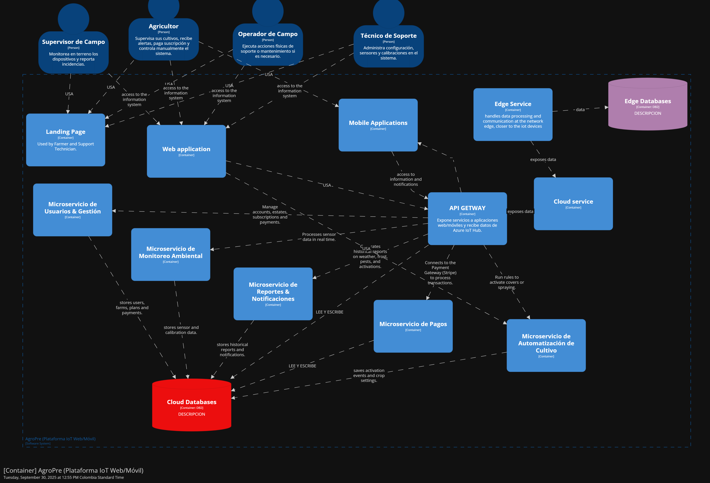

#### 4.1.3.4. Software Architecture Deployment Diagrams

En esta parte se muestra cómo se despliegan físicamente los componentes del sistema AGROPRE dentro de su entorno de ejecución. El diagrama representa los dispositivos/servidores utilizados, los servicios desplegados en cada uno y los protocolos de comunicación que permiten la interacción.

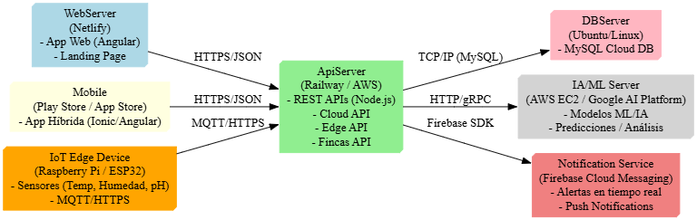

## 4.2. Tactical-Level Domain-Driven Design

### 4.2.1. Bounded Context:Usuarios & Gestión
Este bounded context es el núcleo administrativo de la plataforma AGROPRE, ya que permite gestionar usuarios, fincas, pagos y suscripciones. Su propósito principal es centralizar la administración de identidades, accesos y relaciones comerciales entre agricultores, supervisores y el sistema, garantizando seguridad, control y trazabilidad de la información.
#### 4.2.1.1. Domain Layer

En esta capa se encuentran los modelos y reglas de negocio que rigen la gestión de usuarios y la administración de fincas y pagos.

<b>Entidades principales</b>

| Clase | Descripción |
|-----------|----------|
| User (Aggregate Root)  | - Atributos: id: UUID, email: VARCHAR, password_hash: VARCHAR, user_type: UserType, status: UserStatus, registered_at: TIMESTAMP, last_login: TIMESTAMP, profile_id: UUID.   - Responsabilidades: gestionar credenciales, estado, relaciones con FarmMember, emitir eventos de dominio UserCreated, UserDeactivated.  |
|Profile (Entity / Value Object) | - Atributos: id: UUID, full_name, phone, avatar_url, address (JSON), preferred_language.   -Responsabilidades: contener datos personales y validaciones (email normalizado, teléfono E.164). |
| Role (Entity)  | - Atributos: id, name, permissions: JSONB.   - Responsabilidades: definir conjuntos de permisos. |
| Permission (Value)| - Atributos: name (string, ej. farm.create, device.onboard), description.   |
| Farm (Aggregate Root)| - Atributos: id: UUID, name, geo: Geometry (Polygon), owner_id: UUID, metadata: JSONB, created_at.    - Responsabilidades: geolocalización, límites, asociación de dispositivos y members.  |
| FarmMember (Entity)| - Atributos: id, farm_id, user_id, role_in_farm (OWNER, MANAGER, WORKER), joined_at.   - Responsabilidades: permisos y ámbito de actuación dentro de una finca. |
| Cooperative (Aggregate)| - Atributos: id, name, description, members: List[User ids], metadata.  |
| Invite (Entity)| - Atributos: id, inviter_id, invitee_email, token, status: InviteStatus, expires_at.   - Responsabilidades: flujo de invitación y onboarding. |
| Session (Entity)| - Atributos: id, user_id, device_info, refresh_token_hash, created_at, expires_at.|
| AuditLog (Entity / Append-only)| - Atributos: id, user_id, action, metadata: JSONB, created_at.|

<b>Value Objects</b>

- Email (VO): validación y normalización.

- PhoneNumber (VO): E.164 validation.

- PasswordHash (VO): encapsula algoritmo de hashing.

<b>Enums</b>

- UserType = {FARMER, COOP_ADMIN, AGRONOMIST, TECH, ADMIN}

- UserStatus = {ACTIVE, SUSPENDED, PENDING_VERIFICATION, DELETED}

- InviteStatus = {PENDING, ACCEPTED, REJECTED, EXPIRED}

- RoleName = {OWNER, MANAGER, WORKER, VIEWER, COOP_ADMIN, SYSTEM_ADMIN}

- AuthProvider = {LOCAL, GOOGLE, APPLE}

<b>Reglas de negocio clave</b>

- La creación de una Farm asigna automáticamente un FarmMember con role_in_farm = OWNER al user creador.

- Para operaciones críticas (transferencia de ownership, eliminación masiva) se requiere verificación adicional (2FA) y registro de AuditLog.

- Invites sólo expiran tras expires_at y sólo pueden ser aceptados una vez; al aceptarse si el email no está asociado se crea un User y se asocia el FarmMember.

- Permisos se resuelven en tiempo de autorización combinando Role.permissions y FarmMember.role_in_farm.

<b>Validadores</b>

- SchemaValidator para entradas API.

- PasswordPolicyValidator (largo mínimo, complejidad, check de contraseñas filtradas).

- GeoFenceValidator (valida GeoJSON y superficie máxima permitida).

#### 4.2.1.2. Interface Context
Conjunto de contratos (REST/JSON y mensajes de eventos) que exponen la funcionalidad del bounded context. Versionado con /api/v1/.

<b>Principios</b>
- Usar HTTPs, JWT RS256 para access tokens.

- Minimizar PII en payloads de eventos.

- API REST para operaciones CRUD y RPC-ish endpoints para acciones (ej. accept_invite).

<b>Esquemas (DTOs / JSON-Schema)</b>
| Schemas / DTOs | Descripción |
|-----------|----------|
| LoginRequest: |{ email: string, password: string, device_info?: string } |
|TokenResponse: |{ access_token: string, token_type: "bearer", expires_in: int, refresh_token?: string }|
| UserCreate:| { email, password, full_name?, phone?, user_type? }|
| UserGet: | { id, email, profile: { full_name, phone, avatar_url }, user_type, status, registered_at }|
| ProfileUpdate: |{ full_name?, phone?, address? }|
| FarmCreate: |{ name, geo: GeoJSON, metadata? }|
| FarmGet: |{ id, name, geo, owner_id, metadata }|
| InviteCreate: |{ inviter_id, invitee_email, farm_id, role_in_farm, expires_in_days }|
|InviteAcceptRequest:|{ token, user_credentials?: {email, password} }|

<b>Rutas REST recomendadas</b> 

|REST endpoints (contratos)| Descripción |
|-----------|----------|
| POST /api/v1/auth/register | registrar usuario (o aceptar invite). |
|POST /api/v1/auth/login| autenticar|
|POST /api/v1/auth/refresh | renovar token|
|POST /api/v1/auth/logout | cerrar sesión|
|GET /api/v1/users  | listar (admin).|
|GET /api/v1/users/{user_id}  | obtener perfil|
|PUT /api/v1/users/{user_id} |actualizar.|
|PUT /api/v1/users/{user_id}/profile |actualizar profile|
|POST /api/v1/farms |crear finca|
|GET /api/v1/farms/{farm_id} |obtener|
|GET /api/v1/farms/{farm_id}/members |listar miembros|
|POST /api/v1/farms/{farm_id}/members |agregar miembro|
|DELETE /api/v1/farms/{farm_id}/members/{member_id} |remover|
|POST /api/v1/invites|crear invite|
|GET /api/v1/invites/{token} |estado invite|
|POST /api/v1/invites/{token}/accept |aceptar invite|
|GET /api/v1/roles |listar roles y permisos|
|POST /api/v1/roles|crear roles personalizados (admin)|

<b>Eventos publicados (broker)</b>

- UserCreated { user_id, user_type, created_at }

- UserUpdated { user_id, changes }

- UserDeactivated { user_id, reason }

- InviteCreated { invite_id, inviter_id, invitee_email, farm_id }

- InviteAccepted { invite_id, user_id, farm_id }

#### 4.2.1.3. Application Context
Servicios de aplicación y casos de uso que implementan las reglas de negocio del dominio combinando repositorios, validadores y mappers.

|Servicios de aplicación (use-case layer)| Descripción |
|-----------|----------|
| AuthService | - register(user_data: UserCreate) -> UserGet. - login(email: str, password: str, device_info: str) -> TokenResponse - refresh_token(refresh_token: str) -> TokenResponse  - logout(user_id: UUID, session_id: UUID) - password_reset_request(email: str) |
| UserService| - get_user_by_id(user_id: UUID) -> UserGet  - update_profile(user_id: UUID, profile_update: ProfileUpdate)-> Profile  - list_users(filters, paging) -> List[UserGet]  - deactivate_user(user_id: UUID, reason: str)  - assign_role(user_id: UUID, role_name: str)|
|FarmService | - Create_farm(owner_user_id: UUID, farm_data:FarmCreate) -> FarmGet  - get_farm(farm_id: UUID) ->FarmGet  - add_member(farm_id: UUID, inviter_id: UUID, invitee_identifier:str,role: str)  - remove_member(farm_id: UUID, member_id: UUID)  - transfer_ownership(farm_id: UUID, new_owner_user_id: UUID)|
|InviteService |- create_invite(inviter_id: UUID, invitee_email: str, farm_id: UUID, role: str)  - accept_invite(token: str, user_credentials?: {email, password}) -> FarmMember|
|RoleService|-  create_role(name: str, permissions: List[str])  - get_role(name: str)|
|AuditService | - log(user_id: UUID, action: str, metadata: dict)|

<b>Casos de uso</b>

Flujo: Crear finca y asignar owner

- User solicita creación de Farm.

- FarmService.create_farm valida geo con GeoFenceValidator.

- Persiste Farm y crea FarmMember con role_in_farm=OWNER.

- Publica FarmCreated a broker.

Flujo: Invitar miembro
- inviter llama a InviteService.create_invite.

- Genera Invite.token, persiste y envía notificación (NotificationService) y InviteCreated al broker.

- Cuando accept_invite es llamado: valida token, crea User si no existe, crea FarmMember, cambia estado del invite y publica InviteAccepted.

Flujo: Login y sesiones
- AuthService.login valida credenciales.

- Genera access_token (RS256) y refresh_token (rotativo, almacenado hashed en DB).

- Crea Session y actualiza last_login en User.

- AuditService.log registra intento de login exitoso o fallido.

#### 4.2.1.4. Infrastructure Context
Componentes técnicos que permiten persistencia, mensajería, almacenamiento y servicios externos. 

<b>Repositorio - Interfases y Comportamiento</b>

|Repositorios| Descripción |
|-----------|----------|
| IUserRepository: |- create(user: User) -> User - find_by_id(id: UUID) -> User / None   - find_by_email(email: str) -> User / None   - update(user: User) -> User  - delete(id: UUID)|
| IFarmRepository: | - create(farm: Farm), find_by_id, find_by_owner, find_nearby(geo, radius) (geospatial query)|
|IInviteRepository: | - create, find_by_token, mark_accepted.|
|ISessionRepository: |- store_refresh_token, revoke_session, list_sessions_by_user.|

<b>Infraestructuras auxiliares</b>

- DB: PostgreSQL + PostGIS.

- Cache: Redis (rate limiting, ephemeral sessions).

- Broker: RabbitMQ o Kafka (events pub/sub).

- Object Storage: S3-compatible (avatars, documentos, backups).

- Key Management: KMS para claves JWT (RS256) y secretos.

- Background Workers: Celery / Sidekiq para emails, limpieza de invites expirados.

- Monitoring: Prometheus + Grafana; Log Aggregation con ELK.

<b>Rutas y handlers (ejemplo: FastAPI)</b>

- Cada endpoint valida JWT y permissions con middleware Authorize(permission).

- Persigned URLs para cargas a S3.

#### 4.2.1.5. Bounded Context Software Architecture Component Level Diagrams

#### 4.2.1.6. Bounded Context Software Architecture Code Level Diagrams
#### 4.2.1.6.1. Bounded Context Domain Layer Class Diagrams

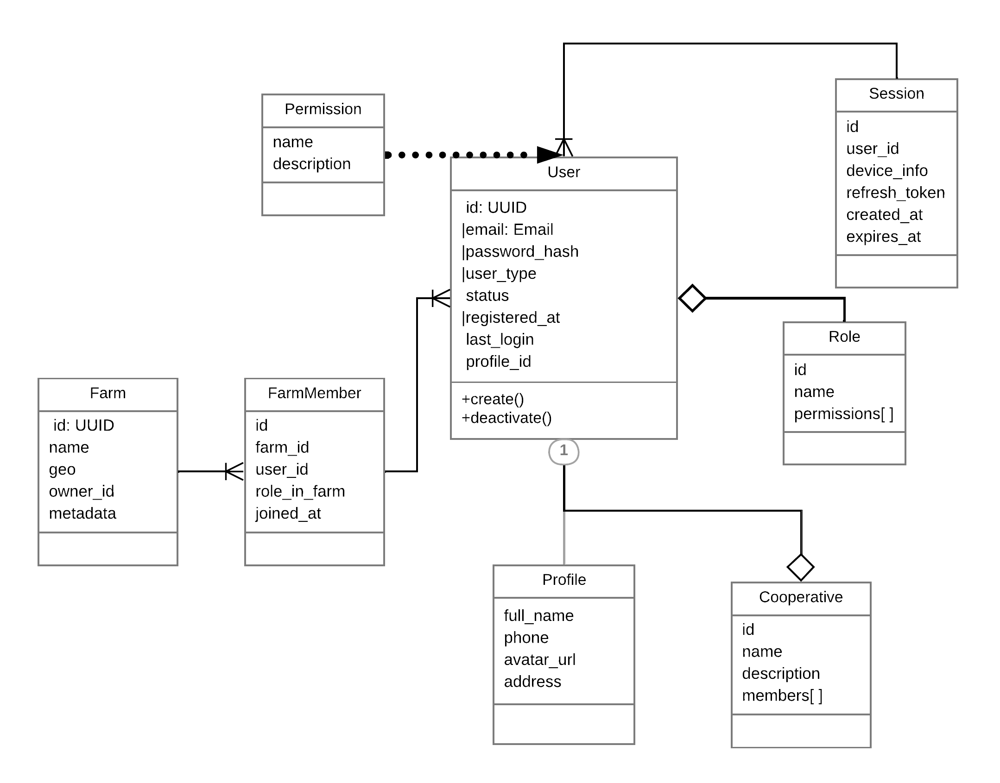

#### 4.2.1.6.2. Bounded Context Database Design Diagram

----

### 4.2.2. Bounded Context: Monitoreo Ambiental
El bounded context de Monitoreo Ambiental se encarga de la captura, almacenamiento, procesamiento y exposición de datos recolectados por los sensores IoT instalados en las viviendas. Estos sensores pueden medir variables como temperatura, humedad, calidad del aire, concentración de gases, ruido, entre otros. Su función principal es brindar información en tiempo real que alimente tanto al sistema de seguridad como a los módulos de gestión y reportes, permitiendo así una visión integral del entorno doméstico.

#### 4.2.2.1. Domain Layer

<b>Modelos</b>

| Clase | Descripción |
|-----------|----------|
| Sensor| - Representa un dispositivo IoT físico capaz de recolectar información ambiental.   - Atributos: id, sensorType, location, status, installationDate.   - Relación con Measurement (uno a muchos).  |
|Measurement | - Registra los datos capturados por los sensores.   -Atributos: id, sensorId, timestamp, value, unit.  - Relación con Sensor (muchos a uno). |
| Alert  | - Entidad encargada de representar eventos críticos cuando una medición supera un umbral establecido.   - Atributos: id, sensorId, measurementId, threshold, alertType, createdAt, resolved. |
| ThresholdConfig| - Define los umbrales máximos y mínimos aceptables para cada tipo de sensor.   - Atributos: id, sensorType, minValue, maxValue, unit.  |

<b>Enums</b>

- SensorType: Enum para clasificar los sensores: Temperature, Humidity, Gas, CO2, Noise, Motion.

- AlertType: Enum para categorizar las alertas: Critical, Warning, Info.

<b>Validators</b>

- MeasurementValidator: Valida que los valores de mediciones cumplan con el formato correcto (unidades, rango, timestamp).

- ThresholdValidator: Asegura que los umbrales sean coherentes (ejemplo: minValue < maxValue).

#### 4.2.2.2. Interface Context
Conjunto de contratos (REST/JSON y mensajes de eventos) que exponen la funcionalidad del bounded context. Versionado con /api/v1/.

<b>Esquemas (DTOs / JSON-Schema)</b>
| Schemas / DTOs | Descripción |
|-----------|----------|
| SensorSchemaPost| Creación de un nuevo sensor (location, sensorType, installationDate). |
|SensorSchemaGet: |Respuesta con la información de un sensor registrado.|
|MeasurementSchemaPost|Registro de una medición proveniente de un sensor.|
| MeasurementSchemaGet | Respuesta detallada con los valores capturados.|
| AlertSchemaGet |Respuesta con los datos de una alerta generada (sensor, valor, umbral, tipo de alerta).|

<b>Rutas REST recomendadas</b> 

|REST endpoints (contratos)| Descripción |
|-----------|----------|
| /sensors [POST] | Registro de un nuevo sensor. |
|/sensors [GET]| Listado de sensores instalados.|
|/measurements [POST] |Registrar mediciones de un sensor.|
|/measurements/{sensorId} [GET] |Consultar mediciones históricas de un sensor.|
|/alerts [GET] | Obtener todas las alertas activas|
|/alerts/{id}/resolve [PUT] |Marcar una alerta como resuelta.|

#### 4.2.2.3. Application Context
Servicios de aplicación y casos de uso que implementan las reglas de negocio del dominio combinando repositorios, validadores y mappers.

|Servicios de aplicación (use-case layer)| Descripción |
|-----------|----------|
| SensorService | - register_sensor(data, db): Registrar un sensor en la base de datos. - get_sensors(db): Recuperar la lista de sensores activos. |
|MeasurementService| - record_measurement(sensorId, value, timestamp, db): Guardar una nueva medición.  - get_measurements(sensorId, startDate, endDate, db): Recuperar mediciones filtradas por fechas.  - validate_measurement(value, unit): Validar rango y unidad antes de registrar. |
|AlertService | - generate_alert(sensorId, measurementId, db): Crear una alerta si se supera un umbral.  - get_active_alerts(db): Recuperar alertas activas.  - resolve_alert(alertId, db): Marcar alerta como atendida. |

#### 4.2.2.4. Infrastructure Context
Componentes técnicos que permiten persistencia, mensajería, almacenamiento y servicios externos. 

<b>Repositorio - Interfases y Comportamiento</b>

|Repositorios| Descripción |
|-----------|----------|
| SensorRepository|- Acceso a datos para registrar y obtener sensores.  |
| MeasurementRepository| - Manejo de lecturas almacenadas en la base de datos.|
|AlertRepository | - Operaciones de creación, consulta y actualización de alertas.|

|Mappers| Descripción |
|-----------|----------|
| SensorMapper:|- Traduce la entidad Sensor a la tabla correspondiente.  |
| MeasurementMapper| -Traduce la entidad Measurement con timestamp y valor.|
|AlertMapper | -Traduce la entidad Alert a su tabla SQL.|

|Integraciones| Descripción |
|-----------|----------|
|IoT Gateway Adapter|- Middleware encargado de recibir la información desde los dispositivos físicos (MQTT, HTTP, CoAP).|
|Notification Adapter| -Permite enviar notificaciones al usuario (email, push, SMS) cuando se genera una alerta crítica.|

#### 4.2.2.5. Bounded Context Software Architecture Component Level Diagrams

#### 4.2.2.6. Bounded Context Software Architecture Code Level Diagrams
#### 4.2.2.6.1. Bounded Context Domain Layer Class Diagrams

#### 4.2.2.6.2. Bounded Context Database Design Diagram

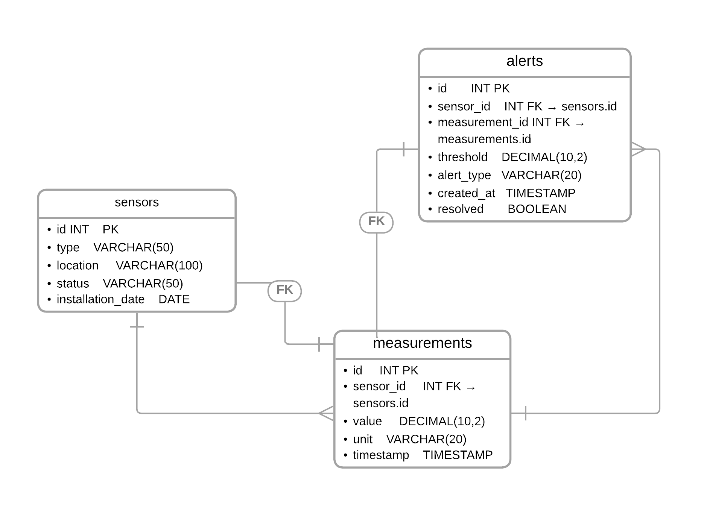

-----

### 4.2.3. Bounded Context: Automatización de Cultivo
El bounded context de Automatización de Cultivo gestiona los procesos automáticos de riego, iluminación, ventilación y fertilización en las viviendas inteligentes con módulos agrícolas. Este subsistema conecta sensores ambientales y actuadores IoT (bombas, válvulas, ventiladores, luces, dosificadores), aplicando reglas predefinidas o configurables por el usuario.

Su objetivo es garantizar condiciones óptimas para el cultivo, reduciendo consumo de agua y energía, y reaccionando en tiempo real ante variaciones ambientales.

#### 4.2.3.1. Domain Layer

<b>Modelos</b>

| Clase | Descripción |
|-----------|----------|
|Actuator| - Representa un dispositivo IoT que ejecuta acciones en el cultivo (riego, ventilación, luz, fertilización).   - Atributos: id, type, location, status, installationDate.   - Relación con ActionLog.  |
|ActionLog| - Registro histórico de acciones realizadas por actuadores.   -Atributos: id, actuatorId, command, executedAt, status.  - Relación con Actuator. |
| AutomationRule | - Define reglas para activar actuadores de forma automática según condiciones ambientales   - Atributos: id, name, sensorType, condition, thresholdValue, actuatorType, action. |
| Schedule| - Programa de ejecución periódica para los actuadores (ej. riego cada 8 horas).   - Atributos: id, actuatorId, frequency, startTime, endTime, enabled. |

<b>Enums</b>

- ActuatorType: IrrigationPump, VentilationFan, LEDLight, FertilizerDispenser.

- ActionType: Start, Stop, Increase, Decrease.

<b>Validators</b>

- RuleValidator: valida la coherencia de las reglas (ejemplo: sensor y actuador compatibles).

- ScheduleValidator: valida que los horarios no se solapen y sean viables.

#### 4.2.3.2. Interface Context
Conjunto de contratos (REST/JSON y mensajes de eventos) que exponen la funcionalidad del bounded context. Versionado con /api/v1/.

<b>Esquemas (DTOs / JSON-Schema)</b>
| Schemas / DTOs | Descripción |
|-----------|----------|
| ActuatorSchemaPost|Registro de un actuador.|
|ActuatorSchemaGet |Respuesta con datos de actuador.|
|ActionLogSchemaGet|Historial de acciones ejecutadas|
| AutomationRuleSchemaPost| Creación de una nueva regla de automatización.|
| AutomationRuleSchemaGet:|Consulta de reglas configuradas|
| ScheduleSchemaPost:|Creación de un nuevo cronograma.|
| ScheduleSchemaGet:|Consulta de cronogramas existentes.|

<b>Rutas REST recomendadas</b> 

|REST endpoints (contratos)| Descripción |
|-----------|----------|
| /actuators [POST/GET] | Registrar y consultar actuadores. |
|/actuators/{id}/status [PUT]| Cambiar estado de un actuador|
|/actions [GET] |Consultar historial de acciones.|
|/rules [POST/GET/PUT/DELETE]|CRUD de reglas de automatización|
|/schedules [POST/GET/PUT/DELETE] |CRUD de cronogramas de automatización.|

#### 4.2.3.3. Application Context
Servicios de aplicación y casos de uso que implementan las reglas de negocio del dominio combinando repositorios, validadores y mappers.

|Servicios de aplicación (use-case layer)| Descripción |
|-----------|----------|
| ActuatorService | - register_actuator(data, db) -get_actuators(db)  - update_status(actuatorId, status, db)|
|ActionLogService| - record_action(actuatorId, command, status, db) - get_action_logs(actuatorId, db) . |
|AutomationRuleService | - create_rule(rule, db)  - evaluate_rules(sensorData, db)  - update_rule(ruleId, db) |
|ScheduleService | - create_schedule(schedule, db)  - execute_schedules(db)  - disable_schedule(scheduleId, db) |

#### 4.2.3.4. Infrastructure Context
Componentes técnicos que permiten persistencia, mensajería, almacenamiento y servicios externos. 

<b>Repositorio - Interfases y Comportamiento</b>

|Repositorios| Descripción |
|-----------|----------|
| ActuatorRepository|- CRUD actuadores  |
| ActionLogRepository| - CRUD historial de acciones|
|AutomationRuleRepository | - CRUD reglas|
|ScheduleRepository | - CRUD cronogramas.|

|Mappers| Descripción |
|-----------|----------|
| ActuatorMapper|- Traducción Actuator ↔ tabla actuators.|
| ActionLogMapper| -Traducción ActionLog ↔ tabla action_logs|
|RuleMapper | -Traducción AutomationRule ↔ tabla automation_rules|
|ScheduleMapper | -Traducción Schedule ↔ tabla schedules|

|Integraciones| Descripción |
|-----------|----------|
|IoT Command Adapter|- puente con actuadores (MQTT, HTTP, CoAP).|
|Event Scheduler Adapter| -gestiona cronogramas recurrentes.|

#### 4.2.3.5. Bounded Context Software Architecture Component Level Diagrams

#### 4.2.3.6. Bounded Context Software Architecture Code Level Diagrams
#### 4.2.3.6.1. Bounded Context Domain Layer Class Diagrams

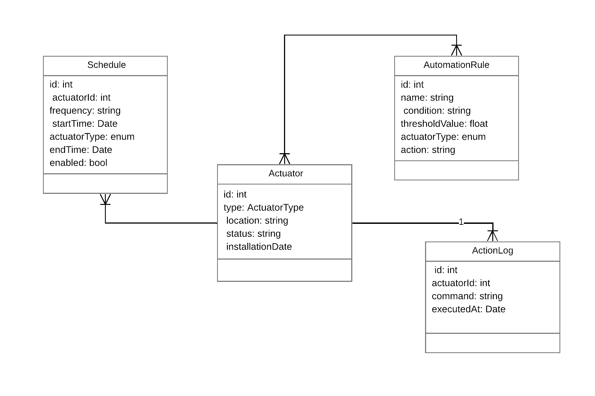

#### 4.2.3.6.2. Bounded Context Database Design Diagram

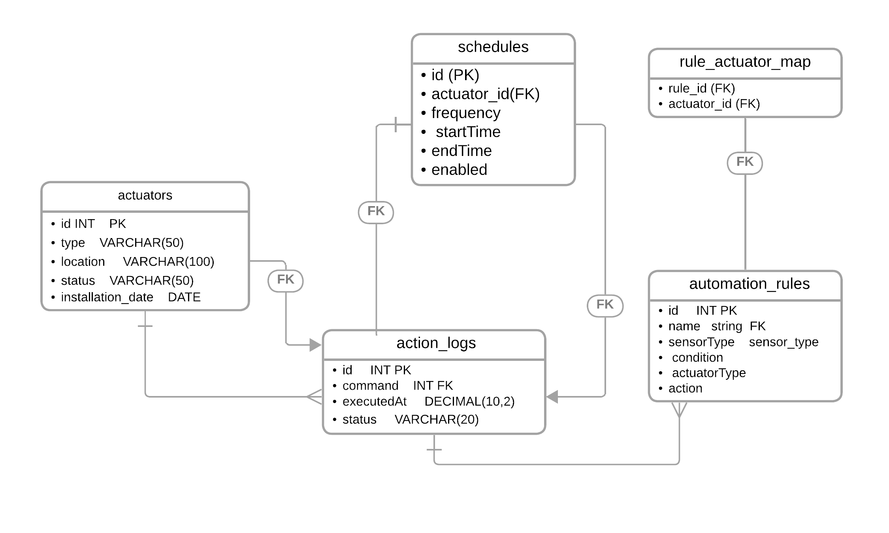

-------
### 4.2.4. Bounded Context: Reportes y Notificaciones
Este bounded context administra la consolidación de datos y eventos de los demás módulos (monitoreo, automatización, seguridad) para generar reportes analíticos y enviar notificaciones en tiempo real a los usuarios.

#### 4.2.4.1. Domain Layer

<b>Modelos</b>

| Clase | Descripción |
|-----------|----------|
|Report| - Representa un informe consolidado generado periódicamente o bajo demanda.   -Atributos: id, type, generatedAt, data, format, requestedBy.   - Relación con User (quien solicita).  |
|Notification| -Notificación enviada a un usuario (ej. alerta de intrusión, reporte disponible, condición anómala en sensores).  -Atributos: id, userId, title, message, priority, status, sentAt.|
|NotificationPreference | - Configuración personalizada del usuario sobre cómo y cuándo recibir notificaciones.   - Atributos: id, userId, channel, enabled, schedule. |
| Channe| - Define la vía de comunicación (ejemplo: Email, SMS, App Push).   - Atributos: id, type, config. |

<b>Enums</b>

- ReportType: Environmental, Automation, Security, SystemUsage.

- NotificationChannel: Email, SMS, Push.

- NotificationPriority: Low, Medium, High, Critical.

- NotificationStatus: Pending, Sent, Failed, Read.

<b>Validators</b>

- ReportValidator: valida formato y completitud del reporte.

- NotificationValidator: valida coherencia entre prioridad y canal disponible.

#### 4.2.4.2. Interface Context
Conjunto de contratos (REST/JSON y mensajes de eventos) que exponen la funcionalidad del bounded context. Versionado con /api/v1/.

<b>Esquemas (DTOs / JSON-Schema)</b>
| Schemas / DTOs | Descripción |
|-----------|----------|
| ReportSchemaPost|creación de reporte bajo demanda.|
|ReportSchemaGet |consulta de reportes generados.|
|NotificationSchemaPost|enviar notificación manual o programada.|
| NotificationSchemaGet| historial de notificaciones recibidas.|
| PreferenceSchemaPost|configuración de preferencias de usuario.|
|PreferenceSchemaGet|consulta de preferencias activas.|

<b>Rutas REST recomendadas</b> 

|REST endpoints (contratos)| Descripción |
|-----------|----------|
|/reports [POST/GET] | CRUD de reportes. |
|/notifications [POST/GET/PUT]| CRUD de notificaciones.|
|/preferences [POST/GET/PUT/DELETE] |CRUD de preferencias de notificación.|

#### 4.2.4.3. Application Context
Servicios de aplicación y casos de uso que implementan las reglas de negocio del dominio combinando repositorios, validadores y mappers.

|Servicios de aplicación (use-case layer)| Descripción |
|-----------|----------|
| ReportService | - generate_report(reportType, format, db) - get_reports(userId, db)|
|NotificationService| - send_notification(userId, message, channel, priority, db) - get_notifications(userId, db)   - mark_as_read(notificationId, db)|
|PreferenceService | - save_preferences(userId, data, db)  - get_preferences(userId, db) |

<b>Casos de uso principales</b>
- Generar reportes ambientales periódicos y notificar al usuario.

- Emitir alertas críticas en tiempo real (ej. intrusión, humedad excesiva).

- Enviar notificaciones de respaldo (ej. por Email cuando falla Push).

#### 4.2.4.4. Infrastructure Context
Componentes técnicos que permiten persistencia, mensajería, almacenamiento y servicios externos. 

<b>Repositorio - Interfases y Comportamiento</b>

|Repositorios| Descripción |
|-----------|----------|
|ReportRepository|- CRUD de reportes.  |
|NotificationRepository| -CRUD de notificaciones|
|PreferenceRepository | - CRUD de preferencias.|

|Mappers| Descripción |
|-----------|----------|
|ReportMapper|- Traducción Report ↔ tabla reports|
|NotificationMapper| -Traducción Notification ↔ tabla notifications|
|PreferenceMapper | -Traducción NotificationPreference ↔ tabla preferences|

|Integraciones| Descripción |
|-----------|----------|
|EmailAdapter|- (SMTP).|
|SMSAdapter| -(proveedor Twilio o equivalente).|
|PushNotificationAdapter| -(Firebase Cloud Messaging).|

#### 4.2.4.5. Bounded Context Software Architecture Component Level Diagrams
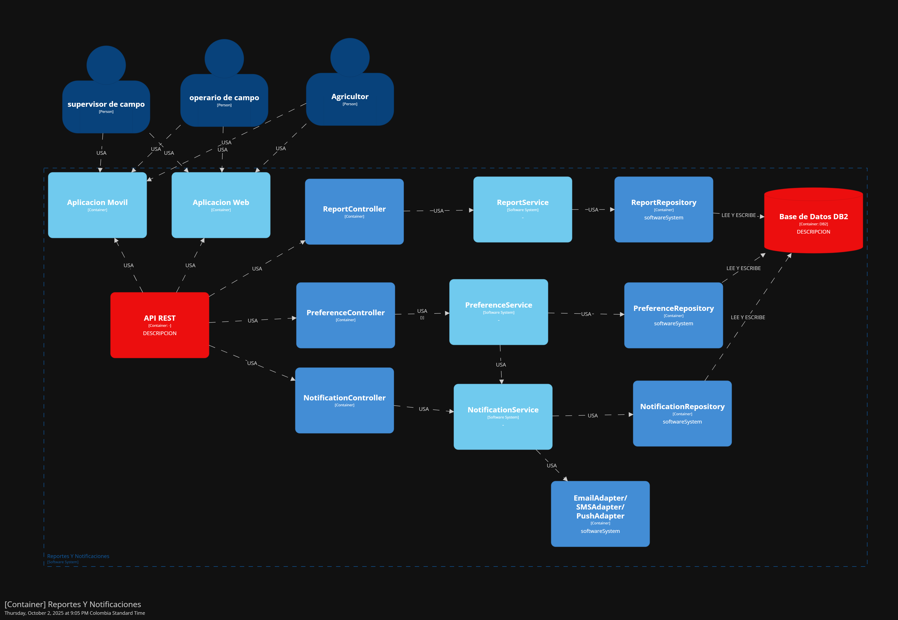

#### 4.2.4.6. Bounded Context Software Architecture Code Level Diagrams
#### 4.2.4.6.1. Bounded Context Domain Layer Class Diagrams

#### 4.2.4.6.2. Bounded Context Database Design Diagram

# Capítulo V: Solutions UI/UX Design

## 5.1. Style Guidelines
En el marco del desarrollo de nuestra solución digital Agropre, enfocada en el monitoreo ambiental, gestión de cultivos, automatización agrícola y generación de reportes inteligentes, establecemos pautas de estilo que garantizarán una presentación coherente, usable y profesional en todos los productos: la aplicación móvil, la plataforma web y las integraciones con dispositivos IoT.

Estas guías buscan mantener una identidad visual clara y homogénea, un lenguaje accesible para agricultores y profesionales, y una experiencia intuitiva en todos los puntos de interacción.

Agropre adopta los principios de Material Design 3 y lineamientos de accesibilidad digital, asegurando que la aplicación sea clara, moderna y escalable, tanto en entornos web como móviles.

### 5.1.1. General Style Guidelines

Nuestra solución Agropre responde a la necesidad de los agricultores y cooperativas de contar con una plataforma integral para la gestión digital de fincas, control ambiental, automatización de procesos agrícolas y generación de reportes predictivos.
El sistema conecta a los agricultores con sensores de campo, dispositivos de control (cubiertas, fumigación, riego) y herramientas de monitoreo en tiempo real, brindando información precisa para la toma de decisiones.
El diseño visual de Agropre se basa en la naturaleza y la innovación tecnológica, con un enfoque en simplicidad, sostenibilidad y confianza.

<b>Branding:</b>

- Brand Name:
El nombre Agropre proviene de la fusión de “Agro” (campo, agricultura) y “Pre” (prevención, predicción y precisión). Refleja el objetivo de la solución: predecir riesgos, prevenir pérdidas y ofrecer precisión en la gestión agrícola.

- Logo:
El logotipo de Agropre combina un escudo estilizado con una hoja verde, simbolizando protección, sostenibilidad y confianza en el campo. Este será el ícono principal de la marca en aplicaciones, landing pages y material corporativo.

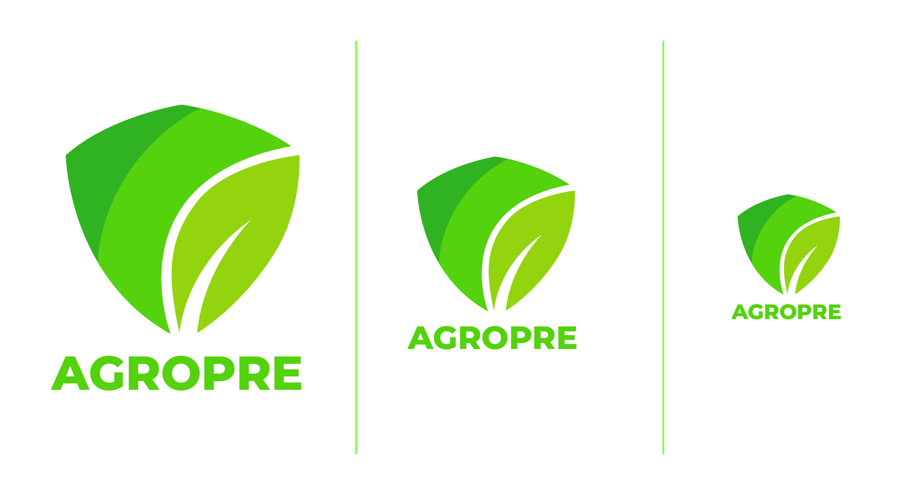{ width=100% }

<b>Typography:</b>

- Fuente Principal: Montserrat (limpia, moderna y legible en web y móvil).

- Fuente Secundaria: Roboto (para interfaces de usuario, tablas y dashboards).
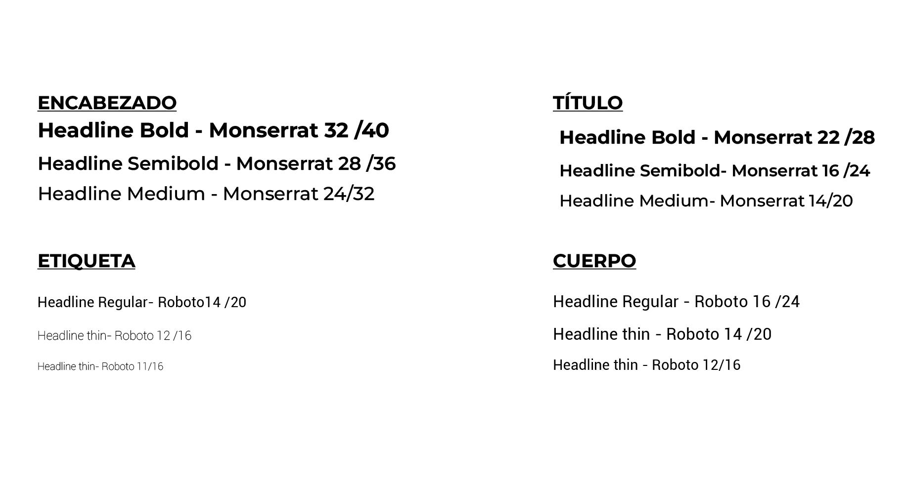{ width=100% }

<b>Usos principales:</b>

- Encabezados: Montserrat Bold (24–32 pt).

- Títulos secundarios: Montserrat SemiBold (18–24 pt).

- Cuerpo de texto: Roboto Regular (14–16 pt).

- Etiquetas y botones: Roboto Medium (12–14 pt).

<b>Colors:</b>

Paleta principal inspirada en la agricultura y la sostenibilidad:

- Verde Agropre (#30B320): crecimiento, sostenibilidad.

- Verde Claro (#53D20D): frescura y vitalidad.

- Verde SemiClaro (#93D40F): frescura y vitalidad.

- Gris Neutro (#00000/ #212121): legibilidad y contraste.

Los colores se aplican con jerarquía visual: verde como identidad principal, amarillo para alertas/acciones críticas y gris para equilibrio.

{ width=100% }

<b>Tono de comunicación y lenguaje:</b>

El lenguaje de Agropre será:

- Formal y profesional en reportes y documentación técnica.

- Claro y cercano en la app móvil para agricultores, evitando tecnicismos innecesarios.

- Orientado a la acción en notificaciones (ej. “Helada detectada: active sus cubiertas”).

Se prioriza un tono confiable, proactivo y preventivo, que motive a los usuarios a actuar a tiempo en la gestión de sus cultivos.

### 5.1.2. Web, Mobile and IoT Style Guidelines

La página web de AgroPre ha sido creada para que se vea apropiadamente en cualquier dispositivo, incluyendo computadores, tablets y teléfonos móviles, lo que asegura un diseño completamente adaptable.  Esto posibilita que, sin tener en cuenta el tamaño o la clase de pantalla, los usuarios en especial técnicos, agricultores o administradores de cultivos tengan acceso a la plataforma.
 El sitio web estará disponible en computadoras de escritorio y en dispositivos móviles para ofrecer una experiencia fluida, accesible y actualizada.

 El diseño web seleccionado es Flat Design para proporcionar una interfaz clara, intuitiva y libre de elementos decorativos superfluos.  Esta selección favorece un entendimiento más acertado de la información presentada (como reportes de cultivo, estado de los sensores o métricas medioambientales) y disminuye las distracciones visuales.
 Igualmente, se utiliza el patrón Z de lectura visual, que dirige la colocación de los componentes esenciales (gráficos, botones de acción, menús y logo) de acuerdo con el movimiento natural ocular del usuario.  Así, la información prioritaria se enfoca sin que se pierda la coherencia visual.

 Asimismo, se han establecido directrices concretas para las interfaces web responsivas, entre las cuales sobresalen:
 
- Grid System: Se utiliza un sistema de 12 columnas, lo cual permite que los componentes se ajusten proporcionalmente a diferentes tamaños de pantalla, garantizando una estructura ordenada y adaptable.

- Breakpoints: Se establecen puntos de quiebre en 320px, 768px y 1200px, que permiten adaptar la disposición de los elementos para dispositivos móviles, tablets y escritorios respectivamente.

- Escalado tipográfico: Los textos mantienen un tamaño mínimo de 16px en pantallas móviles, priorizando la legibilidad en entornos de campo, donde las condiciones de luz pueden variar.

- Consistencia de color: La paleta de colores (verde naturaleza, gris claro) se mantiene constante en todos los estados interactivos (hover, focus, active).

- Botones y enlaces: Los elementos táctiles poseen un tamaño mínimo de 44px de alto, lo que facilita la interacción en pantallas pequeñas o con guantes de trabajo.

- Iconografía: Se emplean íconos universales y de alto contraste que representan acciones como monitorear, agregar sensor, enviar alerta o generar reporte.

<b>Diseño de la Aplicación Móvil</b>

La aplicación móvil de AgroPre se ha pensado principalmente para los agricultores que necesitan consultar información del campo en tiempo real. Por ello, su diseño se basa en la simplicidad y en la rapidez de acceso a los datos críticos.

Los principales lineamientos considerados son:

- Single Column Layout: La disposición de los elementos se realiza en una sola columna vertical, ideal para visualizar datos de sensores, gráficos o formularios breves.

- Bottom Navigation Bar: Se incluye una barra inferior de navegación que agrupa las principales secciones: “Inicio”, “Monitoreo”, “Alertas”, “Reportes” y “Perfil”. Esta ubicación permite un fácil acceso con el pulgar, incluso en dispositivos de gran tamaño.

- Overlays: Se utilizan capas superpuestas para mostrar información complementaria sin abandonar la pantalla principal. Por ejemplo, un overlay puede desplegar detalles del sensor de temperatura o permitir calibrar el umbral de humedad.

- Floating Action Button (FAB): Un botón flotante, ubicado en la esquina inferior derecha, ofrece acceso rápido a acciones frecuentes como “Agregar sensor”, “Registrar cultivo” o “Sincronizar datos”.

- Notificaciones inteligentes: Los usuarios recibirán alertas de heladas o niveles críticos de humedad a través de notificaciones push, acompañadas de íconos y colores distintivos.

<b>Interfaces IoT</b>

En cuanto a las interfaces IoT embebidas, estas se implementan principalmente en los dispositivos de monitoreo y control (sensores de temperatura, cámaras 4K, actuadores de riego o control de cubiertas).
Dado que su propósito es puramente funcional, no se contempla un diseño gráfico complejo. Las pantallas, si existen, se limitan a mostrar valores numéricos o indicadores simples.

Los lineamientos definidos son:

- Indicadores LED: Verde para funcionamiento correcto, rojo para error o desconexión, y azul para conexión activa a la red.

- Pantalla simplificada: En dispositivos con display, solo se muestran datos relevantes (por ejemplo: “Temp: 18.2°C / Hum: 62%”).

- Menú jerárquico básico: Los dispositivos que requieren configuración local presentan menús textuales de una sola capa, manejados con botones físicos o perillas.

- Sincronización visual: Cada sensor indica con un parpadeo azul cuando se está sincronizando con el servidor central de AgroPre.

## 5.2. Information Architecture

La arquitectura de información de AgroPre asegura que los usuarios tengan un acceso rápido a las funciones básicas, una comprensión fácil de la estructura del sistema y la posibilidad de navegar con eficacia gracias a la disposición organizada de todos los módulos y componentes.
Esta arquitectura tiene en cuenta la aplicación móvil, la plataforma web y los aparatos IoT para garantizar uniformidad visual, semántica y funcional a lo largo de toda la experiencia del usuario.

### 5.2.1. Organization Systems
A continuación, se describen los sistemas de organización de la información, diferenciando los principales segmentos de usuario que utiliza AgroPre.

<b>Segmento: Agricultores o Técnicos de Campo</b>

Jerárquica:

- Panel de Sensores: Los agricultores podrán visualizar una lista ordenada de sensores activos (temperatura, humedad, radiación solar, CO₂).

- Gestión de Cultivos: Cada cultivo se presenta jerárquicamente con su información detallada: ubicación, estado de crecimiento, alertas activas y rendimiento.

- Planes de Riego: Se muestran de manera organizada según prioridad o fecha programada.

Secuencial:

- Calibración de Sensores: El proceso de calibración guía paso a paso al usuario desde la detección del sensor hasta su validación final.

- Registro de Cultivos: El usuario debe seguir una secuencia lógica: seleccionar el tipo de cultivo → asignar parcela → definir sensores asociados → confirmar registro.

Matricial:

- Cruce de Datos: El sistema permite comparar métricas de diferentes sensores para analizar correlaciones (por ejemplo, humedad del suelo vs. temperatura ambiental).

- Planes de Fertilización: Se visualizan matrices de fechas y acciones recomendadas según el tipo de cultivo.

<b>Segmento: Administradores o Empresas Agrícolas</b>

Jerárquica:

- Gestión de Usuarios: Listado estructurado de usuarios, roles y permisos dentro del sistema.

- Reportes Históricos: Clasificados por finca, rango de fechas y tipo de sensor.

- Alertas Globales: Organización jerárquica por prioridad (crítica, moderada, informativa).

Secuencial:

- Configuración de Políticas de Alerta: Proceso paso a paso para definir umbrales de temperatura, humedad o luz que activan notificaciones automáticas.

- Revisión de Incidentes: Flujo desde la detección hasta la confirmación y cierre de cada evento.

Matricial:

- Dashboard Comparativo: Vista cruzada de rendimiento entre diferentes fincas o cultivos.

- Control de Energía IoT: Relación entre consumo energético de los sensores y eficiencia operativa.

### 5.2.2. Labeling Systems

El sistema de etiquetado de AgroPre se diseñó para ser claro, breve y orientado a la acción, permitiendo que los usuarios identifiquen rápidamente las funciones.

Etiquetas del sitio web:

- Inicio / Tablero:  Interfaz principal que presenta indicadores generales y la situación presente del campo.

- Vigilancia del medio ambiente:  Panel que muestra los valores más recientes de CO₂, viento, luz, humedad y temperatura.

- Control sobre las cosechas:  Sección para administrar las acciones automatizadas, los cultivos y los sensores.

- Notificaciones y alertas:  Catálogo de sucesos recientes (desconexiones, heladas, niveles bajos).

- Informes y análisis:  Visualización de datos históricos utilizando filtros según la fecha o el tipo de cultivo.

- Ajustes:  Lugar donde se adaptan los umbrales, los usuarios y las preferencias del sistema.

Etiquetas de la aplicación móvil:

- Comienzo:  Ejemplo de un resumen que incluye métricas del campo y alertas recientes.

- Mis cosechas:  Lista interactiva de cultivos registrados, que incluye botones para añadir o modificar los datos.

- Mis sensores:  Panel para examinar los sensores IoT en cuanto a su estado, batería y conexión.

- Avisos:  Notificaciones organizadas según su tipo y su prioridad.

- Perfil:  Sincronización, cierre de sesión, idioma y opciones del usuario.

### 5.2.3. SEO Tags and Meta Tags

Sitio Web Principal:

- Title: AgroPre – Plataforma de Monitoreo y Automatización Agrícola Inteligente

- Description: AgroPre es una solución IoT que integra sensores, análisis de datos y control automático para optimizar la producción agrícola.

- Keywords: agricultura inteligente, monitoreo IoT, sensores agrícolas, control climático, automatización de cultivos

- Author: Equipo UniverseThing

Aplicación Web:

- Title: AgroPre Web Dashboard

- Description: Plataforma para gestionar sensores, visualizar métricas en tiempo real y recibir alertas predictivas sobre el estado del cultivo.

- Keywords: monitoreo agrícola, dashboard IoT, alertas de heladas, sensores de humedad, control ambiental

- Aplicación Móvil:

- Title: AgroPre App – Control Agrícola Móvil

- Description: Supervisa tus cultivos desde cualquier lugar con la app AgroPre. Recibe alertas, consulta métricas y administra tu producción fácilmente.
- Keywords: aplicación agrícola, IoT móvil, monitoreo remoto, gestión de cultivos, alertas agrícolas

### 5.2.4. Searching Systems

El sistema de búsqueda en AgroPre está diseñado para mejorar la eficiencia de consulta dentro de los módulos web y móvil.

- Búsqueda Global: Barra superior disponible en todo el sistema que permite localizar sensores, cultivos o reportes.

- Filtros Contextuales: Permiten filtrar datos por finca, tipo de sensor, rango de fechas o estado (activo/inactivo).

- Búsqueda Predictiva: Autocompletado que sugiere coincidencias a medida que el usuario escribe.

- Historial de Consultas: Permite revisar las últimas búsquedas realizadas.

- Índices Prioritarios: Los datos más relevantes (por ejemplo, alertas recientes) se muestran primero.
### 5.2.5. Navigation Systems

La navegación de AgroPre se ha diseñado bajo principios de usabilidad, consistencia y fluidez, con variaciones según el tipo de plataforma:

Landing Page:
- Incluye un menú superior fijo con las secciones “Inicio”, “Características”, “Cómo Funciona”, “Soporte” y “Contacto”.
- El desplazamiento entre secciones se realiza mediante anclas suaves, facilitando una navegación intuitiva sin recargar la página.

Aplicación Web:
- El menú lateral (sidebar) agrupa las funciones principales, adaptándose al perfil del usuario. Por ejemplo, los agricultores verán “Monitoreo”, “Cultivos”, “Sensores”, “Alertas” y “Reportes”.
- El diseño prioriza los atajos visuales y la navegación contextual dentro de dashboards.

Aplicación Móvil:
- Navegación asistida mediante bottom navigation bar con iconos reconocibles.
- Las vistas verticales permiten desplazamiento tipo scroll limitado, con carruseles de métricas o productos.
- Los accesos rápidos mediante FAB permiten interactuar sin abandonar la pantalla principal.

Dispositivos IoT:
- La navegación física se limita a menús lineales o secuenciales mediante botones físicos, pensados para técnicos en campo.

-----

## 5.3. Landing Page UI Design

### 5.3.1. Landing Page Wireframe

### 5.3.2. Landing Page Mock-up

## 5.4. Application UX/UI Design

### 5.4.1. Applications Wireframes

### 5.4.2. Applications Wireflow Diagrams

### 5.4.3. Applications Mock-ups

### 5.4.4. Applications User Flow Diagrams

## 5.5. Applications Prototyping

# Capítulo VI: Product Implementation, Validation & Deployment

## 6.1. Software Configuration Management

### 6.1.1. Software Development Environment Configuration

### 6.1.2. Source Code Management

### 6.1.3. Source Code Style Guide & Conventions

### 6.1.4. Software Deployment Configuration

## 6.2. Landing Page, Services & Applications Implementation

### 6.2.X. Sprint n

#### 6.2.X.1. Sprint Planning n.

#### 6.2.X.2. Sprint Backlog n.

#### 6.2.X.3. Development Evidence for Sprint Review

#### 6.2.X.4. Testing Suite Evidence for Sprint Review.

#### 6.2.X.5. Execution Evidence for Sprint Review.

#### 6.2.X.6. Services Documentation Evidence for Sprint Review.

#### 6.2.X.7. Software Deployment Evidence for Sprint Review.

#### 6.2.X.8. Team Collaboration Insights during Sprint.

## 6.3. Validation Interviews.

### 6.3.1. Diseño de Entrevistas.

### 6.3.2. Registro de Entrevistas.

### 6.3.3. Evaluaciones según heurísticas.

## 6.4. Video About-the-Product.

# Conclusiones

## Conclusiones y recomendaciones

## Video About-the-Team

# Bibliografía

# Anexos
